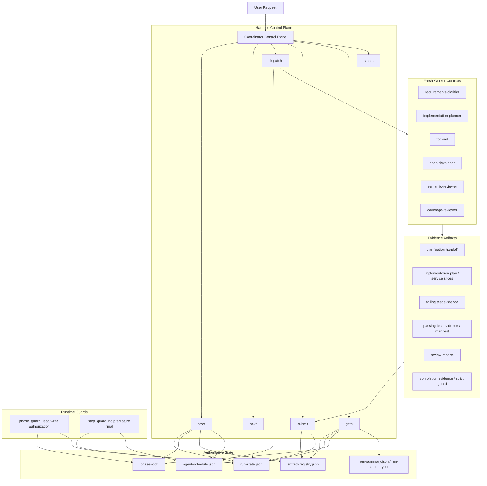
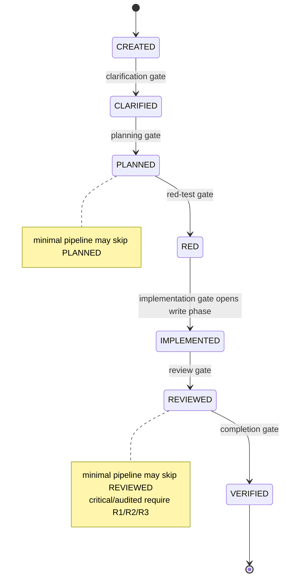
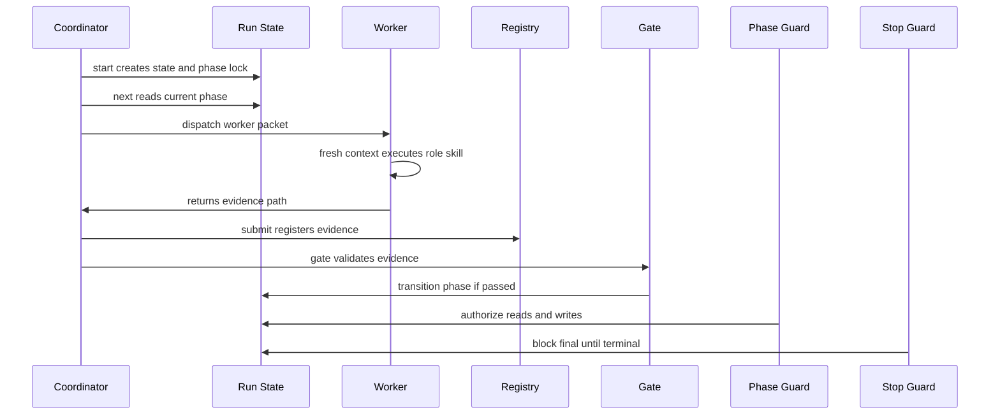

# Agent Team / Subagent Evidence Chain Design

## 目标

本文档定义当前工程中 agent team 与 subagent 的整体协作设计，重点保证：

- 生命周期由 harness 控制面单点推进。
- 每个 worker 只生产被调度任务要求的 evidence。
- 每个阶段必须通过声明式 gate 后才能进入下一阶段。
- 代码读写、阶段跃迁、最终完成都受到 guard 约束。
- 最终 `VERIFIED` 可以被 replay、review、strict guard 共同证明。

核心原则：

> Coordinator owns state. Workers own evidence. Gates own transitions. Guards own permissions.

## 总体架构

## 生命周期链路

## 控制面职责

Coordinator 是唯一允许推进主链路的角色。它只做以下事情：

- 创建 run archive。
- 读取 `next` 输出，决定唯一安全下一步。
- 根据当前 phase 派发 worker packet。
- 接收 worker evidence 并执行 `submit`。
- 执行 `gate`，由 gate 决定能否 transition。
- 在完成前运行 replay、strict guard、summary。

Coordinator 不直接做：

- 需求澄清。
- 实现设计。
- TDD red。
- 生产代码实现。
- 自我 review。
- completion evidence 伪造或手工补状态。

## Worker 模型

Worker packet 是指针模型，只包含：

- `role`
- `skill`
- `context_paths`
- `expected_outputs`

Worker 必须 fresh context 启动，不继承 coordinator 聊天上下文。Worker 只能读取 packet 中列出的 context paths，只能输出 schedule 允许的 artifact。

## 阶段设计

| Phase | Worker | 适用形态 | Required Evidence | Gate |
| --- | --- | --- | --- | --- |
| `CREATED` | coordinator | 串行 | `run-state.json`, `.phase-lock`, `artifact-registry.json`, `agent-schedule.json` | state/schema 初始化检查 |
| `CLARIFIED` | `requirements-clarifier` | subagent | restated intent, acceptance criteria, open questions, degradation approvals | clarification gate |
| `PLANNED` | `implementation-planner` / service-design workers | subagent 或 agent team | implementation plan, service slices, dependency evidence, GitNexus impact, test-impact plan | planning gate |
| `RED` | `tdd-red` | subagent；多服务可 team | failing test command evidence, expected failure reason, test file list | red-test gate |
| `IMPLEMENTED` | `code-developer` | subagent；多服务可 team | passing test evidence, implementation manifest, coverage rows, changed files | implementation gate |
| `REVIEWED` | `semantic-reviewer` | standard 用 subagent；critical/audited 用 team | review report 或 `r1_review`/`r2_review`/`r3_review` | review gate |
| `VERIFIED` | `coverage-reviewer` | subagent；audited 可 team | completion evidence, coverage matrix, replay, strict guard, run summary | completion gate |

## Agent Team 使用点

Agent team 只用于天然可以拆分、且 evidence 能独立归档的阶段。

### 多服务设计

当 global design 声明多个 affected services/modules 时，必须进入 multi-service orchestration。每个 service-design worker 产出：

- service-local AC 映射。
- runtime path。
- first red test。
- expected failure。
- required command。
- dependency boundary。
- test impact。

Gate 只有在所有 global AC 都被映射到服务切片后，才允许进入 `PLANNED`。

### 多服务实现

每个 code-developer 只能 claim 一个 service task。`phase_guard` 必须阻断：

- 未 claim 的服务写入。
- 一个 claimed task 写多个服务。
- 非 `IMPLEMENTED` 阶段写生产代码。

每个服务 code worker 产出：

- service unit/integration test evidence。
- implementation manifest。
- coverage rows。
- changed files。

### Critical / Audited Review

`critical` 和 `audited` 的 `REVIEWED` 阶段必须拆成三个独立 reviewer：

- `r1_review`
- `r2_review`
- `r3_review`

每个 reviewer 必须 fresh context，不能 review 自己写过的实现，不能修改实现文件。

### Audited Verification

Audited completion 可以拆为只读 team：

- coverage reviewer。
- replay checker。
- strict guard checker。
- archive consistency checker。

Coordinator 汇总这些 evidence 后再推进 `VERIFIED`。

## Subagent 使用点

Subagent 适用于单职责、强隔离、顺序依赖明显的阶段：

- `requirements-clarifier`
- `implementation-planner`
- `tdd-red`
- `code-developer`
- `semantic-reviewer`
- `coverage-reviewer`

即使只有一个服务，也应按 role 拆分 subagent，避免一个上下文同时掌握需求、实现、评审和完成裁决。

## Evidence Contract

每个 evidence artifact 必须满足：

- 文件真实存在。
- 非空。
- 路径属于当前 run archive 或 schedule 允许的输出路径。
- 被 `submit` 登记到 run-state 和 artifact registry。
- 包含 phase、key、producer、source command 或 source context。
- 对命令类 evidence，必须包含 command、exit code、elapsed time、output hash。

### Evidence Keys

| Key | 来源 | 关键字段 |
| --- | --- | --- |
| `clarification` | requirements clarifier | restated intent, AC, open questions, approval/degradation |
| `plan` | planner | affected scope, service slices, AC mapping, test strategy |
| `failing_tests` | tdd-red | command, exit code non-zero, expected failure reason |
| `passing_tests` | code-developer | command, exit code zero, manifest, coverage rows |
| `review` | standard reviewer | findings, risks, missing tests, recommendation |
| `r1_review` / `r2_review` / `r3_review` | critical reviewers | independent review proof, no self-review proof |
| `verification` | completion worker | coverage matrix, strict guard, replay, final status |

## Gate Design

### Clarification Gate

必须确认：

- 用户意图已用 worker 自己的话复述。
- AC 可验证。
- 开放问题不阻塞实现。
- 高风险降级有明确用户批准。

### Planning Gate

必须确认：

- 所有 AC 有实现路径。
- 所有 affected services/modules 有 service slice。
- 高风险或 cross-service work 有 GitNexus impact evidence。
- 有 test-impact plan。
- context packs 不超过预算。

### Red Gate

必须确认：

- 测试文件已写入允许范围。
- 命令 evidence 的退出码非 0。
- 失败原因是预期 red failure。
- 没有生产代码实现混入 red 阶段。

### Implementation Gate

必须确认：

- 当前 phase 允许 code write。
- code worker 已 claim 对应 task。
- red evidence 已存在并通过 gate。
- passing command evidence 退出码为 0。
- implementation manifest 覆盖所有 AC。

### Review Gate

必须确认：

- reviewer 与 implementer 独立。
- review artifact 字段完整。
- reviewer 没有改实现文件。
- critical/audited 三份 review 全部存在。

### Completion Gate

必须确认：

- 所有 required evidence 都已登记。
- 所有 scheduled tasks 已完成。
- coverage matrix 覆盖所有 AC。
- strict guard 已保存。
- replay summary 已保存。
- run summary 已生成。

## Guard Design

### Phase Guard

`phase_guard` 是读写权限控制点。它读取 `run-state.json` 和 `.phase-lock`，负责阻断：

- 没有 active run 时读代码。
- 非 red 阶段写测试。
- 非 implementation 阶段写生产代码。
- 未 claim service task 的多服务写入。
- 直接手工修改 `.phase-lock`、`run-state.json`、`artifact-registry.json`、`agent-schedule.json`。

### Stop Guard

`stop_guard` 是最终收口控制点。它负责阻断：

- lifecycle 还不是 terminal。
- post-code reviews 未完成。
- completion evidence 未提交。
- strict guard 未保存。
- schedule 中仍有 open tasks。

## 完整性闭环

## 最终完成判定

一个 run 只有满足以下条件才能报告完成：

- 当前 lifecycle 为 `VERIFIED`。
- 所有 active pipeline phases 都有 required evidence。
- skipped phases 是 pipeline 裁剪结果，不是手工跳过。
- 所有 evidence 都在 registry 中有路径和 hash。
- 所有 scheduled tasks 都是 done。
- red/green command evidence 都真实存在。
- review gate 已通过。
- completion gate 已通过。
- strict guard 已保存并通过。
- replay summary 与 run summary 已生成。

## 推荐落地策略

1. 保持 coordinator 串行推进控制面。
2. 所有 worker 默认 subagent fresh context。
3. 只有多服务、R1/R2/R3 review、audited verification 使用 agent team。
4. 所有 code write 必须由 phase guard 与 service claim 双重授权。
5. 所有 phase transition 必须由 gate 写入 run-state history。
6. 最终报告只引用已登记 evidence，不引用聊天上下文中的口头结论。
