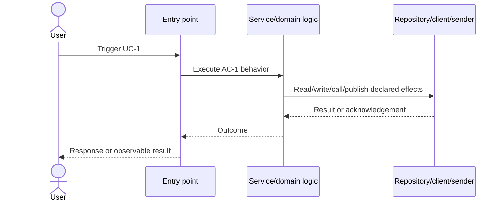

# enterprise harness target architecture completion

## Restated Intent
- Agent restatement: Compare the current `skills/e2e-dev-harness` implementation against `docs/enterprise-harness-target-architecture.md`, identify the remaining enterprise-productization gaps, implement the smallest compatible slice that makes the documented target materially true, and archive unused/generated script artifacts so `skills/e2e-dev-harness/scripts` stays clean.
- User confirmation: implicit in the request "列出实施计划并实施"

## Goal
- 根据 docs/enterprise-harness-target-architecture.md 分析未完成项，列出实施计划并实施；达到文档要求目标即停止；归档不使用脚本以保持 scripts 文件夹干净

## Scope
- Affected services/modules: `skills/e2e-dev-harness`, `pyproject.toml`, tests covering harness packaging/CLI/productization.
- In scope:
  - Verify the current state of the five documented evolution phases.
  - Patch incomplete packaging/productization gaps for the already introduced enterprise modules.
  - Keep legacy script entry points compatible while ensuring installed distributions include the new package and modules.
  - Move generated, unused artifacts out of `skills/e2e-dev-harness/scripts` into an archive location or ignore-clean state.
- Non-goals:
  - Big-bang rewrite into a fully new package layout.
  - Removing legacy `.py` compatibility modules still imported by tests, docs, CLI entry points, or installed aliases.
  - Weakening deterministic gates, worker isolation, phase locks, or review requirements.

## Use Cases
- UC-1: A maintainer installs the harness and can import/use the enterprise modules (`e2e_harness`, event log, runtime adapters, plugin registry, output contract) through the packaged distribution.
- UC-2: A maintainer inspecting `skills/e2e-dev-harness/scripts` does not see generated package/build artifacts mixed with source scripts.

## System Sequence

## Acceptance Criteria
- AC-1: The documented enterprise architecture phases have an evidence-backed completion/gap assessment.
- AC-2: `pyproject.toml` includes all root-level harness modules required by the current enterprise control plane and includes the `e2e_harness` package tree for installation.
- AC-3: A regression test proves the packaging manifest covers enterprise modules and excludes generated artifact directories from source control expectations.
- AC-4: Generated/unused artifacts under `skills/e2e-dev-harness/scripts` are archived or removed from the active scripts surface without moving still-referenced compatibility scripts.
- AC-5: Focused and broad verification pass, including GitNexus change detection before final reporting.

## Test Design
- First red test: Extend `tests/test_unified_cli.py::UnifiedCliTests` to assert packaging coverage for enterprise modules/packages and clean-script generated artifacts.
- Verification command: `python -m unittest discover -s tests -p test_unified_cli.py`

## Impact Summary
- Source: GitNexus impact on `UnifiedCliTests`, local packaging/source evidence, and final `gitnexus detect_changes`.
- Raw Evidence: GitNexus impact returned LOW risk, 0 direct callers/processes affected for the test class before test edits.

| type | interface | affected callers/consumers | related AC | required tests/contracts | risk |
| --- | --- | --- | --- | --- | --- |
| test | `UnifiedCliTests` | none | AC-3 | `python -m unittest discover -s tests -p test_unified_cli.py` | low |
| package metadata | `pyproject.toml` | installer/entry points | AC-2 | packaging manifest regression test | medium |
| script surface | `skills/e2e-dev-harness/scripts` | maintainers/installers | AC-4 | clean script artifact assertion and git status | low |

## Change Logic
- Current behavior: Enterprise modules exist in source, but `pyproject.toml` still lists an older root module set and the active scripts directory contains generated `*.egg-info` / `__pycache__` artifacts.
- Target behavior: Packaging metadata reflects the current enterprise control plane, installed users receive the package and modules needed by CLI facades, and generated artifacts are not part of the active scripts surface.
- Runtime path: CLI entry point remains `e2e_dev_harness:main`; command facades continue delegating to existing modules.
- State/data/API/event effects: No public API or persisted run-state schema changes.
- Compatibility or migration notes: Preserve all legacy root modules still listed in docs/tests/imports; only archive generated artifacts, not compatibility scripts.

## Contracts
- HTTP/API: N/A.
- MQ/DMQ/Kafka: N/A.

## Open Questions
- None. User requested analysis, plan, and implementation in one goal.
