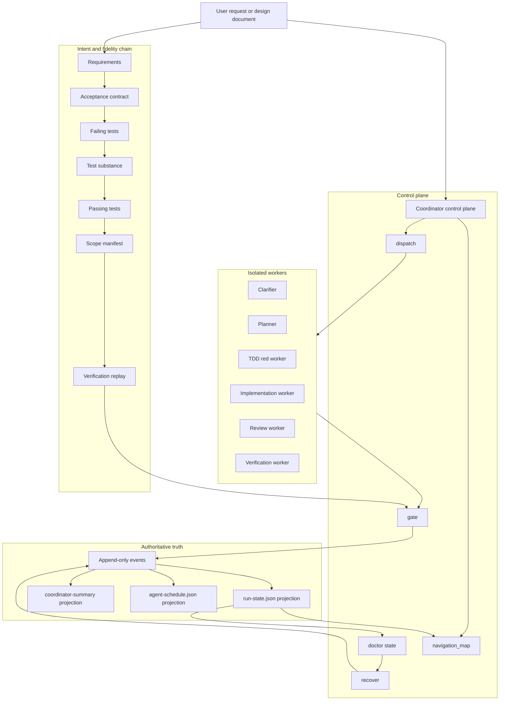
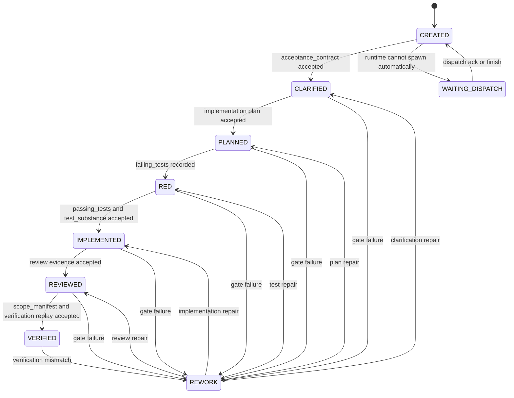
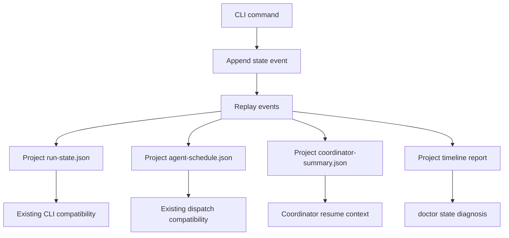

# Loop Engineering Control Plane Design

> Date: 2026-06-12
> Scope: `skills/e2e-dev-harness`
> Status: target design and staged implementation guide

## Executive Summary

当前工程可以演进为 Loop Engineering，但不应该先从改名或品牌包装开始。它已经具备 Loop Engineering 的关键内核：确定性控制面、隔离 worker、运行时 adapter、声明式 pipeline、证据 gate、guard 约束和交付保真链的早期实现。

更准确的定位是：

> `e2e-dev-harness` is a deterministic agent workflow harness that should become a Loop Engineering control plane.

Loop Engineering 在本文中的含义不是“多 agent 自动跑任务”，而是：

> 用一个可审计控制面，把需求、验收、任务分解、worker 执行、证据采集、gate 校验、返工路由、最终验证和恢复诊断连成闭环，并且不信任任何 worker 自报。

因此下一步不是扩大抽象面，而是先闭合两条链：

1. **交付保真链**：证明“通过 gate”确实收敛于“符合设计”。
2. **控制面真相链**：证明状态推进、失败诊断和恢复都来自同一条可审计事实链。

## Current Checkout Facts

以下是当前 checkout 应当被当作事实的能力边界：

- `run-state.json` 已经是版本化、加锁、原子写的单文件 SSOT 起点。
- `verification`、`acceptance_contract`、`test_substance`、`scope_manifest` 已进入 evidence validation 体系。
- `RuntimeAdapter` seam 已存在，Codex、Claude Code、OpenCode、manual runtime 共享 descriptor/capability 契约。
- `pipeline.py` 已支持 YAML pipeline 覆盖 phase spine、`exit_gate`、`produces` 和 `allows_code_write`。
- `navigation_map()` 默认 `skip_replay=True`，读状态不会误触发 verification replay。
- 当前 checkout 中 `doctor` 仍是浅层 installer readiness check，不能被写成成熟 run-level diagnosis。
- 当前 checkout 中没有成型的 `event_log.py`、`state_store.py`、`recover.py`。这些属于目标态或历史分支能力，不能当作当前事实。
- （2026-06-13 核验补充）`verification` replay 当前只覆盖一个命令 allow-list（`python -m pytest｜unittest`、`pytest`、`npx vitest｜playwright`、`node --check`、`mvn`、`gradle`）；`go`/`cargo`/`pnpm`/`yarn`/`jest` 会被 `replay-command-disallowed` 拒——这些栈当前无法过 VERIFIED（见 Review Notes D4 / Phase 1）。
- （2026-06-13 核验补充）`scope_manifest` 的 grounding 当前只对 `tables` 校验 `CREATE TABLE` DDL；`services`/`phases` 取 worker 自报值（见 Review Notes D1 / Phase 1）。
- （2026-06-13 核验补充）`audit_replay`（F5）与 `agent_team_dispatch`（F4）是 audited-tier 的 VERIFIED gate key（经 `pipelines/audited.yaml` 注入、audit 关键词自动路由），默认 minimal/standard/critical tier 不要求它们——这是有意的 tier scaling、非缺陷；`audit_replay` 为 anti-forgery-only、不 replay，与被真 replay 的 `verification` 是不同强度的保证（见 Review Notes D2/D3）。
- （2026-06-13 设计收敛）`module-fanout` 是 dispatch 主链上的可达能力，不是 dead code；当前只由 module dependency 和 evidence presence 控制并发，不包含 write-scope、conflict-group 或 worker-owner 强制。因此 Loop Engineering hardening 不能只补 fidelity/doctor，还必须先给 fan-out 加一个安全地板。
- （2026-06-13 设计收敛）当前 lifecycle diagram 只能作为目标模型；真实 checkout 里没有一等 `REWORK` state。verify failure 通过清空目标 phase evidence、写 `rework_required`、回退 `current_phase` 实现。任何 `doctor --state` 的 `next_legal_command` 都必须按真实 transition mechanics 推导，而不能按概念图推导。

## Hard Boundaries Before Implementation

以下边界是实施前必须承认的硬约束，而不是后续 polish：

1. **No hidden fan-out risk.** 在 `module-fanout` 仍可达的前提下，Phase 1 不能只关闭 fidelity 漏洞；它还必须收紧并发条件或增加 worker ownership guard，避免把并发写隔离继续留给约定。
2. **No lifecycle fiction in operator commands.** 文档可以展示 target lifecycle，但 `doctor --state`、`recover` 和 `next_legal_command` 必须基于当前代码真实状态机制：phase record、`current_phase`、`failures`、`rework_required`、dispatch artifacts 和 gate validation。
3. **No `doctor` schema ambiguity.** 默认 `doctor` 保持 installer readiness contract；run-level diagnosis 必须显式走 `doctor --state`，返回 `doctor-state.v1`，并避免把 installer `ready` 与 run health 混为一个字段。
4. **No ungrounded COMPLETE.** `scope_manifest` 的 `COMPLETE` 必须来自可复验 grounding。`tables` 继续用 DDL grounding；模块/phase grounding 要先定义清楚语义，再接入 run-state ledger。
5. **No soft event truth.** Phase 4 的 append-only events 必须是 tamper-evident：能检测修改、删除、重排和 projection drift，而不是只在每个 event 里放 artifact hash。

## Design Principles

### 1. Fidelity Before Productization

如果 gate 只能证明“流程跑完”，不能证明“符合设计”，那么越自动化越危险。Loop Engineering 的第一原则是先证明交付保真，再谈产品化、插件化、UI 或品牌。

### 2. Coordinator Owns State

Coordinator 只负责状态推进、任务派发、对账、诊断和恢复。它不应该代替 worker 完成阶段产物，也不应该在恢复路径里写 worker-owned artifacts。

### 3. Workers Own Evidence

Worker 只拥有自己被调度任务要求的输出和 evidence。worker 可以失败、返工或补证，但不能靠自然语言声明完成。

### 4. Gates Own Transitions

生命周期跃迁必须由 gate 决定。prompt guidance 可以解释流程，但不能替代 gate。

### 5. Recovery Is A Control-Plane Path

恢复不是绕过 gate 的后门。恢复必须有计划、审批、输入 hash、输出 hash、影响范围和下一条合法命令。

## Target Architecture



## Target Lifecycle Model



### Current Checkout Transition Mechanics

当前 checkout 的真实机制比上图更低层：

- `lifecycle.build_spine(...)` 按 phase name 列表生成顺序，catalog 里的 `next_phase` 不是静态真相。
- `REWORK` 不是持久化 phase/enum/record；verify failure 会定位最近可写 phase，清空该 phase evidence，写入 `rework_required` / `superseded_evidence`，再把 `current_phase` 回退到该 phase。
- `WAITING_DISPATCH` 不是独立 lifecycle phase；它是 dispatch guidance / runtime capability / artifact readiness 共同投影出的操作状态。
- 因此所有 operator-facing diagnosis 必须读取 live state artifacts，而不是按 target diagram 推导合法命令。

## Delivery Fidelity Chain

Loop Engineering 的核心不是 phase 数量，而是每一环都能对上一环负责。

| Link | Input | Output | Gate Question |
| --- | --- | --- | --- |
| Requirements fidelity | Design docs, user request | `acceptance_contract` | 每条需求是否变成可观察、可引用的验收项？ |
| Test fidelity | `acceptance_contract` | `failing_tests` | 测试是否覆盖验收项并真实失败？ |
| Substance fidelity | tests and code | `test_substance` | 测试是否有真实断言，避免空壳绿灯？ |
| Implementation fidelity | code changes | `passing_tests` | 同一批测试是否从红变绿？ |
| Scope fidelity | intended scope, changed files | `scope_manifest` | 交付范围是 COMPLETE 还是 PARTIAL？ |
| Evidence fidelity | command evidence | `verification` | 证据是否由受信取证函数产生并可 replay？ |


## Control-Plane Truth Chain

当前 `run-state.json` 是一个好的 SSOT 起点，但 Loop Engineering 需要更强的审计链。目标态不是马上删除兼容文件，而是让 append-only events 成为权威，现有 JSON 文件作为 projection。



### Event Types

Start with the smallest useful event set:

- `run.started`
- `phase.submitted`
- `gate.passed`
- `gate.failed`
- `dispatch.requested`
- `dispatch.acknowledged`
- `dispatch.finished`
- `dispatch.failed`
- `verification.replayed`
- `recovery.requested`
- `recovery.approved`
- `recovery.applied`

Each event should include:

- `schema`
- `event_id`
- `run_id`
- `phase`
- `task_id`
- `actor`
- `timestamp`
- `input_hashes`
- `output_hashes`
- `reason`
- `source_command`

## Doctor And Recovery Design

### `doctor --state`

`doctor --state` should be read-only. It should not mutate state, replay expensive verification, or attempt repair.

Compatibility boundary:

- `doctor` without `--state` remains the lightweight installer readiness check and keeps `schema: e2e-dev-harness.doctor.v1`.
- `doctor --state` is a separate run-diagnosis surface and returns `schema: e2e-dev-harness.doctor-state.v1`.
- `doctor-state.v1` should not reuse bare `ready` to mean run health. Prefer explicit fields such as `diagnosis_ready`, `run_blocked`, `first_fault`, and `next_legal_command`.
- `next_legal_command` is derived from real current-checkout mechanics, not from the target lifecycle diagram.

Required output fields:

```json
{
  "schema": "e2e-dev-harness.doctor-state.v1",
  "diagnosis_ready": true,
  "run_blocked": true,
  "run_dir": "docs/agent-runs/example",
  "first_fault": {
    "kind": "missing_evidence",
    "phase": "IMPLEMENTED",
    "task_id": "T03",
    "message": "passing_tests evidence is missing"
  },
  "blocked_phase": "IMPLEMENTED",
  "blocked_task": "T03",
  "missing_evidence": ["passing_tests"],
  "next_legal_command": "e2e-harness dispatch-beat --run-dir docs/agent-runs/example",
  "coordinator_may_write_worker_outputs": false
}
```

### `recover`

`recover` should be a two-step path:

1. `recover --plan`: produce an auditable recovery plan.
2. `recover --apply --approval <path>`: apply only approved, narrow control-plane repairs.

Recovery must not:

- mark a worker task complete without trusted worker proof;
- rewrite worker-owned handoffs from coordinator context;
- turn a missing artifact into a passing state;
- silently collapse `PARTIAL` into `COMPLETE`;
- bypass evidence validators.

## Implementation Roadmap

### Phase 0: Baseline And Scope Freeze

Goal: establish the live repo baseline before changing architecture.

Tasks:

- Run `git status --short` and group existing changes by workstream.
- Run GitNexus `detect_changes` before committing any existing work.
- Run focused Python tests for `skills/e2e-dev-harness/tests`.
- Run Node tests and `npm pack --dry-run` before publishing claims.
- Record which failures are code defects and which are Windows temp or permission residue.

Exit criteria:

- Current checkout facts are known.
- Existing dirty work is not mixed into Loop Engineering changes.
- No architecture doc claims unimplemented event/recovery capabilities as current.

### Phase 1: Close Delivery Fidelity

Goal: make `VERIFIED` depend on the complete fidelity chain, and add the minimum fan-out safety floor needed before Loop Engineering claims worker isolation.

Primary files:

- `skills/e2e-dev-harness/scripts/e2e_harness/adapters/evidence/validate.py`
- `skills/e2e-dev-harness/scripts/e2e_harness/adapters/evidence/acceptance.py`
- `skills/e2e-dev-harness/scripts/e2e_harness/adapters/evidence/test_substance.py`
- `skills/e2e-dev-harness/scripts/e2e_harness/adapters/evidence/scope.py`
- `skills/e2e-dev-harness/scripts/e2e_harness/core/module_plan.py`
- `skills/e2e-dev-harness/scripts/e2e_harness/core/multitrack.py`
- `skills/e2e-dev-harness/scripts/e2e_harness/core/engine.py`
- `skills/e2e-dev-harness/scripts/e2e_harness/cli/commands/dispatch.py`

Required tests:

- forged `verification` evidence is rejected;
- missing `acceptance_contract` blocks downstream completion;
- empty or weak tests fail `test_substance`;
- `scope_manifest` can produce `PARTIAL` without allowing final `COMPLETE`;
- navigation reads remain side-effect-free;
- a services/phases-only `scope_manifest` cannot reach `COMPLETE` by self-declaration (gap D1);
- a genuine `verification` record from `go test` / `cargo test` / `pnpm test` / `yarn test` / `npx jest` is accepted, not rejected as `replay-command-disallowed` (gap D4).
- module fan-out is withheld when modules declare shared `conflict_groups`;
- a module worker cannot submit evidence for another module namespace;
- `ready_frontier` keeps its cheap/no-repo-I/O contract while consulting declared module metadata.

Additional fidelity-gap closures (re-verified 2026-06-13 by 4 independent agents — see Review Notes D):

- **D1 — scope grounding (severity medium).** `adapters/evidence/scope.py._ground` grounds only the `tables` category against `CREATE TABLE` DDL; `services`/`phases` pass through self-declared, so a services/phases-only expected set reaches `COMPLETE` ungrounded. Minimal fix: define `phases` as delivered module ids from the module plan, then ground them against completed module chains in run-state. Do not compare module ids directly to lifecycle phase names. `services` grounding is a harder follow-up.
- **D4 — replay command allow-list (severity high).** `validate.py:_replay_command_allowed` is a closed enumeration (pytest/unittest, vitest/playwright, node --check, mvn, gradle); `go test` / `cargo test` / `pnpm test` / `yarn test` / `npx jest` fall through to `return False`, making `VERIFIED` structurally un-passable for those stacks even with genuine evidence — and unlike `audit_replay` this narrowing is undocumented, not by-design. Minimal fix: add conservative `go`/`cargo`/`pnpm`/`yarn` test-subcommand branches and `jest` to the node test set, each as strict as the existing branches (must reference a test subcommand).
- **FAN1 — fan-out safety floor (severity high).** `ready_frontier` currently returns every dependency-ready module phase. Before claiming worker isolation, add declarative `conflict_groups` to module plans and require fanned-out modules to have no shared conflict group. This keeps fan-out for clearly independent modules while serializing migrations, lockfiles, shared schemas, codegen sinks and other named shared resources.
- **OWN1 — evidence namespace ownership (severity high).** `submit_evidence` currently accepts arbitrary phase/key pairs. For module-scoped phases, a worker submitting `IMPLEMENTED#auth` evidence must not be able to satisfy `IMPLEMENTED#billing`. The lightest viable guard is a runtime assertion that claimed worker id, phase namespace and evidence key namespace match when worker identity is available; manual runtime remains an explicit residual-risk path.

> Explicitly NOT in this phase (re-verified by-design, 2026-06-13): default VERIFIED omitting `audit_replay`/`agent_team_dispatch` (Review Notes D2 — intentional tier scaling, enforced in the audited tier via `audited.yaml`; must not be forced onto the default gate) and `audit_replay` being anti-forgery-only rather than replayed (Review Notes D3 — deliberate; the `verification` leaf is the replayed, verification-grade proof). These need wording precision in Readiness, not a gate change.

Exit criteria:

- `acceptance_contract -> failing_tests -> test_substance -> passing_tests -> scope_manifest -> verification replay` is enforced end to end;
- `scope_manifest` `COMPLETE` is grounded (not self-declared) at least for `tables` and delivered module ids;
- `verification` replay accepts the first-class test runner of every supported stack (Python/Node/Go/Rust/JVM), or names the unsupported stack explicitly rather than silently rejecting genuine evidence.
- module fan-out is allowed only for declared-independent modules with no shared `conflict_groups`;
- module evidence submission cannot satisfy another module namespace when worker identity is available.

### Phase 2: Add Read-Only State Diagnosis

Goal: make run failures explainable without manual file archaeology.

Primary files:

- `skills/e2e-dev-harness/scripts/e2e_harness/cli/commands/doctor.py`
- new `skills/e2e-dev-harness/scripts/e2e_harness/core/state_diagnosis.py`
- `skills/e2e-dev-harness/tests/test_cli_doctor.py`

Required behavior:

- explain missing evidence;
- explain stale dispatch;
- explain worker-owned output blockers;
- distinguish missing content from missing proof;
- emit exactly one next legal command when possible.

Exit criteria:

- `doctor --state` can identify the first blocking fact for a stuck run.

### Phase 3: Add Approval-Gated Recovery

Goal: make recovery auditable and bounded.

Primary files:

- new `skills/e2e-dev-harness/scripts/e2e_harness/cli/commands/recover.py`
- new `skills/e2e-dev-harness/scripts/e2e_harness/core/recovery.py`
- `skills/e2e-dev-harness/scripts/e2e_harness/cli/main.py`
- new `skills/e2e-dev-harness/tests/test_cli_recover.py`

Required behavior:

- `recover --plan` writes a recovery plan without mutating state;
- `recover --apply` requires approval metadata;
- recovery records input and output hashes;
- recovery refuses worker-owned artifact writes from coordinator context.

Exit criteria:

- manual recovery becomes a control-plane repair path, not a convenience bypass.

### Phase 4: Introduce Minimal Event Writer

Goal: move from single-file truth toward auditable event truth without breaking compatibility.

Primary files:

- new `skills/e2e-dev-harness/scripts/e2e_harness/core/event_log.py`
- new `skills/e2e-dev-harness/scripts/e2e_harness/core/state_store.py`
- `skills/e2e-dev-harness/scripts/e2e_harness/core/run_state.py`

Required behavior:

- append lifecycle, dispatch, gate, verification and recovery events;
- include `prev_event_hash`, canonical event serialization and monotonic event sequence per run;
- replay events into `run-state.json` projection;
- preserve existing CLI JSON shapes;
- detect first projection mismatch.

Exit criteria:

- event replay can reconstruct the key fields currently read from `run-state.json`.
- event verification detects event modification, deletion, reordering and projection drift.

### Phase 5: Productize Loop Engineering

Goal: only after fidelity, diagnosis and recovery are stable, expose the platform identity.

Possible outputs:

- CLI alias or package wording for Loop Engineering;
- run timeline report;
- provider registry for gates/scanners/policies;
- product-facing docs;
- optional UI/report adapter.

Exit criteria:

- the term Loop Engineering refers to a proven closed loop, not just a renamed harness.

## Non-Goals

- Do not rename the package before Phase 1 and Phase 2 are complete.
- Do not introduce a broad plugin registry before the default fidelity chain is stable.
- Do not replace `run-state.json` immediately; keep it as a compatibility projection.
- Do not let recovery write worker-owned artifacts.
- Do not weaken phase guards to improve convenience.

## Readiness Definition

The project can call itself a Loop Engineering control plane when all of the following are true:

- A design document can be converted into a structured acceptance contract.
- Tests can be traced back to acceptance IDs.
- Final verification evidence is genuine, replayable and shape-validated. （precision, 2026-06-13 二次核验：「replayable」是被真正重跑的 `verification` gate 的保证；`audit_replay` 是有意更弱的 anti-forgery-only 检查、不重跑；且 replay 当前只覆盖一个命令 allow-list（Python/Node-vitest｜playwright/Maven/Gradle，缺 go/cargo/pnpm/yarn/jest）——见 Review Notes D3/D4 与 Phase 1。）
- `COMPLETE` and `PARTIAL` are distinct machine states.
- A stuck run can be diagnosed with one read-only command.
- Recovery requires explicit approval and leaves an audit trail.
- State transitions are reconstructable from event truth or a verified projection.

## Recommended Next Step

Start with Phase 1 and Phase 2, but treat fan-out safety as part of Phase 1 rather than a later cleanup. They produce the most value with the least architectural risk:

1. finish the delivery fidelity chain;
2. add the module fan-out safety floor (`conflict_groups` plus namespace ownership guard);
3. add read-only `doctor --state` with a separate schema and no installer/run-health ambiguity;
4. only then implement `recover` and tamper-evident event projection.

That sequence keeps the system honest. It prevents the project from productizing an attractive loop that still cannot prove it delivered the requested design.

## Adversarial Review Notes (2026-06-13)

> 来源:对 2026-06-12 稿的一次评审,叠加对当前 checkout 的只读代码核验,再经 10 个独立 agent 的对抗性复核(8 条代码断言逐条核验 + 2 份缺口报告)。
> 本节**只追加,不修改上方任何内容**。等级标注:`[verified]` = 独立 agent 读码确认;`[corrected]` = 复核修正了评审初稿的措辞/结论;`[review]` = 单 agent 评审发现,附证据行号,实现前建议各自抽验。

### A. Verified Implementation Facts(并发/隔离现状)

- **[verified] 证据模型无 producer/owner 维度。** `submit_evidence`(`core/engine.py:29-36`)把证据写进 phase 级共享 dict `rec['evidence'][key]={path,sha256,bytes}`,无 worker/submitted_by 字段;`gate_passes`(`core/gates.py:8-37`)从不读提交者身份。
- **[corrected] gate 不是"纯 key 存在 + validate"。** 它还有两个 load-bearing 输入:dispatch-failed floor(`gates.py:13`)与 per-key failures ledger(`gates.py:33-36`,一个未解决的 `failed:<key>` 即使证据在场且 dispatch=DONE 也会阻 gate)。二者都按 evidence-key 而非 worker,故不引入 producer 维度——但"纯 key 存在"的描述不准确。
- **[verified] worker-packet 不含归属/写范围字段。** `_worker`(`builtin.py:115-132`)只产 id/schema/role/skill/context_paths/expected_outputs/parallel_group/depends_on/context_policy(+可选 runtime_subagent_type);`producer_id`/`allowed_write_paths`/`owned_evidence_keys`/`conflict_groups` 全不存在,`depends_on` 硬编码 `[]`。
- **[corrected] 证据归属不是"by construction 结构性安全"(评审初稿的过度断言)。** 真正的隔离来自 **per-phase-record 作用域**:证据存在 `state['phases'][<namespaced phase>]['evidence']`,`gate_passes` 只读自己 phase 的 record(`engine.py:18,36`;`gates.py:60`),所以 IMPLEMENTED#auth 的 gate 根本不看 IMPLEMENTED#billing 的 record——`#mid` key 后缀只是次要层。但 `submit_evidence` 接受**任意** phase+key,一个 mislabeled submit(auth worker 调 `submit --phase IMPLEMENTED#billing --key passing_tests#billing`)即可满足 billing 的 gate。归属安全 = **约定 + per-phase-record 作用域,无运行时 owner 强制**(`producer_ids` 写进 plan 但从不被读,`builtin.py:54,94`)。
- **[verified] `ready_frontier` 不做写隔离。** 它(`core/multitrack.py:93-138`)只查 depends_on 完成 + evidence 存在,deps 仅来自 `module.depends_on`;对并发返回的模块之间的写范围互斥**无任何分析**。
- **[verified] module plan 的 `scope` 是语义验收描述,不是写范围。** 它(`core/module_plan.py:14`)可选、`_validate_module`(`:35-53`)不校验它,`expected_scope`(`:114-133`)当 `{services,tables}` 取并集喂 VERIFIED 的 scope-manifest 验收检查;repo-wide 看,它从不被当文件路径或用于写隔离。
- **[verified] phase guard 是 phase 级路径分类,非 per-worker 写范围。** `adapters/hooks/paths.py` 按全局后缀/前缀分类路径类型,无 worker 身份参数、无 allowed_write_paths(sibling `phase_guard.py:_segment_write_paths` 是解析 shell 写目标 cp/mv/sed -i/tee/dd 的命令分类,也非 per-worker allow-list)。
- **[verified] fan-out 真接线、可达,非 dead code。** `dispatch.py:85-95` 总实例化 provider、默认走 `plan_phase`(single-worker),仅当模块作用域 phase + 有 module plan + `ready_frontier` 返回 ≥2 就绪模块时走 `plan_module_fanout`。
- **[verified] F4 `agent_team_dispatch` 校验派发真实性、不校验归属。** `dispatch_invocation.py:20-45` 校验 schema/descriptors-or-blocked/team_plan 存在;`validate_evidence(repo_root,key,entry)` 签名根本不带提交者身份,结构上无法把 evidence key 的提交者绑定到 descriptor。

### B. 核心意见:不要关并发,也不要把"plan 层 glob 证明"当干净解法

1. **删除 agent-team 设计章节本身,方向上对。** 那套 worker 层 isolation contract 层级错(把规划期不变量塞进每个 worker packet 反复声明、反复在各 runtime 强制)、半冗余(`owned_evidence_keys` 与 namespaced `expected_outputs` 重复、`producer_id` 被命名空间覆盖大半)、且从未实现。删除还顺手消解了"doctor 一条命令 vs 并发""efficiency metrics 无基线""Phase 1.5 编号"这几个张力。
2. **但 `module-fanout` 不应关闭(把 `dispatch.py:92` 的 fan-out 分支降级为 single-worker 是退步)。** 它是多模块 run 的本质吞吐机制(整个 `core/multitrack.py` 的存在理由);强制串行让 N 个独立模块慢 N 倍,这不是产品化糖。
3. **评审初稿提出的"把写范围互斥证明上提到 plan 层"经对抗性复核被证明不充分也不可行(见 C)。** 因此正确立场不是 A(仅文档诚实化)、不是 B(关并发)、也不是简单的 plan-glob C,而是**分层 + 承认残差**:
   - **plan 层**:模块声明 **`conflict_groups`(命名的共享资源:migrations 序列、lockfile/包清单、codegen 输出、共享 schema/types)**——这恰是被删 isolation contract 里唯一不可被 path-glob 替代、且应被保留的内核;frontier 并发要求"无共享 conflict_group"。
   - **运行时层**:仍需 **module-aware 写 guard**。纯静态证明被两点证伪:manual runtime(`can_auto_spawn=False`,人跑、无 harness 进程在环)是 honor system;coordinator 的 band-rework(`engine.py` 清空 `target_rec['evidence']`)会与仍在跑的 fanned-out worker 的 submit 竞争同一 evidence 子树,需 run-state 锁或 ownership 仲裁。
   - **残差(可能无法在调度期完全消除)**:跨模块编译/类型耦合(read-after-write)、PLANNED/TDD 顺序下依赖与文件集不可知。缓解方向:把 fan-out 限制在更保守条件(同 base phase、无 schema/dep 变更的模块),或 fan-out 后加一次串行收敛验证;并把"fan-out 的已知不安全边界"**显式写进设计而非隐藏**。
4. **归属安全的轻量补强**:加一个 "worker 只能提交自己 `#module` namespace 的 phase/key" 的运行时断言即可防 mislabeled submit——比被删的整套 producer 机制小得多,且证据命名空间已让它在 happy path 上几乎免费。

### C. 为什么"plan 层 write-scope 互斥证明"不充分也不可行(反例)

**glob 表达不了的"互斥源、共享汇"(high):**
- **共享 migrations 目录**:path-disjoint 的两模块都要往 `db/migrations/` 加文件 → write_scope 必相交 → 任何含 schema 变更的 plan,fan-out 直接退串行;若按 `<module>_*.sql` 命名空间避开 glob 相交,proof 过但两 worker 仍争同一单调 version 计数,产生重复/乱序 migration,而 grounding 只查 `CREATE TABLE` 不查顺序,冲突在 VERIFIED 之后才暴露。
- **共享 lockfile / 包清单**:两模块各加依赖都改 `package.json` + lockfile(`package-lock.json`/`poetry.lock`/`go.sum`/`Cargo.lock`)→ scope 永相交 → 任一模块加依赖即强制全 frontier 串行;而依赖在 RED/IMPLEMENTED 才发现,`ready_frontier` 决策的 PLANNED 时刻 conflict set **不可知**。
- **codegen / 共享 schema**:互斥源、共享汇(`generated/client.ts`、中央 `schema.graphql`、共享 `types` barrel),glob 模型表达不了;且 `ready_frontier` 今天**根本没有 `conflict_groups` 概念**——全是新代码,与"轻量重定位"的说法矛盾。

**disjoint 写范围仍不安全(high):**
- **路径互斥但语义耦合**:模块 A 的 IMPLEMENTED 改了接口、模块 B import 它;文件互斥所以 proof 过、并行跑,但 B 针对 A 半成品接口编译、其 RED 测试非确定性 flake。write-scope 互斥证明"无两 worker 写同一字节",对跨模块 **read-after-write 耦合零保证**;对编译/类型语言,disjoint 不充分。

**静态证明不消除运行时强制(high):**
- fan-out 下两个 `IMPLEMENTED#auth`/`IMPLEMENTED#billing` worker 都合法通过 `can_write_code`(同 base phase `allows_code_write=True`),运行时没有东西阻止 billing worker 写进 auth 的声明 scope——honor system;manual runtime 由人跑,唯一可能的强制点是 PreToolUse hook,而它无 module/write_scope 维度。

**PLANNED 时不可满足 / 退化为串行(high):**
- `validate_module_plan` 在任何测试/代码存在之前跑;TDD 中真实文件集在 RED/IMPLEMENTED 才发现。强制 PLANNED 声明完整 write_scope → 要么 planner 猜错(运行时写落 scope 外,若强制则实现中途被拒),要么声明过宽 glob(`src/**`)使 `ready_frontier` **永远串行**,悄悄杀死要保留的 fan-out。把现状的 optional scope 升级成 required/enforced/path-precise 是 contract break。
- **PARTIAL / under-declared write_scope 无定义语义**:只声明部分实编文件 → disjointness proof 认证**虚假安全**且无 backstop;`validate_module_plan` 是纯结构校验、PLANNED 时无 repo 访问,无法拒绝 under-declaration。

**调度/审计副作用(medium):**
- write-conflict deferral 无下游接线:被 withheld 的冲突模块既非 complete 也非 dependency-blocked,tracks ledger 可能 stall;且不可审计(`depends_on` 是声明的,scope 冲突抑制是算出来且隐形的)。
- disjointness 必须跨整个 band(RED 写测试文件、REVIEWED 写 review/fix 产物)且跨不同 base phase(`ready_frontier` 让 `REVIEWED#auth` 与 `RED#billing` 同时出现);共享 test fixtures(`tests/fixtures/`、`conftest.py`、共享 seed)是没列的 conflict,而 RED 非 `allows_code_write`,phase_guard 连 code write 都不当它。
- `ready_frontier` 的纯无-I/O 契约(docstring 自述 cheap, no repo I/O):检测"两个 disjoint glob 解析到同一生成文件"需对真实树展开 glob = I/O,破坏其纯度与引擎对它的复用;string-only 则漏掉上面所有 shared-sink 情形。

### D. 与并发无关的交付保真 / 真相漏洞(`[review]`,附行号待抽验)

- **[verified×2,2026-06-13] scope grounding 只查 SQL `CREATE TABLE`,services/phases 纯自报。** `_ground`(`adapters/evidence/scope.py:34-40`)只重新过滤 `tables`;`services`/`phases` 取 worker `delivered` 原值(docstring 自述 "Services/phases are taken as declared")。非-table 的 expected-set 下,worker 可零 grounding 声称 COMPLETE,overclaim 检查只在 table ungrounded 时触发。二次核验确认为真漏洞(severity medium,在 live VERIFIED 路径),**已正式化为 Phase 1 任务**:至少把 `phases` ground against run-state 已完成 phase ledger(镜像 tables-vs-DDL 模式);`services` grounding 较难,作后续。
- **[corrected,2026-06-13 二次核验] 默认 VERIFIED gate 不含 `audit_replay`(F5)/`agent_team_dispatch`(F4)——这不是漏洞,是有意的 tier scaling。** `lifecycle.py:25` 默认 VERIFIED exit_gate = `('verification','scope_manifest')`,`gates.py:22-29` 只对 gate 内 key 跑 validator,故 F4/F5 在 minimal/standard/critical 上 inert——但**非 dead**:`pipelines/audited.yaml:13-14` 注入这两个 key,audited tier 由 `adapters/tier/classify.py:45-47` 在 audit/compliance/incident/regulatory 关键词时自动可达,在那里二者真跑;base chain(到 verification+scope_manifest)在每个 tier 都成立。**不要把这两个 key 加进默认 catalog gate(会强制每个 minimal/standard run 跑 audit-replay+agent dispatch,破坏成本分层);可选硬化仅一个 regression test,钉住 `audited.yaml` 接线 + 关键词路由。**(评审初稿"dead validator"措辞被二次核验否定。)
- **[corrected,2026-06-13 二次核验] `audit_replay` 只反伪造、不反篡改、不 replay——事实准确,但这是有意的弱审计,非缺陷。** 它(`audit_replay.py:8-13,58-60`)校验背书产物是 genuine command-evidence 后,静态比对记录 exit_code、从不重跑;手编 exit_code 可过。docstring 明确说明理由(gate 时重跑 full suite/installer 慢且有副作用)并警告 "must not be mistaken for verification-grade proof"。链的 verification-grade leaf(`verification` key)**确实**被真 replay(`validate.py:168-180`)。**结论:非代码任务,而是 Readiness 措辞需精确化**(把 "replayable" 限定到 `verification` gate,把 `audit_replay` 标为 anti-forgery-only);仅当 roadmap 决定 audit_replay 也要防篡改才照 replay 分支加 re-run。
- **[verified×2,2026-06-13] verification replay allow-list 排除 go/cargo/pnpm/yarn/jest。** `_replay_command_allowed`(`validate.py:95-118`)是闭合枚举(pytest/unittest、vitest/playwright、node --check、mvn、gradle);`go test`/`cargo test`/`pnpm test`/`yarn test`/`npx jest` 全部落到 `return False`,即使证据真实也被 `replay-command-disallowed` 拒——这些栈 VERIFIED **结构上 un-passable**。二次核验确认 severity **high**,且与 `audit_replay` 不同,**此处无任何注释声明 allow-list 按语言有意限定**(是没加,不是 by-design)。**已正式化为 Phase 1 任务**:为 go/cargo/pnpm/yarn 加保守的 test-子命令分支、jest 入 node test 集。
- **F2 contract-snapshot 被 per-key failure ledger 覆盖。** `gate_passes` 评估快照 gate 后**无条件**追加 `failures` 的 `failed:<key>` 标记(`gates.py:33-37`),而 failure 可在 contract stamp 后由 sibling reviewer 经 `submit_evidence status='failed'` 记录。所以"一旦 pass 不可被 retroactively 失效"的 F2 不变量,能经 failure 通道被重新阻塞——与 A 节的 `[corrected]` 呼应。
- **doctor 命令面冲突 / 假可用。** shipped `doctor.py:8-54` 是 installer readiness(`doctor.v1`,`ready` = project_root + settings 解析),与文档的 `doctor --state`(`doctor-state.v1`,run 诊断)共用同一 `doctor` 命令与 `ready` 字段;operator 现在调 `doctor` 得到绿 `ready:true` 与 run health 无关,actively misleading。
- **`label_delivery` 读时重新 ground,projection 会漂移。** 它(`scope.py:66-81`)每次调用都重跑 `_ground`(rglob 扫实时 repo SQL),非快照;repo SQL 在 gate pass 与 projection read 之间变化 → 记录的 COMPLETE/PARTIAL 与 gate 实际批准的悄悄不一致。文档把 run-state 当 validated truth 的忠实 projection,这里 projection 从可变 fs 重新派生非确定值。
- **Loop Lifecycle 状态图相对代码是 fiction(比 Q3 更广)。** catalog 每个 `next_phase=None`,真实顺序由 `build_spine` 接到的 positional 列表决定(YAML 可覆盖);REWORK 无 Phase/enum/record,engine 通过 mutate target phase record(`rework_required`/`superseded_evidence`)+ 后移 `current_phase` 实现(`lifecycle.py:18-43` vs `engine.py:92-124`)。用此图推理合法 transition(或实现 doctor 的 `next_legal_command`)= 推理不存在的 state。

### E. 仍成立的开放问题 + 文档-代码漂移

- **Q1**:控制面真相链在 Phase 4 前并未真正闭合——`doctor`/`recover` 信任 `run-state.json` projection 而非 event truth;Readiness 的 "event truth **or** a verified projection" 软化了 Executive Summary 的强主张。
- **Q2**:event 防篡改性未定义——仅 per-event `input/output_hashes`,未定义 event 间链式 hash、log 完整性、`recovery.applied` 如何自证。
- **Q3**:lifecycle 局部建模(REWORK 无 `→VERIFIED` 边且不携带 rework target;`WAITING_DISPATCH` 只挂 `CREATED`)——D 节的 "lifecycle 图是 fiction" 是它的更广版本。
- **文档-代码漂移**:本稿删除了 agent-team 设计与 `Current Checkout Facts` 的相关条,但 `adapters/agent_team/` 的 provider 与 `plan_module_fanout` 仍是 dispatch 主链且可达(`dispatch.py:85-95`),并发写无隔离。文档不应假装它不存在——这正是 Phase 0 退出标准 "No architecture doc claims unimplemented capabilities as current" 的镜像反面(capability 存在且有风险,而 doc 静默)。

### F. 建议的最小落地顺序

1. **先做文档诚实化(本节即是)**:承认 fan-out 活跃且写无隔离,承认 D 节 fidelity 保证的实际边界。
2. **先补 D 节中代价小、收益高的 fidelity 漏洞**,因为它们直接关系"通过 gate = 符合设计"这条第一原则:默认 VERIFIED gate 是否该要求 `audit_replay`;replay allow-list 扩到 go/cargo/pnpm/yarn/jest;scope grounding 是否该 ground services;`doctor` 命令面去歧义;F2 vs failure ledger 是有意还是缺陷。
3. **fan-out 安全按 B.3 的分层做**:plan 层 `conflict_groups`(命名共享资源)+ 运行时 module-aware 写 guard + 显式声明 fan-out 不安全边界;在此之前,把 `ready_frontier` 的 ≥2 并发条件**收紧**为"仅当模块声明了互不相交 write_scope 且无共享 conflict_group",而不是一刀切关闭。
4. **动 `ready_frontier`/`dispatch` 属主调度链**,按本仓 CLAUDE.md 先跑 `gitnexus_impact` 评估爆炸半径再改。
