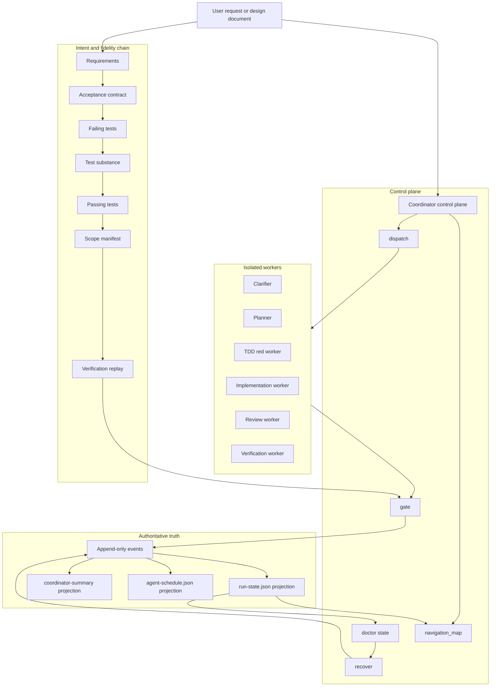
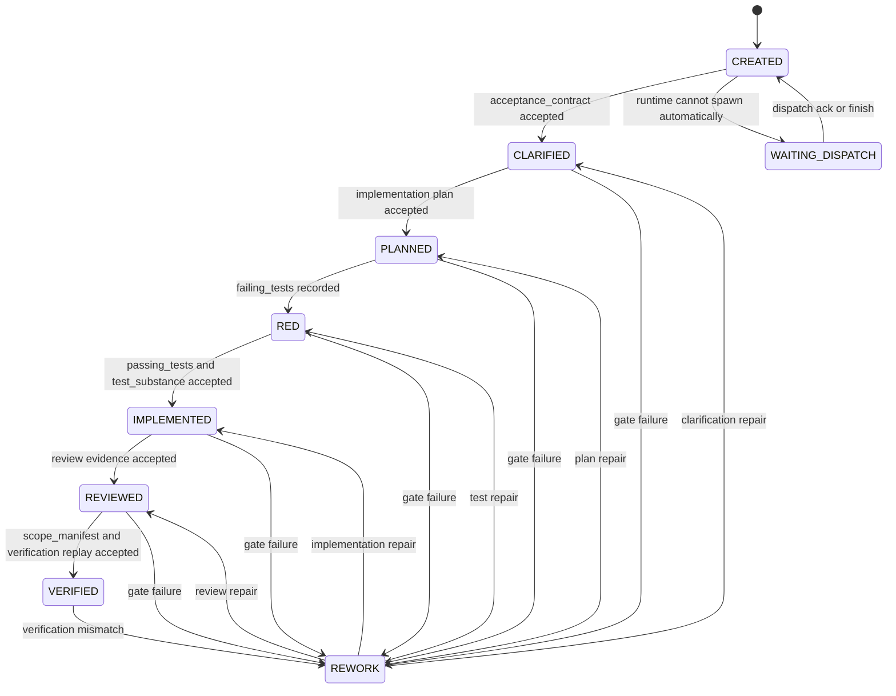
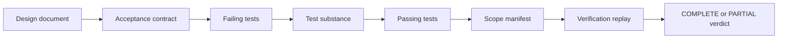
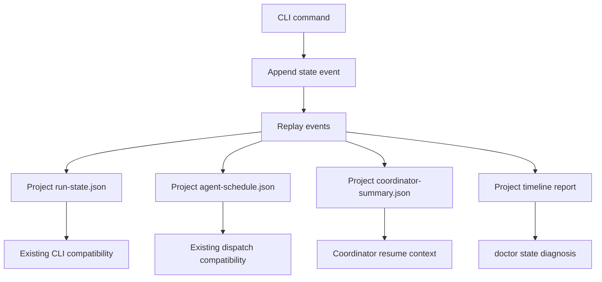

# Loop Engineering Control Plane Design

> Date: 2026-06-12
> Scope: `skills/e2e-dev-harness`
> Status: target design and staged implementation guide

## Executive Summary

当前工程可以演进为 Loop Engineering，但不应该先从改名或品牌包装开始。它已经具备 Loop Engineering 的关键内核：确定性控制面、隔离 worker、运行时 adapter、声明式 pipeline、证据 gate、guard 约束和交付保真链的早期实现。

更准确的定位是：

> `e2e-dev-harness` is a deterministic agent workflow harness that should become a Loop Engineering control plane.

Loop Engineering 在本文中的含义不是“多 agent 自动跑任务”，而是：

> 用一个可审计控制面，把需求、验收、任务分解、worker 执行、证据采集、gate 校验、返工路由、最终验证和恢复诊断连成闭环，并且不信任任何 worker 自报。

因此下一步不是扩大抽象面，而是先闭合两条链：

1. **交付保真链**：证明“通过 gate”确实收敛于“符合设计”。
2. **控制面真相链**：证明状态推进、失败诊断和恢复都来自同一条可审计事实链。

## Current Checkout Facts

以下是当前 checkout 应当被当作事实的能力边界：

- `run-state.json` 已经是版本化、加锁、原子写的单文件 SSOT 起点。
- `verification`、`acceptance_contract`、`test_substance`、`scope_manifest` 已进入 evidence validation 体系。
- `RuntimeAdapter` seam 已存在，Codex、Claude Code、OpenCode、manual runtime 共享 descriptor/capability 契约。
- `pipeline.py` 已支持 YAML pipeline 覆盖 phase spine、`exit_gate`、`produces` 和 `allows_code_write`。
- `navigation_map()` 默认 `skip_replay=True`，读状态不会误触发 verification replay。
- 当前 checkout 中 `doctor` 仍是浅层 installer readiness check，不能被写成成熟 run-level diagnosis。
- 当前 checkout 中没有成型的 `event_log.py`、`state_store.py`、`recover.py`。这些属于目标态或历史分支能力，不能当作当前事实。

## Design Principles

### 1. Fidelity Before Productization

如果 gate 只能证明“流程跑完”，不能证明“符合设计”，那么越自动化越危险。Loop Engineering 的第一原则是先证明交付保真，再谈产品化、插件化、UI 或品牌。

### 2. Coordinator Owns State

Coordinator 只负责状态推进、任务派发、对账、诊断和恢复。它不应该代替 worker 完成阶段产物，也不应该在恢复路径里写 worker-owned artifacts。

### 3. Workers Own Evidence

Worker 只拥有自己被调度任务要求的输出和 evidence。worker 可以失败、返工或补证，但不能靠自然语言声明完成。

### 4. Gates Own Transitions

生命周期跃迁必须由 gate 决定。prompt guidance 可以解释流程，但不能替代 gate。

### 5. Recovery Is A Control-Plane Path

恢复不是绕过 gate 的后门。恢复必须有计划、审批、输入 hash、输出 hash、影响范围和下一条合法命令。

## Target Architecture



## Loop Lifecycle



## Delivery Fidelity Chain

Loop Engineering 的核心不是 phase 数量，而是每一环都能对上一环负责。

| Link | Input | Output | Gate Question |
| --- | --- | --- | --- |
| Requirements fidelity | Design docs, user request | `acceptance_contract` | 每条需求是否变成可观察、可引用的验收项？ |
| Test fidelity | `acceptance_contract` | `failing_tests` | 测试是否覆盖验收项并真实失败？ |
| Substance fidelity | tests and code | `test_substance` | 测试是否有真实断言，避免空壳绿灯？ |
| Implementation fidelity | code changes | `passing_tests` | 同一批测试是否从红变绿？ |
| Scope fidelity | intended scope, changed files | `scope_manifest` | 交付范围是 COMPLETE 还是 PARTIAL？ |
| Evidence fidelity | command evidence | `verification` | 证据是否由受信取证函数产生并可 replay？ |



## Control-Plane Truth Chain

当前 `run-state.json` 是一个好的 SSOT 起点，但 Loop Engineering 需要更强的审计链。目标态不是马上删除兼容文件，而是让 append-only events 成为权威，现有 JSON 文件作为 projection。



### Event Types

Start with the smallest useful event set:

- `run.started`
- `phase.submitted`
- `gate.passed`
- `gate.failed`
- `dispatch.requested`
- `dispatch.acknowledged`
- `dispatch.finished`
- `dispatch.failed`
- `verification.replayed`
- `recovery.requested`
- `recovery.approved`
- `recovery.applied`

Each event should include:

- `schema`
- `event_id`
- `run_id`
- `phase`
- `task_id`
- `actor`
- `timestamp`
- `input_hashes`
- `output_hashes`
- `reason`
- `source_command`

## Doctor And Recovery Design

### `doctor --state`

`doctor --state` should be read-only. It should not mutate state, replay expensive verification, or attempt repair.

Required output fields:

```json
{
  "schema": "e2e-dev-harness.doctor-state.v1",
  "ready": false,
  "run_dir": "docs/agent-runs/example",
  "first_fault": {
    "kind": "missing_evidence",
    "phase": "IMPLEMENTED",
    "task_id": "T03",
    "message": "passing_tests evidence is missing"
  },
  "blocked_phase": "IMPLEMENTED",
  "blocked_task": "T03",
  "missing_evidence": ["passing_tests"],
  "next_legal_command": "e2e-harness dispatch-beat --run-dir docs/agent-runs/example",
  "coordinator_may_write_worker_outputs": false
}
```

### `recover`

`recover` should be a two-step path:

1. `recover --plan`: produce an auditable recovery plan.
2. `recover --apply --approval <path>`: apply only approved, narrow control-plane repairs.

Recovery must not:

- mark a worker task complete without trusted worker proof;
- rewrite worker-owned handoffs from coordinator context;
- turn a missing artifact into a passing state;
- silently collapse `PARTIAL` into `COMPLETE`;
- bypass evidence validators.

## Implementation Roadmap

### Phase 0: Baseline And Scope Freeze

Goal: establish the live repo baseline before changing architecture.

Tasks:

- Run `git status --short` and group existing changes by workstream.
- Run GitNexus `detect_changes` before committing any existing work.
- Run focused Python tests for `skills/e2e-dev-harness/tests`.
- Run Node tests and `npm pack --dry-run` before publishing claims.
- Record which failures are code defects and which are Windows temp or permission residue.

Exit criteria:

- Current checkout facts are known.
- Existing dirty work is not mixed into Loop Engineering changes.
- No architecture doc claims unimplemented event/recovery capabilities as current.

### Phase 1: Close Delivery Fidelity

Goal: make `VERIFIED` depend on the complete fidelity chain.

Primary files:

- `skills/e2e-dev-harness/scripts/e2e_harness/adapters/evidence/validate.py`
- `skills/e2e-dev-harness/scripts/e2e_harness/adapters/evidence/acceptance.py`
- `skills/e2e-dev-harness/scripts/e2e_harness/adapters/evidence/test_substance.py`
- `skills/e2e-dev-harness/scripts/e2e_harness/adapters/evidence/scope.py`

Required tests:

- forged `verification` evidence is rejected;
- missing `acceptance_contract` blocks downstream completion;
- empty or weak tests fail `test_substance`;
- `scope_manifest` can produce `PARTIAL` without allowing final `COMPLETE`;
- navigation reads remain side-effect-free.

Exit criteria:

- `acceptance_contract -> failing_tests -> test_substance -> passing_tests -> scope_manifest -> verification replay` is enforced end to end.

### Phase 2: Add Read-Only State Diagnosis

Goal: make run failures explainable without manual file archaeology.

Primary files:

- `skills/e2e-dev-harness/scripts/e2e_harness/cli/commands/doctor.py`
- new `skills/e2e-dev-harness/scripts/e2e_harness/core/state_diagnosis.py`
- `skills/e2e-dev-harness/tests/test_cli_doctor.py`

Required behavior:

- explain missing evidence;
- explain stale dispatch;
- explain worker-owned output blockers;
- distinguish missing content from missing proof;
- emit exactly one next legal command when possible.

Exit criteria:

- `doctor --state` can identify the first blocking fact for a stuck run.

### Phase 3: Add Approval-Gated Recovery

Goal: make recovery auditable and bounded.

Primary files:

- new `skills/e2e-dev-harness/scripts/e2e_harness/cli/commands/recover.py`
- new `skills/e2e-dev-harness/scripts/e2e_harness/core/recovery.py`
- `skills/e2e-dev-harness/scripts/e2e_harness/cli/main.py`
- new `skills/e2e-dev-harness/tests/test_cli_recover.py`

Required behavior:

- `recover --plan` writes a recovery plan without mutating state;
- `recover --apply` requires approval metadata;
- recovery records input and output hashes;
- recovery refuses worker-owned artifact writes from coordinator context.

Exit criteria:

- manual recovery becomes a control-plane repair path, not a convenience bypass.

### Phase 4: Introduce Minimal Event Writer

Goal: move from single-file truth toward auditable event truth without breaking compatibility.

Primary files:

- new `skills/e2e-dev-harness/scripts/e2e_harness/core/event_log.py`
- new `skills/e2e-dev-harness/scripts/e2e_harness/core/state_store.py`
- `skills/e2e-dev-harness/scripts/e2e_harness/core/run_state.py`

Required behavior:

- append lifecycle, dispatch, gate, verification and recovery events;
- replay events into `run-state.json` projection;
- preserve existing CLI JSON shapes;
- detect first projection mismatch.

Exit criteria:

- event replay can reconstruct the key fields currently read from `run-state.json`.

### Phase 5: Productize Loop Engineering

Goal: only after fidelity, diagnosis and recovery are stable, expose the platform identity.

Possible outputs:

- CLI alias or package wording for Loop Engineering;
- run timeline report;
- provider registry for gates/scanners/policies;
- product-facing docs;
- optional UI/report adapter.

Exit criteria:

- the term Loop Engineering refers to a proven closed loop, not just a renamed harness.

## Non-Goals

- Do not rename the package before Phase 1 and Phase 2 are complete.
- Do not introduce a broad plugin registry before the default fidelity chain is stable.
- Do not replace `run-state.json` immediately; keep it as a compatibility projection.
- Do not let recovery write worker-owned artifacts.
- Do not weaken phase guards to improve convenience.

## Readiness Definition

The project can call itself a Loop Engineering control plane when all of the following are true:

- A design document can be converted into a structured acceptance contract.
- Tests can be traced back to acceptance IDs.
- Final verification evidence is genuine, replayable and shape-validated.
- `COMPLETE` and `PARTIAL` are distinct machine states.
- A stuck run can be diagnosed with one read-only command.
- Recovery requires explicit approval and leaves an audit trail.
- State transitions are reconstructable from event truth or a verified projection.

## Recommended Next Step

Start with Phase 1 and Phase 2. They produce the most value with the least architectural risk:

1. finish the delivery fidelity chain;
2. add read-only `doctor --state`;
3. only then implement `recover` and event projection.

That sequence keeps the system honest. It prevents the project from productizing an attractive loop that still cannot prove it delivered the requested design.
