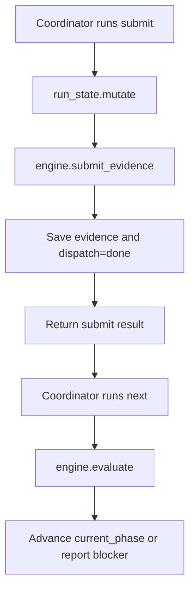
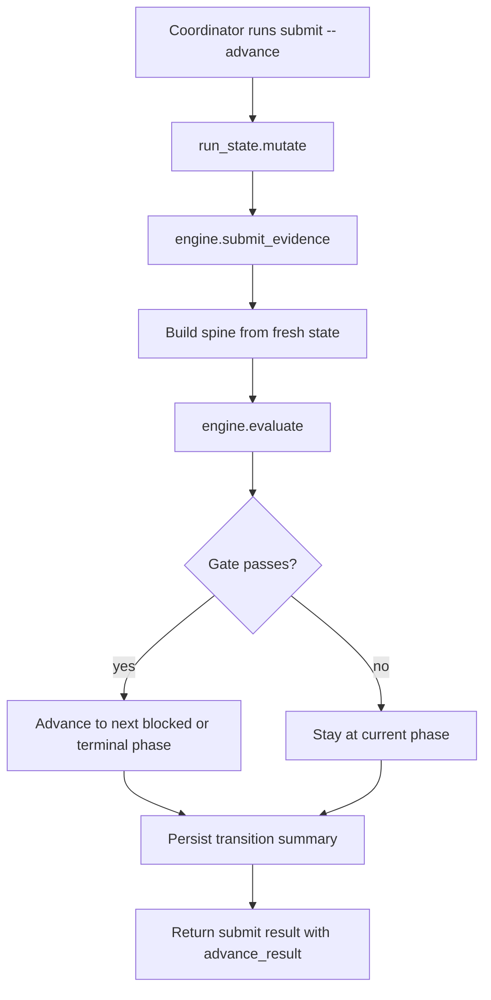

# e2e-dev-harness Controlled Synchronous Auto-Advance Design

> Date: 2026-06-11
> Scope: `skills/e2e-dev-harness`
> Status: design
> Decision: add an opt-in, synchronous, locked auto-advance path after evidence submission. Do not add a background watcher or mutate state from read-only commands.

## 1. Problem

The current run-state model is intentionally lazy:

```text
submit evidence -> current_phase stays where it is
next -> recompute gates and advance current_phase
```

That fail-safe behavior keeps code-write permissions restrictive until the coordinator explicitly runs `next`, but it creates a stale-state window. During that window all evidence for a phase can be present and valid while `run-state.json.current_phase` still points at the old phase. The result is confusing status output, repeated mechanical `next` calls, and phase-guard blocks that are correct by state but surprising by evidence.

The goal is to reduce that friction without weakening the control-plane boundary.

## 2. Non-Goals

- No background daemon, filesystem watcher, scheduled poller, or hidden async process.
- No state mutation from `status`, `navigation_map`, `gate`, hooks, or other read-only views.
- No worker-owned phase transition. Workers still produce artifacts; the CLI-owned control plane validates and mutates state.
- No resurrection of `WAITING_DISPATCH` as a lifecycle phase.
- No change to default behavior unless explicitly enabled.
- No bypass of evidence validation, command-evidence replay, scope-manifest validation, or phase gate closure.

## 3. Design Summary

Add a controlled auto-advance mode to `submit`:

```text
submit --advance
```

or an equivalent persisted run/pipeline policy:

```json
{
  "auto_advance": true
}
```

When enabled, `submit` records evidence and then, inside the same `run_state.mutate()` critical section, invokes the same evaluation engine used by `next`. If all required gate evidence is valid, `current_phase` advances to the next blocked phase or terminal phase. If evidence is missing or invalid, the state remains at the current phase and the submit result reports the blocker.

Default behavior remains unchanged:

```text
submit -> record evidence only
next -> advance
```

## 4. Why Synchronous, Not Async

The desired improvement is automatic convergence after evidence becomes sufficient. A true background async mechanism would add a second writer and a second lifecycle owner. That cuts against the harness's current strength: a deterministic single-file control plane with explicit mutation verbs.

This design keeps one writer path:

```text
CLI submit command
  -> run_state.mutate lock
  -> submit_evidence
  -> optionally evaluate gates
  -> save run-state
```

The user experience improves, but mutation remains deterministic, auditable, and bounded to one command invocation.

## 5. Current Flow



## 6. Proposed Flow



## 7. State Contract

### 7.1 Default

With no flag and no policy, `submit` preserves today's contract:

```text
current_phase advances only on next
```

The existing lazy behavior stays the compatibility baseline.

### 7.2 Controlled Auto-Advance

When enabled, `submit` may update `current_phase`, but only after:

1. Evidence has been recorded through `engine.submit_evidence`.
2. The phase spine has been derived from the run's current `pipeline` or embedded `pipeline_spec`.
3. `engine.evaluate(spine, state, repo_root)` has validated the same gates that `next` validates.
4. The operation remains inside one `run_state.mutate()` lock.

### 7.3 Failed Submissions

If `submit --status failed` is used, auto-advance must not run. A failed submission records:

```json
{
  "dispatch": "failed",
  "blocker": "<reason>"
}
```

The phase remains blocked until a later successful submission clears the blocker and an explicit or auto advance reevaluates the gate.

## 8. Command Contract

### 8.1 CLI

Add an optional flag:

```text
e2e-harness submit --state <path> --phase <phase> --key <key> --path <artifact> --advance
```

Optional run-state or pipeline policy can enable the same behavior without adding the flag every time:

```json
{
  "auto_advance": {
    "on_submit": true
  }
}
```

If both exist, the explicit CLI flag wins. A future `--no-advance` flag can override a policy if needed, but this first design does not require it.

### 8.2 Output

When auto-advance is not requested, output remains compatible:

```json
{
  "schema": "e2e-dev-harness.submit.v1",
  "phase": "CLARIFIED",
  "key": "acceptance_contract",
  "recorded": "docs/agent-runs/.../acceptance-contract.json",
  "status": "done"
}
```

When auto-advance is requested, add a bounded `advance_result` object:

```json
{
  "schema": "e2e-dev-harness.submit.v1",
  "phase": "CLARIFIED",
  "key": "acceptance_contract",
  "recorded": "docs/agent-runs/.../acceptance-contract.json",
  "status": "done",
  "advance_result": {
    "attempted": true,
    "advanced": true,
    "from": "CLARIFIED",
    "to": "RED",
    "complete": false,
    "blocked_phase": "RED",
    "missing_evidence": ["failing_tests"]
  }
}
```

If evidence is still incomplete:

```json
{
  "advance_result": {
    "attempted": true,
    "advanced": false,
    "from": "CLARIFIED",
    "to": "CLARIFIED",
    "complete": false,
    "blocked_phase": "CLARIFIED",
    "missing_evidence": ["acceptance_contract"]
  }
}
```

## 9. Audit Contract

Auto-advance must leave an explicit trace in `run-state.json` so a transition is not hidden inside a submit.

Add a compact transition record:

```json
{
  "last_transition": {
    "trigger": "submit:auto_advance",
    "from": "CLARIFIED",
    "to": "RED",
    "phase": "CLARIFIED",
    "evidence_key": "acceptance_contract",
    "advanced": true,
    "complete": false,
    "blocked_phase": "RED",
    "missing_evidence": ["failing_tests"],
    "at": "20260611T000000Z"
  }
}
```

This is a compatibility snapshot, not a full event log. If command-event emission is available for the simplified harness surface, emit the same transition summary there as an audit event. The run-state field is required; command events are additive.

## 10. Permissions and Phase Guard

Auto-advance can open code-write permission earlier than the current lazy model. That is acceptable only because:

- The behavior is opt-in.
- The transition uses the same gate evaluator as `next`.
- The evaluator runs under the CLI-owned control plane, not worker self-report.
- The phase guard continues to read `current_phase` and `pipeline.can_write_code(state)`.

This means a successful `submit --advance` from `RED` can move the run to `IMPLEMENTED`, and the next code write can be allowed. That is the intended ergonomic improvement and the main semantic change.

## 11. Concurrency Contract

The implementation must preserve these invariants:

- Every mutation stays inside `run_state.mutate()`.
- The phase spine used for evaluation is derived from the fresh in-lock state, or from immutable fields already loaded before the lock and revalidated in-lock.
- Parallel review submissions cannot lose evidence.
- Only the final submission that makes all required keys valid should advance the phase.
- Late submissions for the prior phase must not corrupt `current_phase`.

Recommended implementation shape:

```python
def _submit_and_maybe_advance(state):
    before = state.get("current_phase")
    engine.submit_evidence(...)
    result = None
    if should_advance and status != "failed":
        spine = pipeline.spine_for_state(state)
        state["_run_state_path"] = str(args.state)
        result = engine.evaluate(spine, state, repo_root)
        state.pop("_run_state_path", None)
        record_transition(state, before, state.get("current_phase"), result)
    holder["advance_result"] = result_to_output(before, state, result)
```

## 12. Validation and Replay

Auto-advance must not use `navigation_map(..., skip_replay=True)` semantics. It must call the same gate path as `next`, where command evidence and verification replay remain authoritative.

Expected behavior:

- Fake or missing artifact paths do not advance.
- Hash mismatches do not advance.
- Forged command evidence does not advance.
- Verification replay failure does not advance.
- Scope-manifest overclaim does not advance.

This means `submit --advance` can be slower than normal `submit`, especially at `VERIFIED`. That cost is explicit and opt-in.

## 13. Delivery Labeling

`next` currently labels final delivery from the VERIFIED scope manifest when completion is reached. Auto-advance must preserve that behavior.

When `engine.evaluate()` returns `complete: true`, the submit auto-advance path must run the same delivery labeling logic as `next`:

```text
scope_ev.label_delivery(state, repo_root)
-> state["delivery"]
-> state["undelivered"]
-> advance_result.delivery
-> advance_result.undelivered
```

Without this, `submit --advance` could reach terminal `VERIFIED` while missing the delivery truth marker.

## 14. Read-Only Boundary

The following commands and hooks must stay read-only with respect to lifecycle advancement:

- `status`
- `gate`
- `navigation_map`
- `phase_guard`
- `stop_guard`

They may report that auto-advance is available or suggest `submit --advance`, but they must not mutate run-state or call `engine.evaluate()` as a side effect.

## 15. Compatibility

Existing users and tests keep the lazy default. The existing test that asserts `submit` does not advance remains valid for default submit.

New tests should cover the explicit auto-advance path instead of replacing the lazy test:

```text
test_submit_does_not_advance_current_phase_by_default
test_submit_advance_moves_to_next_phase_when_gate_complete
test_submit_advance_stays_when_gate_incomplete
test_submit_advance_does_not_run_on_failed_submission
test_submit_advance_labels_delivery_on_terminal_completion
test_parallel_review_last_submit_can_advance_once
```

## 16. User-Facing Guidance

Worker instructions should remain unchanged: workers produce artifacts, not transitions.

Coordinator guidance can become:

```text
After receiving worker evidence, run submit --advance.
If advance_result.advanced is true, follow the returned blocked_phase/next_action.
If advance_result.advanced is false, inspect missing_evidence and continue the same phase.
```

This keeps the coordinator in charge while reducing the repeated `submit` then `next` sequence.

## 17. Risk Assessment

| Risk | Impact | Mitigation |
|---|---:|---|
| Code-write permission opens earlier | High | Opt-in only; same gate evaluator as `next`; tests around RED to IMPLEMENTED |
| `submit` becomes slow at final verification | Medium | Explicit `--advance`; document replay behavior |
| Hidden transition inside submit | Medium | Required `advance_result` output and `last_transition` snapshot |
| Parallel review race | Medium | Single `run_state.mutate()` critical section; concurrency tests |
| Incomplete terminal delivery labeling | High | Reuse `next` delivery-label logic on completion |
| Read-only paths accidentally mutate state | High | Tests for `status`, `gate`, navigation, hooks staying read-only |
| Existing lazy-contract tests break | Low | Keep default lazy; add separate auto-advance tests |

## 18. Acceptance Criteria

- Default `submit` does not advance `current_phase`.
- `submit --advance` records evidence and advances when all gates for the current phase pass.
- `submit --advance` leaves `current_phase` unchanged when gates fail or evidence is missing.
- `submit --status failed --advance` records failure and does not attempt advancement.
- Auto-advance runs inside `run_state.mutate()` and leaves no lock file behind.
- Auto-advance output includes `advance_result`.
- Run-state includes `last_transition` for any attempted auto-advance.
- Terminal auto-advance preserves delivery labeling.
- `status`, `gate`, navigation, phase guard, and stop guard remain read-only.
- Existing lazy tests and e2e CLI tests still pass.

## 19. Implementation Plan Sketch

1. Add tests proving default lazy behavior remains unchanged.
2. Add failing tests for `submit --advance` success and incomplete-gate behavior.
3. Add `--advance` argument to CLI parser and submit command args.
4. Add a pure helper in `cli/commands/submit.py` or a small core helper:
   `submit_and_maybe_advance(state, args, repo_root, should_advance)`.
5. Reuse `engine.submit_evidence`, `pipeline.spine_for_state`, and `engine.evaluate`.
6. Extract `next` terminal delivery-labeling into a shared helper so `next` and `submit --advance` cannot diverge.
7. Add `last_transition` snapshot writer.
8. Add concurrency tests for critical review fan-in.
9. Run targeted tests, then full Python suite.
10. Run GitNexus detect-changes before any commit.

## 20. Open Decisions

The design intentionally leaves only two implementation-time decisions:

1. Whether to support persisted policy in the first patch, or only `--advance`.
   Recommendation: start with `--advance` only; add policy after behavior is proven.
2. Whether `last_transition` should be one snapshot or a bounded list.
   Recommendation: start with one snapshot; command events can hold history where available.

## 21. Recommendation

Build this as an explicit synchronous capability first:

```text
submit --advance
```

Do not change the default lazy semantics in the first patch. Do not add a background watcher. Once the explicit path is stable and covered, a later change can decide whether selected pipelines should set `auto_advance.on_submit=true` by default.

This gives the harness most of the ergonomic and liveness benefit while preserving deterministic state ownership and auditability.

## 22. Self-Review

- No placeholders remain.
- The design preserves current lazy behavior by default.
- The proposed mutation path is single-writer and lock-contained.
- Read-only commands remain read-only.
- Terminal delivery labeling is explicitly preserved.
- The design is narrow enough for one implementation plan.
