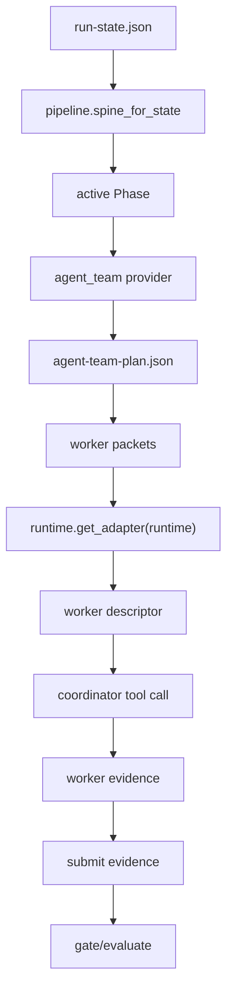

# Plugin Agent Team Design

> Date: 2026-06-11
> Scope: `skills/e2e-dev-harness`
> Goal: add plugin-style agent team support while preserving compatibility with Codex, Claude Code, OpenCode, and manual runtimes.

## Executive Summary

The harness already has the correct small control-plane core:

- `pipeline.py` resolves phase spines from built-in or custom YAML pipeline specs.
- `lifecycle.py` defines phase role, skill, produced evidence, gate evidence, and code-write permission.
- `core/dispatch.py` converts the active phase into a pointer worker packet.
- `cli/commands/dispatch.py` resolves runtime capabilities and blocks manual runtimes instead of pretending dispatch happened.
- `adapters/runtime/__init__.py` converts a worker packet into runtime-specific descriptors for Codex, Claude Code, OpenCode, and manual fallback.

The missing layer is not another hardcoded dispatcher. It is a plugin contract between phase planning and runtime spawning:

```text
pipeline phase -> agent team provider -> worker packets -> runtime adapter -> tool descriptor
```

The recommended design is an additive `agent_team` provider layer. It owns team profiles, role routing, fan-out strategy, and generated worker packets. The existing runtime adapter layer remains responsible only for translating each packet into the correct tool envelope for Claude Code, OpenCode, Codex, or manual operation.

## Current State

### Runtime compatibility that already exists

`adapters/runtime/__init__.py` exposes `get_adapter(runtime)` and `spawn_worker(packet, runtime)`.

Supported runtime shapes:

| Runtime | Tool descriptor | Isolation policy | Notes |
| --- | --- | --- | --- |
| `codex` | `multi_agent_v1.spawn_agent` | `fork_context=false` | Default runtime. No model pin. |
| `claude-code` | `Task` | fresh Task, no coordinator chat except context paths | Uses `subagent_type`. |
| `opencode` | `task` | fresh OpenCode task, no coordinator chat except context paths | Uses `subagent_type`. |
| `manual` | no tool | explicit human dispatch instruction | Must not mark phase as dispatched. |

`cli/commands/dispatch.py` already uses `runtime.get_adapter(...)`. If the adapter reports `can_auto_spawn=False`, dispatch returns `dispatch_blocked` and does not mark the phase `DISPATCHED`. This is the right safety behavior and should be preserved.

### Pipeline and role state

The current phase catalog is compact:

| Phase | Worker role | Worker skill | Evidence |
| --- | --- | --- | --- |
| `CLARIFIED` | `requirements-clarifier` | `e2e-harness-clarification` | `clarification`, `acceptance_contract` |
| `PLANNED` | `implementation-planner` | `e2e-harness-planning` | `plan` |
| `RED` | `tdd-red` | `e2e-harness-tdd-red` | `failing_tests` |
| `IMPLEMENTED` | `code-developer` | `e2e-harness-implementation` | `passing_tests`, `test_substance` |
| `REVIEWED` | `semantic-reviewer` | `e2e-harness-review` | `review`, or `r1_review/r2_review/r3_review` in critical/audited pipelines |
| `VERIFIED` | `coverage-reviewer` | `e2e-harness-completion` | `verification`, `scope_manifest`, optionally `audit_replay` |

Built-in pipeline tiers already express different evidence depth:

- `minimal`: clarify, red, implement, verify.
- `standard`: adds plan and review.
- `critical`: requires `r1_review`, `r2_review`, `r3_review`.
- `audited`: critical plus `audit_replay`.

This means agent team support should attach to pipeline phases and evidence contracts, not replace them.

## Design Goals

1. Plugin-style team definitions
   - Allow bundled and project-local agent team profiles without editing lifecycle code.
   - Let profiles define roles, runtime subagent aliases, fan-out strategy, context budgets, output keys, and reviewer topology.

2. Runtime portability
   - Claude Code and OpenCode must receive their native task descriptors.
   - Runtime-specific naming differences stay inside runtime adapters.
   - Team plugins must not call `Task`, `task`, or `multi_agent_v1.spawn_agent` directly.

3. Control-plane honesty
   - Coordinator owns phase state and transitions.
   - Workers own evidence artifacts.
   - Gates own transition decisions.
   - Runtime adapters only describe how to launch workers.

4. Backward compatibility
   - Existing pipeline YAML files continue to work.
   - Existing single-worker dispatch remains the default.
   - Existing `spawn_worker(packet, runtime)` tests stay valid.
   - Unknown runtimes continue to fall back to explicit manual blocking.

5. Auditable implementation
   - Every team decision is written to machine-readable artifacts.
   - Each spawned worker has a stable task id, role, phase, context paths, expected outputs, runtime descriptor, and evidence contract.

## Non-Goals

- Do not introduce a new lifecycle enum such as `WAITING_DISPATCH`.
- Do not let runtime adapters decide scheduling policy.
- Do not let team plugins bypass gates or write `run-state.json` directly.
- Do not support arbitrary third-party Python execution from untrusted paths by default.
- Do not parallelize code writers inside one service unless edit scopes are explicitly disjoint and phase guards can enforce them.

## Options Considered

### Option A: extend pipeline YAML only

Add `team`, `parallelism`, and `runtime_subagent_type` fields directly to pipeline phase entries.

Pros:

- Smallest implementation.
- Easy for existing custom pipeline users to understand.

Cons:

- Pipeline files become both lifecycle and orchestration policy.
- Hard to reuse a team profile across pipelines.
- Hard to validate role catalog, fan-out, and runtime portability separately.

### Option B: add a separate agent team provider layer

Add `e2e_harness/adapters/agent_team/` with a provider registry. Pipeline phases remain lifecycle declarations. Team providers expand a phase into one or more worker packets.

Pros:

- Clean boundary between lifecycle, team policy, and runtime launching.
- Supports bundled defaults plus project-local profiles.
- Keeps Claude Code/OpenCode compatibility in one runtime adapter layer.
- Makes testing straightforward: provider tests, runtime contract tests, dispatch integration tests.

Cons:

- Requires a new artifact schema and registry.
- Requires careful migration from single-worker dispatch to team-aware dispatch.

### Option C: runtime-owned teams

Let each runtime adapter define its own team behavior.

Pros:

- Runtime-specific features can be used quickly.

Cons:

- Duplicates scheduling semantics across Claude Code/OpenCode/Codex.
- Breaks portability.
- Makes manual fallback and testing harder.
- Risks letting runtime implementation details leak into evidence gates.

Recommendation: choose Option B.

## Proposed Architecture



### New package

Create:

```text
skills/e2e-dev-harness/scripts/e2e_harness/adapters/agent_team/
  __init__.py
  base.py
  builtin.py
  registry.py
  schema.py
```

Responsibility:

- Load bundled and optional project-local team profiles.
- Select a profile for the current pipeline, tier, phase, and runtime.
- Expand one phase into a deterministic team plan.
- Produce worker packets that remain compatible with `runtime.spawn_worker(...)`.

The package must be pure. It reads specs and returns dictionaries. It must not spawn tools, mutate run-state, or register evidence.

### Provider protocol

```python
class AgentTeamProvider(Protocol):
    name: str

    def capabilities(self) -> dict:
        ...

    def plan_phase(self, request: dict) -> dict:
        ...
```

`request`:

```json
{
  "schema": "e2e-dev-harness.agent-team-request.v1",
  "run_state_path": "docs/agent-runs/<run>/run-state.json",
  "runtime": "claude-code",
  "pipeline": "critical",
  "phase": {
    "name": "REVIEWED",
    "worker_role": "semantic-reviewer",
    "worker_skill": "e2e-harness-review",
    "produces": ["r1_review", "r2_review", "r3_review"],
    "exit_gate": ["r1_review", "r2_review", "r3_review"],
    "allows_code_write": false
  },
  "context_paths": ["docs/agent-runs/<run>/run-state.json"],
  "team_profile": "default-critical",
  "constraints": {
    "max_workers": 3,
    "fresh_context": true,
    "allow_code_write": false
  }
}
```

`plan_phase(...)` returns:

```json
{
  "schema": "e2e-dev-harness.agent-team-plan.v1",
  "provider": "builtin",
  "profile": "default-critical",
  "phase": "REVIEWED",
  "execution_model": "reviewer-fanout",
  "max_workers": 3,
  "workers": [
    {
      "id": "REVIEWED-r1",
      "role": "semantic-reviewer",
      "runtime_subagent_type": "semantic-reviewer",
      "skill": "e2e-harness-review",
      "context_paths": ["docs/agent-runs/<run>/run-state.json"],
      "expected_outputs": ["r1_review"],
      "parallel_group": "review:r1",
      "depends_on": [],
      "context_policy": "fresh"
    }
  ],
  "blocked_parallelism": [],
  "evidence_contract": {
    "required_keys": ["r1_review", "r2_review", "r3_review"],
    "producer_ids": ["REVIEWED-r1", "REVIEWED-r2", "REVIEWED-r3"]
  }
}
```

## Team Profile Schema

Bundled profiles should live under:

```text
skills/e2e-dev-harness/agent-teams/
  default-minimal.yaml
  default-standard.yaml
  default-critical.yaml
  default-audited.yaml
```

Project-local profiles may live under:

```text
.e2e/agent-teams/*.yaml
```

The registry loads bundled profiles first, then project-local overlays by explicit name only. Project-local profiles must not silently override bundled defaults unless the run-state or CLI explicitly selects them.

Example:

```yaml
schema: e2e-dev-harness.agent-team-profile.v1
name: default-critical
description: Critical pipeline with independent R1/R2/R3 review fan-out.
runtime_compat:
  claude-code:
    task_tool: Task
    subagent_field: subagent_type
  opencode:
    task_tool: task
    subagent_field: subagent_type
  codex:
    task_tool: multi_agent_v1.spawn_agent
roles:
  requirements-clarifier:
    skill: e2e-harness-clarification
    runtime_subagent_type: requirements-clarifier
    max_workers: 1
  implementation-planner:
    skill: e2e-harness-planning
    runtime_subagent_type: implementation-planner
    max_workers: 1
  tdd-red:
    skill: e2e-harness-tdd-red
    runtime_subagent_type: test-case-developer
    max_workers: 1
  code-developer:
    skill: e2e-harness-implementation
    runtime_subagent_type: code-developer
    max_workers: 1
    requires_claim: true
  semantic-reviewer:
    skill: e2e-harness-review
    runtime_subagent_type: semantic-reviewer
    max_workers: 3
  coverage-reviewer:
    skill: e2e-harness-completion
    runtime_subagent_type: coverage-reviewer
    max_workers: 1
phases:
  REVIEWED:
    strategy: evidence-key-fanout
    workers:
      - id_suffix: r1
        expected_outputs: [r1_review]
      - id_suffix: r2
        expected_outputs: [r2_review]
      - id_suffix: r3
        expected_outputs: [r3_review]
```

The profile can declare runtime compatibility metadata for validation, but runtime launch shape still comes from `adapters/runtime`.

## Runtime Compatibility Rules

### Common invariant

The agent team provider emits the same packet shape for all runtimes:

```json
{
  "schema": "e2e-dev-harness.worker-packet.v1",
  "role": "semantic-reviewer",
  "skill": "e2e-harness-review",
  "runtime_subagent_type": "semantic-reviewer",
  "context_paths": ["docs/agent-runs/<run>/run-state.json"],
  "expected_outputs": ["r1_review"]
}
```

Runtime adapters translate that packet:

- Claude Code: `tool="Task"`, `arguments.description`, `arguments.prompt`, `arguments.subagent_type`.
- OpenCode: `tool="task"`, `arguments.description`, `arguments.prompt`, `arguments.subagent_type`.
- Codex: `tool="multi_agent_v1.spawn_agent"`, `arguments.agent_type="worker"`, `arguments.fork_context=false`, `arguments.message`.
- Manual: `tool=None`, explicit `instruction`, dispatch blocks.

### Required adapter change

The current `_subagent_type(role)` reads environment overrides by role and otherwise returns `general-purpose`.

For plugin teams, add packet-level override support while preserving env precedence:

```python
def _subagent_type(role: str, packet: dict | None = None) -> str:
    key = "E2E_HARNESS_SUBAGENT_TYPE_" + str(role).strip().upper().replace("-", "_")
    override = os.environ.get(key, "").strip()
    if override:
        return override
    if packet:
        declared = str(packet.get("runtime_subagent_type", "")).strip()
        if declared:
            return declared
    return PORTABLE_SUBAGENT_TYPE
```

Then call `_subagent_type(role, packet)` from Claude Code and OpenCode descriptor builders.

This preserves the validated order:

```text
env override -> team/profile-declared runtime_subagent_type -> general-purpose
```

### OpenCode and Claude Code portability

Do not assume the two runtimes use the same tool name:

- Claude Code descriptor uses `Task`.
- OpenCode descriptor uses `task` in the current codebase.

Do assume both can consume:

- a textual prompt,
- a description,
- a runtime subagent alias,
- fresh context policy,
- expected output paths/keys.

If OpenCode later changes its tool casing or argument shape, only `_opencode(packet)` changes. Team profiles and gates do not change.

## Dispatch Flow

### Phase dispatch before this design

```text
dispatch command
  -> load run-state
  -> find active phase
  -> build one worker packet
  -> runtime adapter creates descriptor
  -> mark DISPATCHED if runtime can auto-spawn
```

### Phase dispatch after this design

```text
dispatch command
  -> load run-state
  -> find active phase
  -> agent_team registry selects provider/profile
  -> provider returns agent-team-plan
  -> for each ready worker:
       runtime adapter creates descriptor
  -> write descriptors to compact output
  -> mark DISPATCHED only if at least one auto-spawn descriptor is returned
```

Manual runtime remains blocked:

- Provider may still return a plan.
- Runtime adapter reports `can_auto_spawn=False`.
- Dispatch output includes `dispatch_blocked`.
- Phase is not marked `DISPATCHED`.

## Artifacts

New generated artifacts:

```text
docs/agent-runs/<run>/agent-team-plan.json
docs/agent-runs/<run>/dispatch-invocations/<phase>-<timestamp>.json
```

`agent-team-plan.json` is the durable plan for the active phase or run. `dispatch-invocations/*` records what the coordinator should spawn for a specific dispatch call.

Minimum invocation record:

```json
{
  "schema": "e2e-dev-harness.dispatch-invocation.v1",
  "phase": "REVIEWED",
  "runtime": "opencode",
  "team_plan_path": "docs/agent-runs/<run>/agent-team-plan.json",
  "descriptors": [
    {
      "worker_id": "REVIEWED-r1",
      "runtime": "opencode",
      "tool": "task",
      "arguments": {
        "description": "semantic-reviewer: e2e-harness-review",
        "subagent_type": "semantic-reviewer"
      },
      "expected_outputs": ["r1_review"]
    }
  ],
  "blocked": []
}
```

## Gate Integration

The existing gates should remain evidence-key based. Agent team support adds producer accountability:

- `gates.gate_passes(...)` still checks required evidence keys.
- A new helper may validate `agent-team-plan.evidence_contract` against registered evidence producers.
- `submit_evidence(...)` should continue to hash real files when `repo_root` is available.

Critical and audited review should remain strict:

- `REVIEWED` in `critical` requires `r1_review`, `r2_review`, `r3_review`.
- Team provider fans these out into three reviewer workers.
- Gate only passes when all required keys exist.
- Reviewer independence can be checked from producer ids and runtime/session metadata.

## CLI Surface

Keep the existing command small:

```powershell
e2e-harness dispatch . --state docs/agent-runs/<run>/run-state.json --runtime opencode
```

Add optional flags:

```text
--team-profile <name>
--max-workers <n>
--json
```

Do not require a new command for the default path. The default behavior should remain one worker for minimal and standard phases except where pipeline evidence requires fan-out.

Add inspection command only if needed after the core path is stable:

```powershell
e2e-harness team-plan . --state docs/agent-runs/<run>/run-state.json --runtime claude-code --team-profile default-critical
```

This command should be read-only and useful for debugging profile selection without dispatching.

## Implementation Plan

### Phase 1: provider contract and builtin single-worker compatibility

Files:

- Create `skills/e2e-dev-harness/scripts/e2e_harness/adapters/agent_team/base.py`
- Create `skills/e2e-dev-harness/scripts/e2e_harness/adapters/agent_team/builtin.py`
- Create `skills/e2e-dev-harness/scripts/e2e_harness/adapters/agent_team/registry.py`
- Create `skills/e2e-dev-harness/tests/test_agent_team_provider.py`

Acceptance:

- Builtin provider turns a normal phase into exactly the same worker packet that `core.dispatch.worker_packet(...)` emits today.
- Single-worker dispatch output is unchanged for minimal and standard single evidence phases.
- Provider functions are pure and do not mutate state.

### Phase 2: packet-level runtime subagent type

Files:

- Modify `skills/e2e-dev-harness/scripts/e2e_harness/adapters/runtime/__init__.py`
- Extend `skills/e2e-dev-harness/tests/test_runtime_spawn.py`
- Extend `skills/e2e-dev-harness/tests/test_runtime_adapter_contract.py`

Acceptance:

- Claude Code descriptor honors `packet["runtime_subagent_type"]` when no env override exists.
- OpenCode descriptor honors `packet["runtime_subagent_type"]` when no env override exists.
- Existing env override tests continue to pass.
- Codex remains model-unpinned and context-isolated.

Required GitNexus before editing:

```text
impact({ repo: "e2e-dev-workflow", target: "_subagent_type", direction: "upstream" })
impact({ repo: "e2e-dev-workflow", target: "_claude_code", direction: "upstream" })
impact({ repo: "e2e-dev-workflow", target: "_opencode", direction: "upstream" })
```

### Phase 3: dispatch consumes agent team plans

Files:

- Modify `skills/e2e-dev-harness/scripts/e2e_harness/cli/commands/dispatch.py`
- Modify `skills/e2e-dev-harness/scripts/e2e_harness/core/dispatch.py` only if packet schema helpers need extension.
- Add `skills/e2e-dev-harness/tests/test_agent_team_dispatch.py`

Acceptance:

- Dispatch can emit multiple descriptors for a phase whose profile expands to multiple workers.
- Manual runtime still blocks and does not mark the phase `DISPATCHED`.
- Auto-spawn runtimes mark `DISPATCHED` after descriptors are produced.
- Output includes `agent_team_plan` and per-worker descriptors.

Required GitNexus before editing:

```text
impact({ repo: "e2e-dev-workflow", target: "run", file_path: "skills/e2e-dev-harness/scripts/e2e_harness/cli/commands/dispatch.py", direction: "upstream" })
impact({ repo: "e2e-dev-workflow", target: "worker_packet", direction: "upstream" })
```

### Phase 4: bundled profile files and registry validation

Files:

- Create `skills/e2e-dev-harness/agent-teams/*.yaml`
- Add `skills/e2e-dev-harness/scripts/e2e_harness/adapters/agent_team/schema.py`
- Add profile validation tests.

Acceptance:

- Builtin profile files validate against the schema.
- Profile load order is deterministic.
- Project-local profiles load only by explicit name.
- Invalid profile errors identify the path and field.

### Phase 5: critical/audited reviewer fan-out

Files:

- Extend builtin critical and audited profiles.
- Extend dispatch tests.
- Extend gate/review tests if producer identity validation is added.

Acceptance:

- Critical `REVIEWED` phase expands to R1/R2/R3 reviewer workers.
- Each worker has one expected evidence key.
- Gate remains evidence-key based and requires all three keys.
- Producer metadata can prove reviewer independence.

### Phase 6: docs, installed-copy sync, and change detection

Files:

- Update `skills/e2e-dev-harness/SKILL.md`.
- Update `skills/e2e-dev-harness/references/agent-orchestration.md`.
- Run installer sync after implementation.

Verification:

```powershell
python -m pytest skills/e2e-dev-harness/tests/test_runtime_spawn.py
python -m pytest skills/e2e-dev-harness/tests/test_runtime_adapter_contract.py
python -m pytest skills/e2e-dev-harness/tests/test_agent_team_provider.py
python -m pytest skills/e2e-dev-harness/tests/test_agent_team_dispatch.py
python -m pytest skills/e2e-dev-harness/tests/test_dispatch.py
node tools\install-e2e-dev-harness.mjs --sync --yes --json
```

Before commit:

```text
detect_changes({ repo: "e2e-dev-workflow", scope: "all" })
```

## Test Matrix

| Area | Test |
| --- | --- |
| Provider parity | Single phase produces same packet fields as current dispatch. |
| Profile validation | Builtin profiles parse, invalid local profile fails with field path. |
| Claude Code | Descriptor uses `Task`, prompt, description, `subagent_type`, no model pin. |
| OpenCode | Descriptor uses `task`, prompt, description, `subagent_type`, no model pin. |
| Codex | Descriptor uses `multi_agent_v1.spawn_agent`, `fork_context=false`, no model pin. |
| Manual | Dispatch returns blocked and does not mark `DISPATCHED`. |
| Critical review | R1/R2/R3 fan-out creates three workers and three expected evidence keys. |
| Gates | Existing evidence keys still control phase transition. |
| Backward compatibility | Existing runtime and dispatch tests pass without profile selection. |

## Risks and Mitigations

| Risk | Mitigation |
| --- | --- |
| Plugin config becomes a control-plane bypass | Providers are pure planners; only dispatch/run-state/gates mutate state. |
| Runtime-specific behavior leaks into profiles | Profiles declare intent; runtime adapters own tool descriptors. |
| OpenCode and Claude Code diverge | Keep separate adapter functions and shared descriptor contract tests. |
| Reviewer fan-out produces evidence but no independence proof | Add producer/runtime metadata to invocation records and validate it in review gate. |
| Single-service code parallelism causes edit conflicts | Keep single-service code serial until explicit disjoint edit scopes and phase guard enforcement exist. |
| Existing custom pipelines break | Default provider treats each phase as one worker unless profile expands it. |

## Migration Strategy

1. Implement the provider layer with behavior parity.
2. Add packet-level `runtime_subagent_type` support.
3. Thread provider output through dispatch while keeping single-worker default.
4. Add profile files for bundled tiers.
5. Enable critical/audited reviewer fan-out.
6. Add optional project-local profiles.
7. Only after the above is stable, consider multi-service or task-lane code fan-out.

This order keeps the compatibility surface stable. The first release can ship with no visible behavior change except richer metadata. Later releases can enable fan-out profile by profile.

## Open Decisions

1. Should project-local profiles be allowed outside `.e2e/agent-teams/`?
   - Recommendation: no. Keep the trust boundary narrow.

2. Should `dispatch` write `agent-team-plan.json`, or should `start/plan` generate it?
   - Recommendation: dispatch writes a phase-local plan first. Later, planning can precompute whole-run schedules.

3. Should critical reviewer fan-out be enabled immediately?
   - Recommendation: yes after provider parity and descriptor tests pass, because the existing `critical.yaml` already requires separate evidence keys.

4. Should OpenCode use `task` or `Task`?
   - Recommendation: preserve the current codebase contract, which uses `task`. If OpenCode changes, update only `_opencode(packet)` and its tests.

## Final Shape

The durable architecture should look like this:

```text
Lifecycle:
  pipeline + Phase define what evidence a phase needs.

Agent team:
  provider/profile defines how many workers produce that evidence.

Runtime:
  adapter defines how one worker packet becomes a runtime-specific task descriptor.

Control plane:
  dispatch emits descriptors, submit registers evidence, gate advances state.
```

That gives the project plugin-style agent teams without sacrificing the core guarantee that the harness state, evidence, and runtime-visible truth remain auditable.
