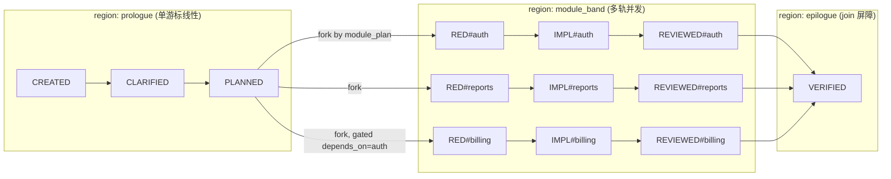

# Multi-Track Concurrent Coordinator Design

> Date: 2026-06-12
> Scope: `skills/e2e-dev-harness`
> Status: approved design, pending implementation plan
> Related: `docs/loop-engineering-control-plane-design.md`

## Executive Summary

今天 `e2e-dev-harness` 的并行只活在 **dispatch 扇出**：在多模块运行的 module-scoped 阶段，`dispatch` 用 `multitrack.ready_frontier()` 算出独立可派的模块前沿，再用 `plan_module_fanout()` 一次发出 N 个 worker descriptor。但**状态机的真相只有一个游标**——`multitrack.expand()` 把所有模块拓扑**拍平成一条线性 spine**，`engine.evaluate()` 沿 `next_phase` 每次 `next` 只推进一个阶段。前沿（并行意图）算出来了，coordinator 却仍逐 `next` 扫拍平顺序。

本设计把引擎从"单一拍平游标"演进为**一等公民多轨**（方案 B）：每个模块一条**独立游标的轨**，在 fork-join 结构里**端到端并发推进**，`current_phase` 降为派生的"领头游标"做向后兼容。harness 仍是**纯控制面**——真正的并行 spawn 仍由 coordinator agent 在一个回合里发 N 个 `Task`/`spawn_agent` 并 `await` 全部。

## Problem Statement

| 观察 | 事实出处 |
| --- | --- |
| 扇出在 dispatch 层 | `cli/commands/dispatch.py` 调 `ready_frontier` + `plan_module_fanout`，`execution_model: module-fanout` |
| 引擎是单游标 | `core/multitrack.py::expand` 拓扑拍平；`core/engine.py::evaluate` 单 `current_phase`，每次 `next` 推进一个阶段（docstring 自述）|
| dispatch 账本单游标 | `dispatch.py::_mark_dispatched` 只对 `state["current_phase"]` 打标，前沿兄弟模块无独立 dispatch 记录 |
| coordinator 循环单数 | `SKILL.md` 循环为 `next → dispatch → spawn worker → submit → next`（单数）|
| `current_phase` 是承重字段 | 横跨 10 个文件读取：dispatch / gate / pipeline / phase_guard / pipeline_validate / navigation / engine / start / run_state / stop_guard |

结论：要做到"真正多 worker 并发执行"，缺口在三处——引擎需要**多轨独立游标**、dispatch/submit/gate 需要**按轨记账**、coordinator 循环需要从"单步"变成"**一拍 fan-out + 全部回收再对账**"的 beat 模型。

## Goals / Non-Goals

### Goals

- 模块 band 内的独立模块**端到端并发推进**（各自游标，不再靠单游标扫拍平顺序）。
- 按轨记 dispatch / 证据 / gate / rework，失败轨**不阻塞**兄弟轨。
- `depends_on` 作为 **fork 门控**、VERIFIED 作为 **join 屏障**，二者都由状态机强制。
- 保留 harness **纯控制面**：真正并行 spawn 仍是 coordinator 的活。

### Non-Goals

- 不在 harness 内置并发执行器 / 子进程编排（纯控制面边界，已与用户确认）。
- 不引入 `event_log`/`state_store` 事件真相链（属设计文档 Phase 4，本次 YAGNI）。
- 不新增 CLI 动词（遵守 design §6 动词克制；`dispatch`/`next` 改为 region-aware）。
- 不改动 gate 校验真实产物的机制，也不弱化 phase guard。

## Invariants Preserved

1. **Gates own transitions** —— 每条轨的每次跃迁仍由 gate 依据证据 keys 决定。
2. **Workers don't self-report** —— 仍靠 namespaced 证据，不靠自然语言声明完成。
3. **Harness stays pure control plane** —— harness 永不 spawn；coordinator 发真实工具调用。
4. **Run-state 加锁原子版本化写** —— 并发 submit 经 `run_state.mutate` 串行化，证据对账是与顺序无关的不动点。
5. **Simple runs pay nothing** —— `tracks` 为 0/1 条时 band 退化为今天单链，单模块运行行为逐字节不变。

## Architecture: Fork-Join Three Regions



- **prologue**（CREATED→CLARIFIED→PLANNED）：whole-run 单例，一个游标，行为与今天一致。产物 `acceptance_contract`/`plan`/`module_plan` 不变。
- **module_band**：PLANNED 后按 `module_plan` fork 成 M 条轨，每轨子 spine `RED#m→IMPLEMENTED#m→REVIEWED#m`，各自独立游标并发推进，受 `depends_on` 门控。
- **epilogue**：VERIFIED 是 join 屏障，所有轨 `complete` 才能进。

## State Schema

在现有 run-state 上**增量加字段**，不破坏 `phases` 证据结构：

```jsonc
{
  "current_phase": "<派生：领头游标>",          // 兼容投影
  "region": "prologue" | "module_band" | "epilogue",
  "tracks": {
    "auth":    { "module_id": "auth",    "current_phase": "IMPLEMENTED#auth", "dispatch": "dispatched", "depends_on": [],       "complete": false },
    "reports": { "module_id": "reports", "current_phase": "RED#reports",      "dispatch": "pending",    "depends_on": [],       "complete": false },
    "billing": { "module_id": "billing", "current_phase": "RED#billing",      "dispatch": "pending",    "depends_on": ["auth"], "complete": false }
  },
  "phases": {
    "IMPLEMENTED#auth": { "evidence": { "passing_tests#auth": { "path": "...", "sha256": "...", "bytes": 123 } } }
  }
}
```

- **证据与 gate 机器完全不动**：证据仍住 `phases[namespaced].evidence`，gate 仍判某阶段 exit_gate keys；多轨只是把同一套 gate **按轨各调一次**。复用现有 `multitrack._namespaced_phase` 的命名空间隔离。
- `tracks[m].dispatch` 用现有 `DispatchStatus` 枚举（pending/dispatched/running/done/failed），**按轨**取代今天只给 `current_phase` 打标。
- `tracks` 由 `module_plan` 在 fork 时一次性物化（含 `depends_on`），之后只更新各轨游标/状态。

## `current_phase` Projection (向后兼容)

`current_phase` 降为**派生的领头游标**，规则确定性：

- `region == prologue | epilogue` → 就是那个单例阶段名（CREATED…PLANNED / VERIFIED）。
- `region == module_band` → 取**最不前进的活跃轨**的 namespaced `current_phase`；并列时按 `module_plan` 拓扑序 tie-break。

这样 navigation 的 `you_are_here`、两个 guard（phase_guard/stop_guard）、gate、pipeline_validate 等**单游标读者全部继续工作**，而 `tracks` 才是真相。投影是纯函数，单测覆盖确定性。

## Engine: Region-Aware Per-Track Advance

`engine.evaluate` 从"单线性游标 walk"改成**分区评估**（仍是终止的：每轨沿有限子 spine 推进 ≥0 阶段后 block/complete）：

```python
def evaluate(spine, state, repo_root=None) -> dict:
    region = _region_of(state)
    if region in ("prologue", "epilogue"):
        return _evaluate_singleton(spine, state, repo_root)   # 复用今天的单游标逻辑
    return _evaluate_band(spine, state, repo_root)            # 多轨
```

- **`_evaluate_singleton`**：今天的逻辑原样跑单例阶段；PLANNED 通过后若 `module_plan` ≥2 模块 → 物化 `tracks`、`region = module_band`、fork。
- **`_evaluate_band`**：对每条**活跃轨**（`active = 所有 depends_on 轨都 complete`）把 `tracks[m].current_phase` 沿子 spine 推过所有已过 gate，停在该轨第一个 blocker；推到 REVIEWED-complete 标 `tracks[m].complete = true`。
- **join**：所有轨 `complete` → `region = epilogue`、`current_phase = VERIFIED`，再跑 VERIFIED gate。
- **返回值**：band 区返回多 blocker
  ```jsonc
  { "region": "module_band",
    "tracks_frontier": [
      { "track": "auth",    "blocked_phase": "IMPLEMENTED#auth", "missing": ["passing_tests#auth"], "worker_packet": {...} },
      { "track": "reports", "blocked_phase": "RED#reports",      "missing": ["failing_tests#reports"], "worker_packet": {...} }
    ],
    "blocked_phase": "<领头游标>", "next_action": {...} }   // 单 blocker 投影，旧调用者/测试不破
  ```

`tracks_frontier` 即一拍的派发集；`blocked_phase`/`next_action` 仍投影领头游标，保证读单 blocker 的旧路径不破。

## Beat Cycle & CLI Verb Surface (不加新动词)

遵守 design §6 动词克制：**不新增 `beat` 动词**，让现有两动词 region-aware：

- `dispatch` @ band：扇出**整条 frontier**（每条活跃轨一个 descriptor，复用 `plan_module_fanout` + runtime adapter），并**按轨**写 `tracks[m].dispatch = "dispatched"`。
- `next` @ band：返回整条 `tracks_frontier`，并把所有 gate 已过的轨推到不动点。

一个 **beat** = 一次并发循环：

```text
next (看到 tracks_frontier)
  → dispatch (band 区：一次拿到整批 descriptor，按轨记 dispatched)
  → coordinator 一个回合发 N 个 Task/spawn_agent 并 await 全部   ← 真并发在这里
  → 各 worker submit 自己的 namespaced 证据 (经 run_state.mutate 串行化)
  → next (对账：所有过 gate 的轨推进；失败轨进 rework；新解锁的依赖轨进下一拍 frontier)
```

循环 beat 直到 join → VERIFIED。doctor 设计文档里的 `dispatch-beat` 映射为"band 区的 dispatch"。

> 决策记录：用户已拍板不加显式 `beat` 动词（保 §6）。

## Per-Track Rework Isolation

`_rework_target` 的单链假设改成**轨内回溯**：轨 m 内某阶段失败，只在 m 的子 spine 找最近可写代码阶段回退，**其它轨不受影响**——这是一等公民多轨的最大红利。

**Verification-rework（v1 简化，已拍板）**：VERIFIED join 后若 verification 不符——

- 能归因到模块（missing 证据 key 带 `#m` 后缀）→ 只重开对应轨（重置该轨 `complete=false`、`current_phase` 回到轨内 rework target、`region` 退回 `module_band`）。
- 不能归因 → 保守重开全部轨。

精确按模块归因留作 future work。

## navigation_map Multi-Track View

`navigation_map` 加两个**增量字段**，顶层 `you_are_here/phases/progress/next` 形状保持：

```jsonc
{
  "schema": "e2e-dev-harness.navigation-map.v1",
  "region": "module_band",
  "you_are_here": "<领头游标>",
  "tracks": [
    { "module_id": "auth",    "phases": [...lane...], "progress": "2/3", "dispatch": "dispatched", "blocked_by_deps": [] },
    { "module_id": "billing", "phases": [...lane...], "progress": "0/3", "dispatch": "pending",    "blocked_by_deps": ["auth"] }
  ],
  "phases": [...], "full_catalog": [...], "progress": "5/9", "next": {...}
}
```

每条轨一条 lane（自己的阶段状态 + progress + dispatch + 被哪些 depends_on 挡住）；旧渲染（顶层字段）不破。

## Determinism & Concurrency Safety

- 所有轨推进是**证据存在 + gate 结果**的纯函数 → 确定性。
- 并发 submit 经 `run_state.mutate` 加锁原子写**串行化**；beat 的"并发"在 spawn worker，证据对账是与顺序无关的不动点 → 同一批证据无论 submit 顺序，`next` 收敛到同一状态。
- gate 仍独占每条轨的每次跃迁；harness 仍永不 spawn。

## Back-Compat / Degenerate Single-Track

- `tracks` 为 0 条（无 module_plan 或单模块）→ 永不进 `module_band`，走今天的单游标 prologue→…→VERIFIED，**零变化**。
- 现有单轨测试预期全绿（frontier≤1 路径不变）。
- `current_phase`/`navigation_map`/guards 的旧字段全部保留，新增字段为 additive。

## Affected Surface (待实现期逐符号 impact 复核)

| 文件 | 改动性质 |
| --- | --- |
| `core/engine.py` | `evaluate` 分区化；`_rework_target` 轨内化；新增 `_evaluate_band`/`_region_of`/join 逻辑 |
| `core/multitrack.py` | 复用 `ready_frontier`/`module_of`；新增 fork 物化 `tracks` + 投影 `current_phase` |
| `core/run_state.py` | schema 增 `region`/`tracks`（版本兼容默认值）|
| `core/navigation.py` | 加 `region`+`tracks` lane 视图（增量）|
| `cli/commands/dispatch.py` | band 区扇出整条 frontier + 按轨 `dispatch` 记账 |
| `cli/commands/next.py` | 透传 `tracks_frontier` |
| `adapters/agent_team/builtin.py` | `plan_module_fanout` 已支持，按需对齐 worker id/parallel_group |
| `SKILL.md` | coordinator 循环改为 beat 语义（一拍 fan-out + 全部回收再对账）|

> 项目铁律：实现期对每个被改符号先跑 `gitnexus_impact(direction:upstream)`，提交前跑 `gitnexus_detect_changes()`。本设计仅基于已读源码与 grep，逐符号 blast radius 由实现计划强制。

## End-to-End 演练 (Worked Walkthrough)

3 模块计划：`auth`（无依赖）、`reports`（无依赖）、`billing`（`depends_on: [auth]`）。standard tier。

**Prologue（单游标）**
```
start → next(CREATED 缺 →) dispatch clarifier → submit → next(CLARIFIED 缺 →) dispatch planner → submit
→ next: PLANNED 通过, module_plan=3 模块 → fork, region=module_band
```
`tracks` 物化：auth/reports active（无依赖），billing 被 `depends_on=[auth]` 挡住。

**Beat 1（auth + reports 并发，billing 阻塞）**
```
next → tracks_frontier = [RED#auth, RED#reports]              # billing 不在 frontier
dispatch → 2 descriptors；tracks[auth].dispatch=dispatched, tracks[reports].dispatch=dispatched
coordinator → 同一回合发 2 个 Task，await 全部
submit failing_tests#auth, failing_tests#reports
next → 两轨各推 RED→IMPLEMENTED
```
> 对照今天：拍平 spine 下 `next` 只会把单游标从 `RED#auth` 挪到 `IMPLEMENTED#auth`，`reports` 仅因证据恰好已在才被扫过——无独立游标。B 下两轨**各有游标真正并发**。

**Beat 2（auth + reports 仍并发，可处不同 base 阶段）**
```
next → tracks_frontier = [IMPLEMENTED#auth, IMPLEMENTED#reports]
dispatch → 2 descriptors → spawn → submit passing_tests/test_substance (各带 #m)
next → 两轨推 IMPLEMENTED→REVIEWED
```
若 `reports` 的 IMPLEMENTED 失败：`tracks[reports]` 轨内回退到 IMPL#reports rework，**auth 不受影响**继续，frontier 下一拍含 `[REVIEWED#auth, IMPLEMENTED#reports(rework)]`。

**Beat 3（auth、reports 完成 → billing 解锁）**
```
next → tracks_frontier = [REVIEWED#auth, REVIEWED#reports]
... submit review#auth, review#reports → 两轨 complete
next → auth complete 使 billing.active=true → tracks_frontier=[RED#billing]
```

**Beat 4（billing 单轨跑完）→ Join**
```
RED#billing → IMPLEMENTED#billing → REVIEWED#billing 各拍推进
next → 三轨全 complete → join, region=epilogue, current_phase=VERIFIED
dispatch coverage/completion → submit verification, scope_manifest
next → VERIFIED gate 通过 → complete
```

并发收益：本例 band 区从"9 个 module-scoped 阶段逐 next 串行"压缩为"auth/reports 两轨并行 + billing 串接在 auth 后"，关键路径 = `max(auth, reports) 链 + billing 链`，而非三链相加。

## Testing Strategy

- **单测**：fork 物化 `tracks`、depends_on 门控、按轨推进到不动点、按轨 rework 隔离、`current_phase` 投影确定性、join 屏障、navigation 分轨渲染、verification-rework v1 归因/保守两路。
- **E2E**：上节 3 模块剧本——断言"一拍返回多 descriptor""独立轨可在不同 base 阶段同时入 frontier""某轨失败不卡兄弟轨""billing 在 auth complete 后才入 frontier""join 挡住 VERIFIED 直到全 complete"。
- **兼容**：现有单轨测试全绿；`current_phase` 读者（guards/gate/navigation）功能不变。
- **TDD**：本设计交由 harness 自身按 RED→IMPLEMENTED→REVIEWED→VERIFIED 实现（dogfooding）。

## Open Questions / Future Work

- 精确按模块归因的 verification-rework（替换 v1 保守重开）。
- band 区 navigation 的 `you_are_here` 是否从"领头游标"升级为显式多焦点视图。
- 跨轨共享文件写冲突的检测（当前假设 module_plan 切分使各轨写不相交文件集）。
