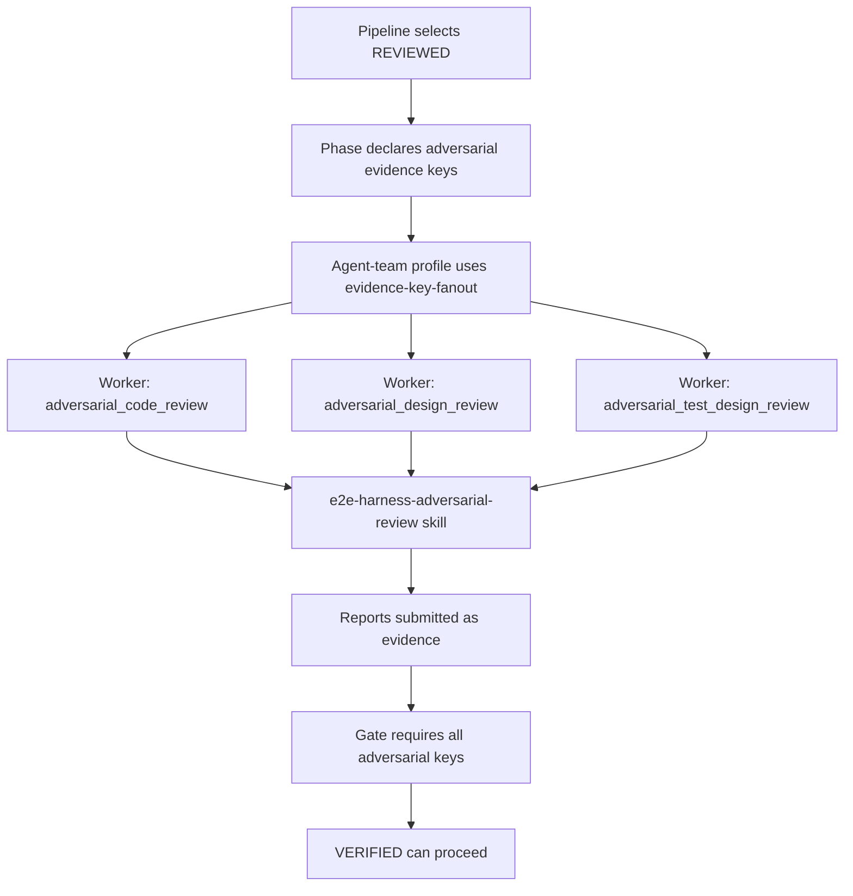

# Adversarial Review Skill Design

> Date: 2026-06-13
> Scope: `skills/e2e-dev-harness`, worker skills, review fan-out, evidence validation
> Status: design proposal, pending user review

## Executive Summary

The current harness can support adversarial review without a large control-plane rewrite. The right integration point is the existing `REVIEWED` phase and agent-team fan-out: add a dedicated worker skill for adversarial review, then let selected pipelines require adversarial review evidence before moving to `VERIFIED`.

The first implementation should be deliberately small:

- Add `skills/e2e-harness-adversarial-review/SKILL.md`.
- Add an opt-in pipeline, such as `adversarial.yaml`, that requires three independent adversarial outputs:
  - `adversarial_code_review`
  - `adversarial_design_review`
  - `adversarial_test_design_review`
- Add an agent-team profile, such as `default-adversarial.yaml`, that fans out those three evidence keys.
- Keep the existing runtime and dispatch protocol intact.

The stronger second slice should make adversarial review structurally verifiable by adding JSON evidence validation for the adversarial keys. That prevents a generic prose file from satisfying the gate when the user explicitly chooses an adversarial pipeline.

## Current Checkout Facts

- The lifecycle catalog maps `REVIEWED` to `semantic-reviewer`, `e2e-harness-review`, and one `review` evidence key in `skills/e2e-dev-harness/scripts/e2e_harness/core/lifecycle.py`.
- Pipeline YAML can override catalog phase fields, including `worker_role`, `worker_skill`, `produces`, `exit_gate`, and `allows_code_write` in `skills/e2e-dev-harness/scripts/e2e_harness/pipeline.py`.
- `critical.yaml` already overrides `REVIEWED` to require `r1_review`, `r2_review`, and `r3_review`.
- `default-critical.yaml` and `default-audited.yaml` already use `evidence-key-fanout` for `REVIEWED`.
- The built-in agent-team provider creates one worker per configured evidence key when a phase uses `strategy: evidence-key-fanout`.
- Runtime descriptors already instruct each worker to run the packet's `skill`, read only listed `context_paths`, and produce listed `expected_outputs`.
- Current review artifacts are mostly prose-gated: unknown review keys pass if the file exists, is non-empty, and matches any submitted hash. Strong JSON validation exists only for keys registered in `STRUCTURED_KEYS`.
- The repository already contains an example of adversarial review practice in `docs/loop-engineering-control-plane-design.md`, but there is no reusable adversarial review worker skill.

## Problem

The existing review phase answers "does this look correct?" better than it answers "how could this fail?". For high-risk work, that is not enough.

Three gaps show up:

1. Code review, design review, and test-design review are different adversarial jobs. A single semantic-review prompt tends to collapse them into a general review.
2. Critical and audited tiers already use three reviewers, but their packet shape does not distinguish review perspectives. The three workers can independently review, yet still converge on the same angle.
3. A prose-only evidence gate can prove that a file exists, but not that the worker enumerated claims, attacked assumptions, found counterexamples, or tied findings to evidence.

## Goals

- Add a reusable worker skill for adversarial review.
- Cover three review perspectives:
  - Code: implementation defects, integration hazards, security/reliability edge cases, hidden coupling.
  - Design: wrong abstractions, unstated invariants, bad ownership boundaries, migration risk.
  - Test design: missing negative cases, insufficient acceptance coverage, weak assertions, false confidence.
- Preserve the control-plane model: coordinator dispatches workers, workers produce evidence, gates inspect evidence keys.
- Keep worker isolation: fresh context, no inherited coordinator chat, no self-review of own implementation.
- Make the capability opt-in at first, so standard and current critical behavior remain compatible.
- Provide a clear path from prose-gated MVP to structured evidence gates.

## Non-Goals

- Do not replace `e2e-harness-review` in the standard pipeline.
- Do not make every run adversarial by default.
- Do not introduce a new runtime.
- Do not add model-specific prompting.
- Do not require the coordinator to rewrite worker reports.
- Do not weaken existing `critical` or `audited` review gates.
- Do not solve producer identity or evidence ownership in this design; those are adjacent control-plane concerns.

## Design Options

### Option A: Extend `e2e-harness-review` Only

Add adversarial sections to the existing review skill.

Pros:

- Smallest file change.
- No new pipeline or profile.
- Standard review improves immediately.

Cons:

- Review prompt becomes broader and less crisp.
- Code/design/test-case perspectives are still not separated.
- Harder to tell whether a run performed adversarial review or only ordinary review.

Verdict: useful as a minor quality improvement, but too soft for a named adversarial capability.

### Option B: Add One Adversarial Skill and Fan Out by Evidence Key

Create `e2e-harness-adversarial-review`. The same skill inspects its `expected_outputs` and performs the matching perspective. A profile fans out three workers with distinct expected outputs.

Pros:

- Fits the current packet shape.
- Reuses existing `evidence-key-fanout`.
- Keeps one compact skill with three perspectives.
- No runtime adapter change.
- Easy to test with existing review fan-out tests as a template.

Cons:

- The worker packet does not carry a first-class `review_perspective` field, so the skill must infer perspective from `expected_outputs`.
- If the output key is misconfigured, the skill can only fail by instruction rather than schema.

Verdict: recommended MVP.

### Option C: Add Per-Worker Skill Overrides to Agent-Team Profiles

Extend profile worker entries so each fan-out worker can specify its own skill, such as `e2e-harness-code-adversary`, `e2e-harness-design-adversary`, and `e2e-harness-test-adversary`.

Pros:

- Most explicit dispatch model.
- Each perspective can have a very small skill.
- Avoids inference from expected output names.

Cons:

- Requires schema and provider changes.
- More moving parts to install, validate, and document.
- Overkill before proving the new review mode is useful.

Verdict: good future direction if the MVP is used heavily.

## Recommended Architecture

Use Option B for the first implementation and leave Option C as a later refinement.



## New Worker Skill

Create:

```text
skills/e2e-harness-adversarial-review/SKILL.md
```

The skill should be concise and use progressive disclosure only if it grows. The first version can live entirely in `SKILL.md`.

Frontmatter:

```yaml
---
name: e2e-harness-adversarial-review
description: Use for e2e-dev-harness adversarial reviewer worker tasks that attack code, design, or test-case assumptions from a fresh isolated context and produce adversarial review evidence.
---
```

Core body rules:

- Do not inherit coordinator chat context.
- Use only packet `context_paths`.
- Never review your own implementation.
- Do not modify implementation files.
- Determine perspective from `expected_outputs`.
- If expected output contains `adversarial_code_review`, perform code adversarial review.
- If expected output contains `adversarial_design_review`, perform design adversarial review.
- If expected output contains `adversarial_test_design_review`, perform test-design adversarial review.
- If the expected output is unknown, stop with a blocker report rather than guessing.

Required report sections:

```markdown
# Adversarial Review: <Perspective>

## Verdict

## Claims Attacked

## Counterexamples

## Findings

## Missing Evidence

## Residual Risk

## Required Fixes
```

Finding format:

```markdown
### F-001: <short title>

- Severity: critical | high | medium | low
- Target: <file/path or design section>
- Claim attacked: <assumption or claim>
- Evidence: <file/line, command output, artifact, or explicit absence>
- Counterexample: <concrete failure mode>
- Required fix: <specific action>
```

Submission command pattern:

```text
python skills/e2e-dev-harness/scripts/e2e_dev_harness.py submit --state <run-state> --phase REVIEWED --key <expected-output-key> --path <report-path>
```

For module-band phases, the worker must preserve the phase and key namespace supplied by its packet, such as `REVIEWED#auth` and `adversarial_code_review#auth`.

## Pipeline Shape

Add an opt-in built-in pipeline:

```text
skills/e2e-dev-harness/pipelines/adversarial.yaml
```

Proposed shape:

```yaml
name: adversarial
phases:
  - CREATED
  - CLARIFIED
  - PLANNED
  - RED
  - phase: IMPLEMENTED
    allows_code_write: true
  - phase: REVIEWED
    worker_skill: e2e-harness-adversarial-review
    produces:
      - adversarial_code_review
      - adversarial_design_review
      - adversarial_test_design_review
    exit_gate:
      - adversarial_code_review
      - adversarial_design_review
      - adversarial_test_design_review
  - VERIFIED
```

This keeps the review work inside the existing `REVIEWED` phase rather than adding a new lifecycle phase. That matters because the engine, navigation, phase guards, and run-state model already know how to reason about `REVIEWED`.

## Agent-Team Profile

Add:

```text
skills/e2e-dev-harness/agent-teams/default-adversarial.yaml
```

The profile should mirror `default-critical.yaml` and change only the review fan-out evidence keys.

```yaml
schema: e2e-dev-harness.agent-team-profile.v1
name: default-adversarial
description: Adversarial pipeline with code, design, and test-design review fan-out.
roles:
  requirements-clarifier:
    skill: e2e-harness-clarification
    runtime_subagent_type: requirements-clarifier
    max_workers: 1
  implementation-planner:
    skill: e2e-harness-planning
    runtime_subagent_type: implementation-planner
    max_workers: 1
  tdd-red:
    skill: e2e-harness-tdd-red
    runtime_subagent_type: test-case-developer
    max_workers: 1
  code-developer:
    skill: e2e-harness-implementation
    runtime_subagent_type: code-developer
    max_workers: 1
  semantic-reviewer:
    skill: e2e-harness-adversarial-review
    runtime_subagent_type: semantic-reviewer
    max_workers: 3
  coverage-reviewer:
    skill: e2e-harness-completion
    runtime_subagent_type: coverage-reviewer
    max_workers: 1
phases:
  REVIEWED:
    strategy: evidence-key-fanout
    workers:
      - id_suffix: code
        expected_outputs: [adversarial_code_review]
      - id_suffix: design
        expected_outputs: [adversarial_design_review]
      - id_suffix: tests
        expected_outputs: [adversarial_test_design_review]
```

Note: in the current provider, worker skill comes from the phase, not from the role entry. The role entry remains useful for `runtime_subagent_type` and `max_workers`, but the pipeline must set `worker_skill: e2e-harness-adversarial-review`.

## Structured Evidence Upgrade

The MVP can gate on non-empty Markdown reports. That is compatible with the current evidence validator, but it is not enough for a high-assurance adversarial mode.

The second slice should add a JSON schema:

```json
{
  "schema": "e2e-dev-harness.adversarial-review.v1",
  "perspective": "code",
  "verdict": "pass-with-findings",
  "claims_attacked": [
    {
      "id": "C-001",
      "claim": "The review fan-out guarantees independent perspectives.",
      "source": "skills/e2e-dev-harness/agent-teams/default-adversarial.yaml"
    }
  ],
  "findings": [
    {
      "id": "F-001",
      "severity": "medium",
      "target": "skills/e2e-dev-harness/scripts/e2e_harness/adapters/agent_team/builtin.py",
      "claim_attacked": "Worker perspective is explicit in the packet.",
      "evidence": "Worker packet has expected_outputs but no review_perspective field.",
      "counterexample": "A misnamed expected output can make the worker choose no clear perspective.",
      "required_fix": "Either keep the key naming contract tested or add a review_perspective field later."
    }
  ],
  "missing_evidence": [],
  "residual_risk": [
    "Markdown companion report may contain richer explanation than the JSON summary."
  ]
}
```

Validator rules:

- `schema` must equal `e2e-dev-harness.adversarial-review.v1`.
- `perspective` must match the submitted evidence key:
  - `adversarial_code_review` -> `code`
  - `adversarial_design_review` -> `design`
  - `adversarial_test_design_review` -> `test-design`
- `verdict` must be one of `pass`, `pass-with-findings`, `block`.
- `claims_attacked` must be non-empty.
- Every finding must include `id`, `severity`, `target`, `claim_attacked`, `evidence`, `counterexample`, and `required_fix`.
- `severity` must be one of `critical`, `high`, `medium`, `low`.
- A `block` verdict must include at least one `critical` or `high` finding.

Register the three adversarial evidence keys in `STRUCTURED_KEYS` so the gate rejects empty prose and malformed JSON.

## Dispatch and Runtime Behavior

No runtime adapter change is required for the MVP.

The dispatch packet already includes:

- `skill`
- `context_paths`
- `expected_outputs`
- `parallel_group`
- `context_policy`

The existing runtime prompt already says:

- run the packet skill,
- read only the packet context paths,
- produce the packet expected outputs.

That is sufficient for an adversarial worker as long as the skill explains how to map expected output names to perspectives.

## Tier and Selection Policy

Do not make adversarial review automatic for every request in the first slice.

Recommended policy:

- `minimal`: no adversarial review.
- `standard`: ordinary `e2e-harness-review`.
- `critical`: keep existing R1/R2/R3 review behavior for compatibility.
- `audited`: keep current audited behavior for compatibility.
- `adversarial`: opt-in pipeline requiring code/design/test-design adversarial review.

After the pipeline proves useful, tier recommendation can suggest `adversarial` for requests with:

- high GitNexus impact,
- security-sensitive changes,
- control-plane changes,
- cross-module concurrency changes,
- evidence/gate/dispatch changes,
- test framework or verification semantics changes.

## Tests

Add focused tests before implementation.

### Skill Contract Tests

Extend `skills/e2e-dev-harness/tests/test_worker_skills_delegate.py`:

- The new skill must mention `external skill system`.
- The new skill must mention `harness contract`.
- The new skill must mention `expected_outputs`.
- The new skill must mention all three output keys:
  - `adversarial_code_review`
  - `adversarial_design_review`
  - `adversarial_test_design_review`
- The new skill must include the canonical `e2e_dev_harness.py submit` command.

### Pipeline Tests

Extend `skills/e2e-dev-harness/tests/test_pipeline_yaml_load.py`:

- `pipeline.active_phase_names("adversarial")` returns the full spine.
- `REVIEWED.worker_skill == "e2e-harness-adversarial-review"`.
- `REVIEWED.produces` and `REVIEWED.exit_gate` contain the three adversarial keys.

Extend `skills/e2e-dev-harness/tests/test_pipeline_validate.py`:

- `adversarial` validates under `validate_spec`.

### Agent-Team Tests

Add or extend tests near `test_review_fanout.py`:

- `default-adversarial` produces three workers for `REVIEWED`.
- Worker IDs end in `code`, `design`, and `tests`.
- Each worker has exactly one expected output.
- The top-level packet still includes `agent_team_plan`, `worker_descriptors`, and the first worker descriptor for compatibility.

### Gate Tests

MVP:

- Submitting only two of the three adversarial reports keeps `REVIEWED` blocked.
- Submitting all three advances the gate.

Structured evidence slice:

- A malformed adversarial JSON artifact is rejected.
- A JSON artifact whose `perspective` does not match its key is rejected.
- A valid code/design/test-design artifact passes.
- A `block` verdict without high or critical findings is rejected.

## Rollout Plan

### Slice 1: Prose-Gated MVP

1. Add the adversarial worker skill.
2. Add `adversarial.yaml`.
3. Add `default-adversarial.yaml`.
4. Add tests for skill contract, pipeline loading, profile fan-out, and three-key gate behavior.
5. Update `skills/e2e-dev-harness/SKILL.md` tier table to mention the opt-in adversarial pipeline.
6. Verify with targeted tests.

### Slice 2: Structured Gate

1. Add an adversarial review validator module.
2. Register adversarial keys in `STRUCTURED_KEYS`.
3. Update the skill to require JSON evidence, optionally with a Markdown companion report.
4. Add malformed/mismatched/valid evidence tests.
5. Verify with targeted evidence and gate tests.

### Slice 3: Recommendation Integration

1. Teach tier recommendation to suggest adversarial mode for selected high-risk changes.
2. Keep the recommendation explicit and user-confirmed.
3. Add tests that recommendation reasons mention adversarial review triggers.

## Risk Assessment

Main risks:

- The new pipeline might create another tier-like surface that users confuse with `critical` or `audited`.
- If left prose-gated forever, the capability can look stronger than it is.
- Inferring perspective from evidence key names is a pragmatic coupling.
- Adding structured evidence too early may make the first version heavy and slow to adopt.

Mitigations:

- Name it as an opt-in pipeline first, not as a default tier.
- Make the MVP documentation honest: prose gate is useful but not high assurance.
- Add tests around exact expected output keys.
- Upgrade to structured validation once the report shape stabilizes.

## Acceptance Criteria

- A user can select an adversarial pipeline and receive three isolated adversarial reviewer workers.
- The three workers cover code, design, and test-design perspectives.
- The `REVIEWED` gate does not pass until all declared adversarial evidence keys are submitted.
- Existing `minimal`, `standard`, `critical`, and `audited` pipelines keep their current review shape.
- The new worker skill follows the harness contract and does not ask the coordinator to perform worker-owned review.
- The implementation can be verified with targeted tests before broad regression.

## Implementation Boundaries

Files likely created:

- `skills/e2e-harness-adversarial-review/SKILL.md`
- `skills/e2e-dev-harness/pipelines/adversarial.yaml`
- `skills/e2e-dev-harness/agent-teams/default-adversarial.yaml`

Files likely modified:

- `skills/e2e-dev-harness/SKILL.md`
- `skills/e2e-dev-harness/tests/test_worker_skills_delegate.py`
- `skills/e2e-dev-harness/tests/test_pipeline_yaml_load.py`
- `skills/e2e-dev-harness/tests/test_pipeline_validate.py`
- `skills/e2e-dev-harness/tests/test_review_fanout.py`

Structured evidence slice likely modifies:

- `skills/e2e-dev-harness/scripts/e2e_harness/adapters/evidence/validate.py`
- `skills/e2e-dev-harness/tests/test_gate_artifact_validation.py`
- A new focused adversarial evidence test file.

Before modifying Python symbols, run GitNexus impact analysis for the exact target symbols, especially `validate_evidence`, `plan_phase`, and any tier recommendation functions.

## Final Recommendation

Build the capability as an opt-in adversarial pipeline backed by one new worker skill. This matches the current architecture, keeps the dispatch/runtime seams stable, and gives the project a clear upgrade path from useful adversarial reports to hard structured gates.

Do not start by expanding worker packets or splitting into three separate skills. Those are reasonable future refinements, but the current evidence-key fan-out model is already sufficient to prove the behavior with low disruption.
