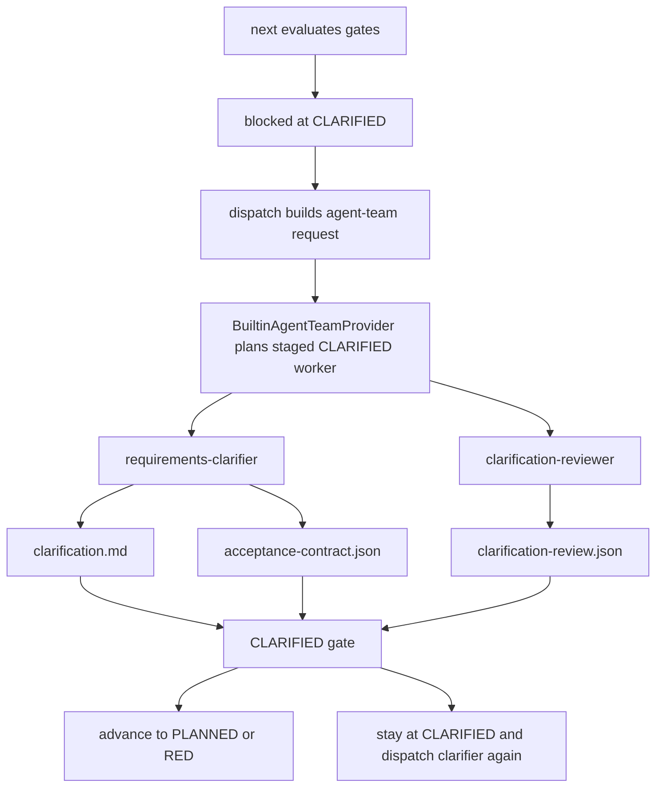

# Clarification Review Dispatch Design

Date: 2026-06-13
Scope: `skills/e2e-dev-harness`
Status: Proposed design

## Summary

The current `CLARIFIED` phase can prove that every question recorded in
`acceptance_contract.open_questions` is no longer `open`. It cannot prove that
the requirements clarifier found every important ambiguity, that a `resolved`
answer is specific enough, or that a `deferred` answer was explicitly approved by
the user.

Add an independent `clarification-reviewer` worker before `CLARIFIED` can pass.
The reviewer is dispatched by the coordinator-controlled `dispatch` path through
the existing agent-team provider layer. The requirements clarifier must not spawn
or choose its own reviewer.

The recommended implementation keeps review inside the `CLARIFIED` phase as a
staged dispatch sequence:

```text
CLARIFIED:
  stage 1: requirements-clarifier -> clarification + acceptance_contract
  stage 2: clarification-reviewer -> clarification_review
  gate: clarification + acceptance_contract + clarification_review
```

This preserves the current control-plane model: `next` evaluates gates,
`dispatch` plans and emits worker descriptors, runtime adapters only translate
worker packets, workers produce evidence, and `run-state.json` remains the
single source of truth.

## Current State

The live checkout has these relevant surfaces:

- `core/lifecycle.py` defines `CLARIFIED` as a single worker phase using
  `requirements-clarifier` and `e2e-harness-clarification`.
- `core/acceptance.py` validates `acceptance_contract` and exposes
  `unresolved_questions`.
- `adapters/evidence/validate.py` rejects `acceptance_contract` when any
  `open_questions[]` item still has `status: "open"`.
- `cli/commands/next.py` surfaces still-open questions when the run is blocked
  at `CLARIFIED`.
- `cli/commands/dispatch.py` owns phase-to-agent-team planning. It calls
  `BuiltinAgentTeamProvider`, writes `agent-team-plan.json` and
  `dispatch-invocations/<phase>-<stamp>.json`, and then marks dispatch state
  only when the selected runtime can auto-spawn.
- `adapters/runtime/__init__.py` creates runtime-specific descriptors for
  Codex, Claude Code, OpenCode, or manual dispatch. It does not execute the
  worker itself.

The current guarantee is therefore narrow but real:

```text
Every registered open question is resolved or deferred.
```

The missing guarantee is:

```text
The clarification itself is complete enough to begin planning or TDD.
```

## Problem

The clarification worker is both author and implicit judge of the clarification
ledger. That leaves a quality gap:

- A necessary question can be omitted from `open_questions`.
- A user answer can be marked `resolved` while still too vague to implement.
- A `deferred` item can be accepted without a clear user-approved reason.
- Acceptance criteria can pass structural validation while missing edge cases,
  impact boundaries, rollback/degradation decisions, or testable behaviors.
- The pipeline can move into `PLANNED` or `RED` with unresolved ambiguity that
  only appears later as planning churn, weak tests, or implementation rework.

Adding a reviewer after implementation does not fix this. A semantic reviewer in
`REVIEWED` arrives too late: by then TDD and implementation work may already be
built on a weak contract.

## Goals

1. Require an independent review before `CLARIFIED` can pass in normal pipelines.
2. Keep reviewer dispatch under the coordinator/control plane.
3. Preserve fresh worker isolation: the reviewer reads artifacts and context
   paths, not inherited coordinator or clarifier chat.
4. Keep gates evidence-driven and machine-checkable.
5. Avoid a broad lifecycle rollback redesign for this slice.
6. Preserve the existing `next -> dispatch -> spawn -> submit -> gate` operator
   loop.
7. Make repeated clarification natural: review failure sends the next dispatch
   back to `requirements-clarifier` while the run remains at `CLARIFIED`.

## Non-Goals

- Do not let `requirements-clarifier` spawn subagents.
- Do not reuse the post-implementation `REVIEWED` phase as the clarification
  review mechanism.
- Do not add a generic rollback system for every phase in this slice.
- Do not let agent-team plans pass gates by themselves.
- Do not let runtime adapters own scheduling policy.
- Do not require `minimal` tier to pay this cost unless explicitly configured.

## Options Considered

### Option A: Clarifier Self-Review

The clarifier would update `acceptance_contract` and then run a self-check before
submitting evidence.

Pros:

- Smallest change.
- No new dispatch behavior.

Cons:

- No independent context.
- The worker that may have missed a question is judging whether it missed one.
- It does not address the user's concern that another actor should decide whether
  clarification is done.

Verdict: reject.

### Option B: New `CLARIFICATION_REVIEWED` Lifecycle Phase

The pipeline would become:

```text
CREATED -> CLARIFIED -> CLARIFICATION_REVIEWED -> PLANNED -> ...
```

Pros:

- Obvious phase boundary.
- Uses existing phase dispatch model without staged behavior.

Cons:

- If the reviewer finds a problem, the run blocks at
  `CLARIFICATION_REVIEWED`, but the necessary work belongs to `CLARIFIED`.
- The current engine only has special rollback behavior for verification rework.
  General rollback would be a larger control-plane change.
- It adds a new public lifecycle phase and compatibility surface.

Verdict: possible later, but too large for the immediate problem.

### Option C: Staged Dispatch Inside `CLARIFIED`

Keep one lifecycle phase, but allow its dispatch policy to select the correct
worker based on current evidence:

- no valid clarification contract -> dispatch `requirements-clarifier`;
- valid clarification contract but no review -> dispatch `clarification-reviewer`;
- failed/stale review -> dispatch `requirements-clarifier` again;
- passing review -> `CLARIFIED` gate passes.

Pros:

- Directly models the review loop without new rollback semantics.
- Keeps `current_phase` at `CLARIFIED` until all clarification work is done.
- Reuses `dispatch`, agent-team provider, runtime adapter, submit, and gate
  machinery.
- Preserves control-plane ownership.

Cons:

- Requires the agent-team provider to become evidence-aware for `CLARIFIED`.
- Requires a new structured evidence key and validator.

Verdict: recommended.

## Proposed Architecture



### Authority Boundaries

`next`

- Evaluates the current spine and gates.
- Returns a blocker and `next_action`.
- Does not select a team and does not spawn workers.

`dispatch`

- Reads `run-state.json`.
- Determines the active phase.
- Calls the agent-team provider.
- Writes `agent-team-plan.json` and `dispatch-invocations/*`.
- Converts planned workers through runtime adapters.
- Marks dispatch state only when runtime capabilities allow auto-spawn.

`BuiltinAgentTeamProvider`

- Owns phase-to-worker planning.
- For `CLARIFIED`, chooses the next staged worker from evidence state.
- Does not mutate run state.
- Does not call runtime tools.

Runtime adapter

- Converts worker packets into runtime descriptors.
- Does not decide scheduling policy.
- Does not execute workers itself.

Workers

- Read only declared `context_paths`.
- Produce declared `expected_outputs`.
- Submit evidence through `submit`.
- Do not write `run-state.json`.
- Do not spawn sibling workers.

Gates

- Decide phase pass/fail from declared evidence keys and validators.
- Do not inspect chat history.

## Lifecycle and Evidence Contract

For `standard`, `critical`, and `audited`, change `CLARIFIED` from:

```text
produces:  clarification, acceptance_contract
exit_gate: clarification, acceptance_contract
```

to:

```text
produces:  clarification, acceptance_contract, clarification_review
exit_gate: clarification, acceptance_contract, clarification_review
```

For `minimal`, preserve the current two-key gate by default:

```text
produces:  clarification, acceptance_contract
exit_gate: clarification, acceptance_contract
```

This keeps the low-cost path available while making the normal default safer.
If `--tier auto` floors ordinary work to `standard`, clarification review becomes
the default for ordinary work without breaking explicitly minimal runs.

## `clarification_review` Schema

Add a structured JSON evidence artifact:

```json
{
  "schema": "e2e-dev-harness.clarification-review.v1",
  "verdict": "approved",
  "reviewer": {
    "role": "clarification-reviewer",
    "worker_id": "CLARIFIED-review"
  },
  "reviewed_artifacts": {
    "clarification": "docs/agent-runs/<run>/handoffs/01-requirements-clarifier.md",
    "acceptance_contract": "docs/agent-runs/<run>/acceptance-contract.json"
  },
  "checks": {
    "no_unregistered_critical_questions": true,
    "resolved_questions_are_actionable": true,
    "deferred_questions_have_user_approval": true,
    "acceptance_criteria_are_testable": true,
    "impact_and_degradation_decisions_are_explicit": true
  },
  "findings": [],
  "required_followups": []
}
```

Allowed verdicts:

- `approved`: the `CLARIFIED` gate can use this evidence.
- `needs_clarification`: the reviewer found missing or insufficient
  clarification. This artifact is useful diagnostic evidence but must not pass
  the gate.

Validator rules for `clarification_review`:

- Must be JSON.
- `schema` must match `e2e-dev-harness.clarification-review.v1`.
- `verdict` must be `approved` to satisfy the gate.
- All required checks must be true.
- `reviewed_artifacts` must reference the current submitted `clarification` and
  `acceptance_contract` paths.
- An approved review must have empty `required_followups`.
- A non-approved review must include at least one `required_followups[]` item
  with a non-empty question or repair instruction.

The first implementation can validate path equality and schema/check fields. A
later hardening slice can add artifact hash binding so review evidence becomes
stale automatically when the clarifier resubmits either input.

## Dispatch Policy for `CLARIFIED`

The provider should plan `CLARIFIED` with evidence-aware staged selection:

```text
if clarification or acceptance_contract is missing:
    dispatch requirements-clarifier
else if acceptance_contract is structurally invalid:
    dispatch requirements-clarifier
else if acceptance_contract has open questions:
    dispatch requirements-clarifier
else if clarification_review is missing:
    dispatch clarification-reviewer
else if clarification_review is invalid or verdict != approved:
    dispatch requirements-clarifier
else:
    no dispatch should be needed; next can advance
```

The provider should not run validators directly if that would duplicate too much
gate logic. A small read-only helper can classify `CLARIFIED` evidence state and
return one of:

- `needs_clarifier`
- `needs_reviewer`
- `review_approved`

That helper belongs near evidence validation or dispatch planning, not in the
runtime adapter.

## Agent-Team Profile Changes

Add a new role to standard, critical, and audited profiles:

```yaml
clarification-reviewer:
  skill: e2e-harness-clarification-review
  runtime_subagent_type: clarification-reviewer
  max_workers: 1
```

Add `CLARIFIED` phase policy metadata:

```yaml
phases:
  CLARIFIED:
    strategy: staged-clarification-review
    stages:
      - id_suffix: clarify
        role: requirements-clarifier
        expected_outputs: [clarification, acceptance_contract]
      - id_suffix: review
        role: clarification-reviewer
        expected_outputs: [clarification_review]
```

This is not a parallel fanout. The reviewer stage depends on clarifier evidence,
so the provider must only emit one of these workers at a time.

## New Worker Skill

Add `skills/e2e-harness-clarification-review/SKILL.md`.

The worker must:

- run in fresh context;
- read only the run-state path and referenced clarification artifacts;
- never modify `clarification` or `acceptance_contract`;
- write `docs/agent-runs/<run>/clarification-review.json`;
- submit it with:

```text
python skills/e2e-dev-harness/scripts/e2e_dev_harness.py submit \
  --state <run-state> \
  --phase CLARIFIED \
  --key clarification_review \
  --path docs/agent-runs/<run>/clarification-review.json
```

If the reviewer finds gaps, it still writes a review artifact with
`verdict: "needs_clarification"` and concrete follow-up questions. The gate
rejects that artifact, and the next `dispatch` routes back to the clarifier.

The reviewer must not ask the user directly. User interaction remains the
clarifier's job so the clarification ledger stays single-owner.

## Failure and Rework Flow

### Happy Path

```text
next -> blocked at CLARIFIED, missing clarification + acceptance_contract
dispatch -> requirements-clarifier
submit clarification
submit acceptance_contract
next -> blocked at CLARIFIED, missing clarification_review
dispatch -> clarification-reviewer
submit clarification_review approved
next -> advances to PLANNED or RED
```

### Reviewer Finds More Questions

```text
reviewer submits clarification_review with verdict needs_clarification
gate rejects clarification_review
next remains blocked at CLARIFIED
dispatch selects requirements-clarifier
clarifier asks user follow-ups and updates acceptance_contract
dispatch later selects clarification-reviewer again
```

This avoids a lifecycle rollback. The run never leaves `CLARIFIED` until both
the clarifier and reviewer evidence are acceptable.

### Reviewer Worker Fails

If the reviewer crashes or cannot complete, `submit --status failed --phase
CLARIFIED --key clarification_review --reason ...` records the failure under the
existing per-key failure ledger. The gate remains blocked until a later
successful `clarification_review` submission clears that key's failure.

## Compatibility

- Existing `minimal` runs stay unchanged unless configured otherwise.
- Existing `standard`, `critical`, and `audited` runs created before the change
  may carry a stamped phase contract. The existing contract-stamp behavior should
  prevent retroactive failure for already-passed phases.
- New runs in standard-or-higher tiers require `clarification_review`.
- Custom pipelines that embed phase specs should keep their declared gate unless
  they opt into the new `clarification_review` key.
- Runtime descriptor shape remains unchanged: one worker packet in, one runtime
  descriptor out.

## Implementation Slices

### Slice 1: Schema and Gate

- Add `clarification_review` validator.
- Add tests that approved review passes and `needs_clarification` fails.
- Add `clarification_review` to standard/critical/audited `CLARIFIED` gate.
- Keep minimal unchanged.

### Slice 2: Role and Skill

- Add `clarification-reviewer` role to agent-team profiles.
- Add `e2e-harness-clarification-review` worker skill.
- Add worker-skill delegation tests similar to existing worker skill tests.

### Slice 3: Evidence-Aware Staged Dispatch

- Extend agent-team profile schema to allow `stages` metadata.
- Add a `staged-clarification-review` planner path in
  `BuiltinAgentTeamProvider`.
- Ensure `dispatch` writes the normal `agent-team-plan.json` and
  `dispatch-invocations/*` artifacts for both stages.
- Add dispatch tests:
  - missing clarification -> clarifier worker;
  - valid clarification but missing review -> reviewer worker;
  - failed or rejected review -> clarifier worker;
  - approved review -> no further dispatch expected because `next` advances.

### Slice 4: Navigation and Operator Feedback

- Update `next`/navigation output to distinguish:
  - missing clarifier evidence;
  - open questions awaiting user response;
  - clarification review pending;
  - clarification review rejected with follow-up questions.
- Keep compact output bounded and put long details in artifact paths.

### Slice 5: Docs and Installed Runtime Sync

- Update README phase table and agent-team section.
- Sync installed skill copies after verification.
- Re-run focused tests and the normal pre-merge checks for the touched slice.

## Test Strategy

Focused tests:

- `test_acceptance.py`: existing open question checks remain unchanged.
- New `test_clarification_review_evidence.py`:
  - malformed review rejected;
  - `needs_clarification` rejected;
  - approved review accepted;
  - approved review with follow-ups rejected.
- `test_pipeline_tiers.py`:
  - minimal does not require `clarification_review`;
  - standard/critical/audited require it.
- `test_agent_team_provider.py`:
  - `CLARIFIED` dispatch chooses clarifier first;
  - chooses reviewer after valid clarifier evidence;
  - chooses clarifier again after rejected review.
- `test_agent_team_dispatch.py`:
  - dispatch artifacts and runtime descriptors remain valid for both stages.
- `test_worker_skills_delegate.py`:
  - new reviewer skill declares expected output and fresh-context policy.

Regression checks:

- `python -m unittest discover -s skills/e2e-dev-harness/tests`
- Existing Node wrapper tests if CLI docs or forwarding behavior changes.
- `npx gitnexus detect-changes --scope all --repo e2e-dev-workflow` before any
  commit.

## Risks and Mitigations

Risk: staged dispatch duplicates gate validation logic.

Mitigation: keep a tiny shared read-only classifier for `CLARIFIED` evidence
state and let `validate_evidence` remain the authoritative validator.

Risk: reviewer rejection leaves stale `clarification_review` evidence that blocks
future progress even after clarifier fixes the contract.

Mitigation: either require the reviewer to resubmit after every clarifier update
or bind review evidence to artifact hashes in a follow-up hardening slice. The
first slice can keep the rule simple: after clarifier resubmits, dispatch routes
to reviewer again before the gate can pass.

Risk: custom profiles do not know the new role.

Mitigation: when `staged-clarification-review` is requested and the role is
missing, dispatch should fail with a clear profile validation error rather than
falling back to the clarifier.

Risk: this increases latency for small tasks.

Mitigation: keep explicit `minimal` unchanged and rely on tier selection to avoid
review for truly low-risk runs.

## Acceptance Criteria

- Standard-or-higher new runs cannot advance past `CLARIFIED` without
  `clarification_review`.
- `clarification_review` must be structured JSON and must approve every required
  check to pass.
- A rejected clarification review keeps the run at `CLARIFIED` and the next
  dispatch selects `requirements-clarifier`.
- The reviewer is dispatched by `dispatch` through the agent-team provider, not
  by the clarifier worker.
- Runtime adapters remain pure descriptor translators.
- Minimal-tier behavior remains backward compatible.
- Tests prove both the gate behavior and the staged dispatch behavior.

## Open Decisions

- Whether to bind `clarification_review` to artifact hashes in the first slice or
  defer that to hardening. Recommendation: defer one slice, but design the schema
  so hashes can be added without changing the top-level contract.
- Whether `--tier auto` should ever choose minimal. Current direction favors
  standard as the ordinary floor, which makes clarification review the normal
  default.
- Whether rejected review follow-ups should be copied automatically into
  `acceptance_contract.open_questions`. Recommendation: no. The clarifier should
  own user-question ledger updates.
