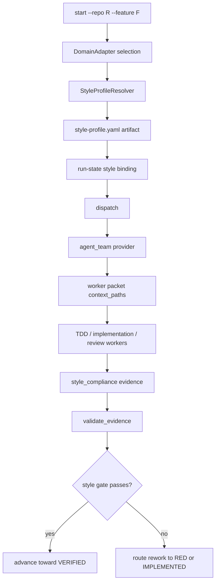

# Enterprise Style Profile Design

> Date: 2026-06-13
> Scope: `skills/e2e-dev-harness`
> Status: approved design, pending implementation
> Related: `docs/superpowers/specs/2026-06-08-e2e-dev-harness-u5-domain-adapter-design.md`, `docs/superpowers/specs/2026-06-11-plugin-agent-team-design.md`

## Executive Summary

Enterprise teams often have local engineering conventions that are more specific
than language or framework defaults. A Java Spring team may require MockServer for
HTTP boundary tests and forbid Mockito, while another team in the same company may
prefer Mockito for unit tests. The harness should not treat these rules as prompt
advice. They need to become a structured, auditable contract that workers read and
gates verify.

This design adds an additive **Enterprise Style Profile** mechanism:

```text
start/init
  -> resolve project domain
  -> resolve enterprise style profile
  -> persist style profile artifact and run-state pointer
dispatch
  -> include the style profile path in worker context_paths
worker
  -> generate tests, implementation, and review evidence against the profile
gate
  -> validate style_compliance evidence
  -> route violations back to RED or IMPLEMENTED
```

The key product decision is: enterprise style is a delivery contract, not a chat
instruction. Prompt text can remind workers, but `style_profile` and
`style_compliance` evidence decide whether the run can reach `VERIFIED`.

## Current Checkout Facts

- `start` is implemented in `skills/e2e-dev-harness/scripts/e2e_harness/cli/commands/start.py`.
- The current domain seam lives under `skills/e2e-dev-harness/scripts/e2e_harness/adapters/domain/`.
- `start` already selects a domain adapter, merges pipeline overrides, can embed
  `pipeline_spec`, and can persist a self-describing `domain` block in run-state.
- `run_state.new_run_state(...)` already accepts additive optional blocks such as
  `pipeline_spec` and `domain`.
- `dispatch` is implemented in `skills/e2e-dev-harness/scripts/e2e_harness/cli/commands/dispatch.py`.
- `dispatch` builds an agent-team request, then `BuiltinAgentTeamProvider`
  expands it into worker packets with `context_paths` and `context_policy: fresh`.
- Runtime adapters translate worker packets into runtime-specific descriptors.
  They should not own style policy.
- Evidence validation lives in
  `skills/e2e-dev-harness/scripts/e2e_harness/adapters/evidence/validate.py`.
- Command-style evidence already exists through `command_evidence.record_command`
  and is used to reject forged test and verification artifacts.
- The core remains a control plane: lifecycle, gates, dispatch, and navigation
  should not run language-specific scanners directly.

## Goals

- Make project or department coding style visible to all workers before they write
  tests or code.
- Support hard test-double rules such as "MockServer required, Mockito forbidden".
- Preserve the current core control-plane boundary.
- Keep backend/default runs compatible when no style profile is configured.
- Make style violations machine-checkable and auditable.
- Route failed style checks to the right rework phase instead of letting a run
  become falsely `VERIFIED`.
- Allow explicit enterprise profiles to override weak local inference.

## Non-Goals

- No enterprise policy service in the first implementation slice.
- No full Java, TypeScript, or Python AST engine in the first implementation slice.
- No blocking stdin prompt to ask for style choices.
- No runtime-adapter-specific style logic.
- No change to worker runtime descriptors beyond passing style context paths
  through the existing packet model.
- No attempt to infer every subjective style preference. The first slice focuses
  on verifiable conventions.

## Design Decision

Add a new adapter family:

```text
skills/e2e-dev-harness/scripts/e2e_harness/adapters/style/
```

The style layer is parallel to the domain layer:

- Domain answers: what kind of project is this?
- Style answers: what coding and testing contract is in force for this run?

The style resolver produces a concrete artifact:

```text
docs/agent-runs/<run>/style-profile.yaml
```

Run-state stores only a compact pointer and identity block:

```json
{
  "style": {
    "schema": "e2e-harness.style-binding.v1",
    "profile_id": "department-payment-java",
    "profile_path": "docs/agent-runs/<run>/style-profile.yaml",
    "enforcement": "strict",
    "source": "explicit"
  }
}
```

The profile file becomes a normal worker context artifact. It is included in
`context_paths`, referenced by evidence, and hashed by the existing evidence
path machinery.

## Style Profile Contract

Use a small YAML or JSON-compatible shape. YAML is operator-friendly, but the
validator should parse it into a plain dict and emit normalized JSON inside
`style_compliance` evidence.

```yaml
schema: e2e-harness.enterprise-style.v1
profile_id: department-payment-java
language: java
framework: spring-boot
enforcement: strict

formatting:
  commands:
    - mvn spotless:check
    - mvn checkstyle:check

testing:
  framework: junit5
  test_double_policy:
    allowed:
      - mockserver
    forbidden:
      - mockito
  forbidden_imports:
    - org.mockito.*
    - static org.mockito.Mockito.*
  forbidden_annotations:
    - Mock
    - MockBean
  required_patterns:
    - external HTTP dependencies must use MockServerClient
    - HTTP boundary tests must assert real request/response behavior

implementation:
  dependency_injection:
    constructor_injection: required
    field_injection: forbidden
  logging: slf4j
  exception_style: project_existing
```

Fields are intentionally narrow:

- `formatting.commands` names commands that can be captured as command evidence.
- `testing.test_double_policy` is the main extension point for Mockito versus
  MockServer style constraints.
- `forbidden_imports` and `forbidden_annotations` support cheap first-pass
  source checks before language-specific AST support exists.
- `implementation` starts with conventions that are easy to inspect in review
  and can later grow language-specific validators.

## Resolution Precedence

Style resolution is deterministic:

1. Explicit CLI flag: `--style-profile <name-or-path>`.
2. Project-local profile: `.e2e-harness/style-profile.yaml`.
3. Enterprise preset registry bundled or configured under
   `.e2e-harness/style-profiles/<name>.yaml`.
4. Project tool configuration inference:
   `.editorconfig`, Checkstyle, Spotless, PMD, ktlint, ESLint, Prettier, Ruff,
   Maven, Gradle, npm scripts.
5. Existing code sample inference:
   imports, annotations, test container usage, MockServer usage, Mockito usage,
   naming and folder patterns.
6. Harness default advisory profile.

Explicit profiles are authoritative. Inference can add warnings but should not
silently override a declared department rule.

## Data Flow



The profile is not re-derived during dispatch or validation. Run-state is the
source of truth for which profile was in force when the run started.

## Components

### `adapters/style/base.py`

Defines small protocols and pure helpers:

```python
class StyleProfileResolver(Protocol):
    name: str

    def detect(self, repo: Path) -> bool: ...
    def resolve(self, repo: Path, explicit: str | None = None) -> StyleProfile: ...

class StyleProfile(TypedDict):
    schema: str
    profile_id: str
    enforcement: Literal["strict", "advisory"]
    rules: dict
    source: str
```

The resolver returns data, not side effects. The CLI command owns writing the
artifact into the run directory.

### `adapters/style/registry.py`

Owns resolver order and profile lookup:

```text
explicit path/name -> project-local -> enterprise preset -> inferred -> default
```

Unknown explicit profile names return exit 2 with machine-readable JSON.

### `adapters/style/infer.py`

Performs cheap, deterministic inference:

- Java test framework and mocking imports.
- Maven or Gradle formatting/check commands.
- npm lint/test scripts.
- Python lint/test tools.
- Existing test double patterns.

Inference output is advisory unless the project opts into strict enforcement.

### `adapters/evidence/style.py`

Validates `style_compliance` artifacts:

- The artifact schema is `e2e-harness.style-compliance.v1`.
- It references the active `style_profile` path and hash.
- It contains command evidence results for required style commands.
- It contains static scan results for forbidden imports, annotations, and
  dependencies.
- For strict profiles, any violation rejects the evidence.
- For advisory profiles, violations are recorded but do not block the gate.

### `adapters/evidence/validate.py`

Adds one structured validator entry:

```python
STRUCTURED_VALIDATORS = {
    ...
    "style_compliance": style.validate_style_compliance,
}
```

The validator should not replay arbitrary shell commands by default. Style
commands must be captured beforehand through command evidence, following the
existing safe command-evidence boundary.

### `cli/commands/start.py`

After domain selection and before run-state save:

1. Resolve style profile.
2. Write `style-profile.yaml` under the new run directory.
3. Include a compact `style` binding in run-state.
4. Include `"style_profile": "<profile_id>"` in `start.v1` output.

When no explicit or inferred style exists, the default backend-compatible path
uses an advisory profile and can omit strict gates for parity.

### `cli/commands/dispatch.py`

Reads `state["style"]["profile_path"]` and appends that path to the existing
`context_paths` list. The worker packet remains pointer-based and fresh-context
compatible.

The domain extra context can remain as a short string, but style should be a real
path because workers need a durable, inspectable contract rather than a compressed
prompt fragment.

### Pipeline Integration

Add two evidence keys when style enforcement is active:

- `style_profile`: produced during planning or start materialization.
- `style_compliance`: required before `VERIFIED`.

Recommended first implementation:

- Minimal and standard default runs remain unchanged unless a strict profile is
  present.
- Strict profile runs add `style_compliance` to `VERIFIED.exit_gate`.
- Audited runs always include `style_compliance` when a style binding exists.

This keeps compatibility while giving enterprise users a hard gate when they opt
into a profile.

## Mockito Versus MockServer

For a profile that forbids Mockito and requires MockServer:

```yaml
testing:
  test_double_policy:
    allowed: [mockserver]
    forbidden: [mockito]
  forbidden_imports:
    - org.mockito.*
    - static org.mockito.Mockito.*
  forbidden_annotations:
    - Mock
    - MockBean
  required_patterns:
    - MockServerClient
```

TDD worker obligations:

- Do not add Mockito imports or Mockito dependencies.
- Do not generate `@Mock`, `@MockBean`, `Mockito.mock`, `when(...)`, or
  `verify(...)` patterns.
- Use MockServer for external HTTP dependencies.
- Write tests that exercise the real client or HTTP boundary where the profile
  requires it.

Implementation worker obligations:

- Keep production code aligned with the dependency injection and exception rules
  in the profile.
- Do not make implementation changes that force forbidden test doubles.

Review and verification obligations:

- Scan changed tests for forbidden imports and annotations.
- Scan dependency manifests for forbidden libraries.
- Confirm `style_compliance` references the active profile hash.

Violation example:

```json
{
  "schema": "e2e-harness.style-compliance.v1",
  "status": "failed",
  "profile_id": "department-payment-java",
  "violations": [
    {
      "rule": "testing.test_double_policy.forbidden.mockito",
      "file": "src/test/java/com/acme/PaymentClientTest.java",
      "line": 7,
      "evidence": "import org.mockito.Mockito"
    }
  ],
  "route_back": "IMPLEMENTED"
}
```

## Rework Routing

Style violations route according to where the failure entered:

- Test style violation in failing tests: route back to `RED`.
- Test style violation in passing tests: route back to `IMPLEMENTED`.
- Production style violation: route back to `IMPLEMENTED`.
- Review-only advisory note: remain in current phase but surface warning.
- Tool unavailable under strict profile: block `VERIFIED` and request operator
  remediation or profile downgrade.

This should reuse the existing verification failure pattern: supersede the
affected phase evidence, write `rework_required`, and move `current_phase` to the
nearest phase that can repair the artifact.

## Error Handling

| Condition | Behavior |
|---|---|
| Unknown explicit profile | exit 2 JSON with `unknown_style_profile`. |
| Profile parse failure | exit 2 JSON with file path and parser reason. |
| Conflicting inferred signals | advisory warning unless a strict explicit profile exists. |
| Required style command missing | strict profile blocks; advisory profile records warning. |
| Forbidden dependency found | strict profile blocks `style_compliance`. |
| Forbidden import found | strict profile blocks and reports file/line. |
| No style signals found | use default advisory profile and preserve current behavior. |

## Security And Trust Invariants

- Style profile selection is persisted once per run; downstream workers do not
  re-resolve policy from the mutable repo.
- `style_compliance` must name the active profile path and hash.
- Command evidence must be produced by `command_evidence.record_command`, not
  hand-written JSON.
- The evidence validator checks artifacts, not prose claims.
- Runtime adapters only transport context; they do not interpret policy.
- The core control plane remains language-agnostic.

## Implementation Slices

### Slice 1: Profile Binding And Dispatch Context

- Add `adapters/style/` with explicit path/name support and default advisory
  profile.
- Add `--style-profile` to `start`.
- Persist `style-profile.yaml` and run-state `style` binding.
- Add profile path to dispatch `context_paths`.
- Tests: explicit profile selection, default fallback, dispatch context path.

### Slice 2: Static Style Compliance Evidence

- Add `adapters/evidence/style.py`.
- Add `style_compliance` structured validator.
- Implement forbidden import, forbidden annotation, and dependency checks.
- Support strict versus advisory enforcement.
- Tests: Mockito forbidden, MockServer allowed, advisory warning does not block.

### Slice 3: Pipeline Gate Integration

- Add pipeline merge logic so strict profiles require `style_compliance` before
  `VERIFIED`.
- Preserve default parity for runs without strict profiles.
- Add rework routing for failed strict style evidence.
- Tests: strict violation cannot reach `VERIFIED`; clean MockServer-style run can.

### Slice 4: Tool Command Evidence

- Capture configured style commands as command evidence.
- Validate style command evidence under `style_compliance`.
- Keep replay safety aligned with existing command-evidence policy.
- Tests: forged command evidence rejected; missing command blocks strict profile.

## Testing Plan

Add fixtures:

- `tests/fixtures/java_mockito_allowed/`
- `tests/fixtures/java_mockserver_required/`
- `tests/fixtures/java_style_conflict/`

Focused tests:

- `test_style_profile_resolution.py`
  - explicit profile wins over inference.
  - project-local profile wins over inferred style.
  - no profile returns default advisory profile.
- `test_dispatch_style_context.py`
  - worker packet includes `style-profile.yaml` when a style binding exists.
  - backend/default path without strict profile remains unchanged.
- `test_style_compliance.py`
  - Mockito import fails when forbidden.
  - MockServer usage passes when required.
  - forbidden dependency fails.
  - advisory profile records violations without blocking.
- `test_style_gate_rework.py`
  - strict style failure prevents `VERIFIED`.
  - violation routes back to `RED` or `IMPLEMENTED` based on artifact type.
- `test_style_command_evidence.py`
  - genuine style command evidence passes.
  - forged command evidence fails.

Regression commands should follow this repo's current test hygiene:

```text
python -m unittest discover -s tests -p test_style_profile_resolution.py
python -m unittest discover -s tests -p test_style_compliance.py
python -m unittest discover -s tests
```

## Compatibility

- Existing runs without `style` continue to load because the new block is
  optional.
- Worker packets remain compatible because `context_paths` already accepts
  additional paths.
- Default advisory style does not add a hard gate.
- Strict enterprise profiles are opt-in through explicit profile or local
  `.e2e-harness/style-profile.yaml`.
- The first implementation should avoid modifying core lifecycle primitives
  unless impact analysis shows a small, necessary surface.

## Future Extensions

- Central enterprise profile service keyed by repo, owner, department, or service.
- Language-specific AST validators for Java, TypeScript, Python, and Go.
- Style profile versioning and migration.
- Profile inheritance such as `company-java-base` plus `payment-service-overrides`.
- IDE/LSP diagnostic integration as advisory evidence.
- Richer review worker specialization for architecture and test-style rules.

## Implementation Notes

Before implementation, run GitNexus impact analysis for any edited existing
symbol, especially:

- `start.run`
- `dispatch.run`
- `run_state.new_run_state`
- `validate_evidence`
- `gate_passes`
- any pipeline merge helper added to support strict style gates

If impact analysis returns HIGH or CRITICAL, stop and narrow the implementation
slice before editing. The safest first slice is profile binding plus dispatch
context injection, because it uses additive run-state data and the existing
worker packet context path model.
