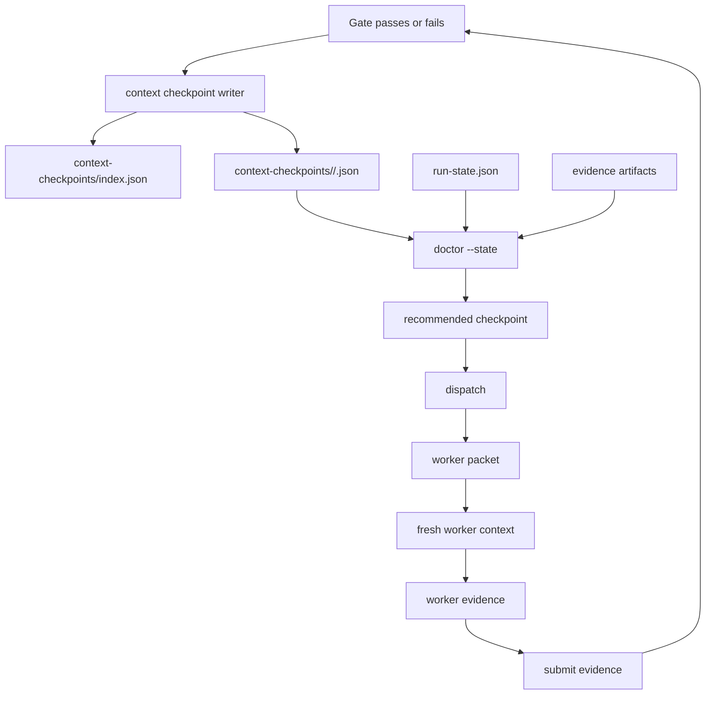

# Loop Engineering Context Checkpoints Design

> Date: 2026-06-13
> Scope: `skills/e2e-dev-harness`
> Status: design proposal

## Executive Summary

Loop Engineering 必然会经历多轮 clarify、plan、red、implement、review、verify 和 rework。问题不在于循环本身，而在于如果每轮都复用同一个长上下文，主 agent 会持续吸收命令输出、局部判断、失败尝试、过期假设和 worker 细节，最终形成上下文污染和上下文膨胀。

本文设计一个独立的 **Context Checkpoint** 机制：在关键 gate 通过、状态推进或 rework 发生时，控制面生成可验证、可重建、可最小加载的上下文胶囊。后续 rework 不从长聊天继续，而是由 `doctor --state` 定位 fault，再从最近可信 checkpoint 生成 fresh worker 的 `context_paths`。

关键定位：

> Context checkpoint is a resumable context capsule, not a second source of truth.

权威事实仍来自 `run-state.json`、phase records、evidence artifacts、artifact hashes，以及未来的 append-only event log。checkpoint 只回答一个问题：

> 如果要从某个关键点重新进入工作，应该加载哪些最小上下文？

## Problem Statement

Loop Engineering 的循环越强，越容易出现四类上下文问题：

1. **污染**：失败假设、过期路径、临时 debug 输出留在主 agent 对话中，后续推理会继续引用它们。
2. **膨胀**：每轮 test、grep、diff、review、artifact 摘要进入同一上下文，导致后续阶段携带无关细节。
3. **漂移**：聊天记忆、run-state、artifact、worker handoff 之间不一致，人工很难判断哪个才可信。
4. **返工失焦**：rework 时 agent 往往带着最近失败上下文继续修，而不是回到失败步骤之前的可信输入边界。

因此需要把“上下文延续”从聊天层移到控制面层：主 agent 保持轻量，只读状态、派发任务、审核 evidence；phase worker 用 fresh context 从 checkpoint 进入。

## Design Goals

- 保持 coordinator 上下文轻量，不让 phase execution 长期驻留在主聊天里。
- 每个关键 checkpoint 都可验证：引用的 artifact 必须有路径、hash 和 state/event 绑定。
- rework 能从最近可信节点恢复，而不是从失败后的脏上下文继续。
- checkpoint 只作为 context view，不替代 `run-state.json` 或 event log。
- 兼容当前 worker packet 模型：通过 `context_paths` 给 fresh worker 加载上下文。
- 支持未来 event-sourced replay：checkpoint 可由 event log 和 artifact registry 重建或校验。

## Non-Goals

- 不保存完整聊天 transcript 作为恢复依据。
- 不把 checkpoint 作为 lifecycle truth。
- 不允许 checkpoint 绕过 gate、伪造 worker completion 或修改 worker-owned artifacts。
- 不在第一版实现自动长期记忆提升；durable memory 只作为可选引用。
- 不要求每次命令都生成 checkpoint；只在关键控制面节点生成。

## Current Checkout Facts

当前 checkout 已有一些可复用底座：

- worker packet 已包含 `context_paths` 和 `context_policy: fresh`，适合加载最小上下文而不是继承 coordinator 聊天。
- `run_state.mutate()` 是受控状态修改 seam，适合挂接 checkpoint index 更新。
- verification failure 当前通过清空目标 phase evidence、写 `rework_required`、回退 `current_phase` 表达。
- `doctor --state` 已是目标方向，应成为定位 first fault 和 recommended checkpoint 的入口。
- 当前 `docs/loop-engineering-control-plane-design.md` 明确要求 `doctor --state`、`recover` 和 `next_legal_command` 基于真实 transition mechanics，而不是概念状态图。

同时也要承认边界：

- 当前 checkout 没有完整的一等 Context Checkpoint 机制。
- 当前 checkpoint-like 文档和 snapshots 主要是历史设计、计划或兼容投影，不能直接当作当前实现事实。
- 当前 rework 机制记录的是目标 phase 和 residue，不负责自动生成干净上下文包。

## Proposed Architecture



The coordinator stays small:

1. Read state.
2. Ask `doctor --state` or `next` for the legal next action.
3. Select the recommended checkpoint.
4. Dispatch a fresh worker with checkpoint paths.
5. Submit and gate evidence.

The worker receives a bounded context capsule:

1. The checkpoint JSON.
2. Referenced artifacts by path.
3. The current run-state pointer.
4. The specific failure evidence or rework reason.
5. The worker skill and expected outputs.

## Checkpoint Types

### 1. Phase Entry Checkpoint

Created when a phase becomes the active phase.

Purpose: capture the minimal inputs needed to execute this phase from a clean context.

Examples:

- `CLARIFIED` entry: user request, accepted clarification, acceptance contract.
- `PLANNED` entry: acceptance contract and planning constraints.
- `RED` entry: plan, acceptance contract, test scope.
- `IMPLEMENTED` entry: failing tests, implementation plan, allowed write scope.
- `REVIEWED` entry: passing tests, changed files, review instructions.
- `VERIFIED` entry: review evidence, scope manifest expectation, verification commands.

### 2. Gate Pass Checkpoint

Created after a gate passes.

Purpose: record the validated output boundary that downstream phases may trust.

This checkpoint should reference the exact evidence entries that passed validation and the phase record hash after mutation.

### 3. Rework Checkpoint

Created when gate evaluation or verification routes work backward.

Purpose: describe the failure, the target phase, the superseded evidence, and the clean input checkpoint to use for repair.

This is not a new lifecycle state. It is a context routing artifact derived from current checkout mechanics: `rework_required`, `current_phase`, phase evidence records, failures ledger, and gate validation.

### 4. Recovery Checkpoint

Created by future `recover --plan` / `recover --apply` flows.

Purpose: preserve the approved recovery boundary, input hashes, output hashes, and the legal next command after repair.

Recovery checkpoints must never mark worker-owned outputs complete by themselves.

## Checkpoint Schema

```json
{
  "schema": "e2e-dev-harness.context-checkpoint.v1",
  "checkpoint_id": "20260613T180512Z-IMPLEMENTED-gate-pass",
  "kind": "gate_pass",
  "run_id": "20260613T175900Z-example",
  "run_state_path": "docs/agent-runs/example/run-state.json",
  "phase": "IMPLEMENTED",
  "phase_record_hash": "sha256:...",
  "state_hash": "sha256:...",
  "event_id": null,
  "created_at": "2026-06-13T18:05:12Z",
  "created_by": "coordinator",
  "trusted": true,
  "trust_basis": [
    "gate_passed",
    "artifact_hashes_match",
    "state_hash_matches"
  ],
  "artifact_refs": [
    {
      "key": "passing_tests",
      "path": "docs/agent-runs/example/evidence/passing-tests.json",
      "sha256": "..."
    }
  ],
  "decision_summary": [
    "Implementation satisfies acceptance item AC-1.",
    "Verification must replay python -m pytest for final gate."
  ],
  "known_risks": [
    "Scope manifest still needs final grounding at VERIFIED."
  ],
  "open_questions": [],
  "changed_files": [
    "skills/e2e-dev-harness/scripts/e2e_harness/core/engine.py"
  ],
  "context_paths": [
    "docs/agent-runs/example/run-state.json",
    "docs/agent-runs/example/context-checkpoints/IMPLEMENTED/20260613T180512Z-IMPLEMENTED-gate-pass.json"
  ],
  "resume_prompt": "Resume from the IMPLEMENTED gate-pass checkpoint. Do not rely on coordinator chat. Read referenced artifacts, confirm hashes if needed, and produce only REVIEWED evidence.",
  "invalidates_when": [
    "state_hash_mismatch",
    "artifact_hash_mismatch",
    "git_head_changed_without_scope_refresh"
  ]
}
```

## Checkpoint Index

Each run should have a compact index:

```json
{
  "schema": "e2e-dev-harness.context-checkpoint-index.v1",
  "run_id": "20260613T175900Z-example",
  "latest_by_phase": {
    "CLARIFIED": "context-checkpoints/CLARIFIED/20260613T180000Z-CLARIFIED-gate-pass.json",
    "PLANNED": "context-checkpoints/PLANNED/20260613T180100Z-PLANNED-gate-pass.json",
    "RED": "context-checkpoints/RED/20260613T180200Z-RED-gate-pass.json",
    "IMPLEMENTED": "context-checkpoints/IMPLEMENTED/20260613T180512Z-IMPLEMENTED-gate-pass.json"
  },
  "latest_trusted": "context-checkpoints/IMPLEMENTED/20260613T180512Z-IMPLEMENTED-gate-pass.json",
  "latest_rework": null
}
```

The index is an acceleration structure. If it is missing or stale, the control plane should rebuild it from state and artifacts rather than trust it blindly.

## Rework Routing

Rework should load the checkpoint before the fault boundary, not the context after the failed attempt.

| Fault | Recommended Checkpoint |
| --- | --- |
| acceptance contract is wrong | phase entry or gate-pass checkpoint for `CLARIFIED` |
| plan contradicts acceptance | `CLARIFIED` gate-pass checkpoint |
| red tests are weak or wrong | `PLANNED` gate-pass checkpoint |
| implementation fails tests | `RED` gate-pass checkpoint |
| review finds implementation defect | `IMPLEMENTED` entry or gate-pass checkpoint |
| verification replay fails | `REVIEWED` gate-pass checkpoint, or target from `rework_required` |
| scope overclaim | latest checkpoint before `scope_manifest` was produced |

The rule is:

> Load the smallest trusted checkpoint that contains all valid upstream facts and none of the failed downstream assumptions.

## Doctor Integration

`doctor --state` should become the read-only selector for rework context. It should not create or mutate checkpoints in its first version.

Suggested output extension:

```json
{
  "schema": "e2e-dev-harness.doctor-state.v1",
  "run_blocked": true,
  "first_fault": {
    "kind": "verification_failed",
    "phase": "VERIFIED",
    "message": "verification replay failed"
  },
  "rework_target_phase": "IMPLEMENTED",
  "recommended_checkpoint": {
    "path": "docs/agent-runs/example/context-checkpoints/RED/20260613T180200Z-RED-gate-pass.json",
    "reason": "Last trusted checkpoint before IMPLEMENTED evidence was superseded."
  },
  "next_legal_command": "e2e-dev-harness dispatch --state docs/agent-runs/example/run-state.json --repo ."
}
```

This keeps diagnosis and mutation separate:

- `doctor --state` selects context.
- `dispatch` launches a fresh worker.
- `submit` records evidence.
- `next` or `gate` evaluates transitions.

## Dispatch Integration

Worker packets should continue to be pointers, not payload dumps.

Before:

```json
{
  "context_paths": [
    "docs/agent-runs/example/run-state.json"
  ],
  "context_policy": "fresh"
}
```

After:

```json
{
  "context_paths": [
    "docs/agent-runs/example/run-state.json",
    "docs/agent-runs/example/context-checkpoints/RED/20260613T180200Z-RED-gate-pass.json",
    "docs/agent-runs/example/evidence/failing-tests.json"
  ],
  "context_policy": "fresh"
}
```

The runtime adapter remains simple. It only passes paths to Codex, Claude Code, OpenCode, or manual runtime. It does not decide which checkpoint is correct.

## Trust And Invalidation

Checkpoint trust must be explicit.

A checkpoint is trusted only if:

- referenced artifact files exist;
- recorded hashes match current files;
- recorded `state_hash` or future `event_id` matches the control-plane truth;
- checkpoint phase is compatible with current `current_phase` and `rework_required`;
- checkpoint kind is legal for the requested operation.

A checkpoint becomes invalid if:

- any artifact hash changes;
- run-state phase record no longer matches;
- git head changes and the checkpoint includes code-sensitive context;
- future event replay cannot reproduce the checkpoint boundary;
- checkpoint was produced by a failed or untrusted recovery path.

Invalid checkpoint behavior should be conservative:

1. Mark checkpoint `trusted: false`.
2. Rebuild from state and artifacts if possible.
3. If rebuild fails, require a fresh phase worker rather than reusing old context.

## Storage Layout

Recommended run-local layout:

```text
docs/agent-runs/<run>/
  run-state.json
  context-checkpoints/
    index.json
    CLARIFIED/
      <checkpoint-id>.json
    PLANNED/
      <checkpoint-id>.json
    RED/
      <checkpoint-id>.json
    IMPLEMENTED/
      <checkpoint-id>.json
    REVIEWED/
      <checkpoint-id>.json
    VERIFIED/
      <checkpoint-id>.json
    REWORK/
      <checkpoint-id>.json
```

Do not store full raw command output in checkpoints. Large output belongs in evidence artifacts, with checkpoint references and hashes.

## Context Budget Policy

Checkpoint loading should enforce a budget:

- Maximum direct checkpoint JSON: small enough for coordinator and worker prompts.
- Maximum referenced artifacts loaded inline: zero by default; workers read files from paths.
- Maximum summary bullets per checkpoint: bounded and phase-specific.
- Full command output: never inline; only path, exit code, hash, and short diagnosis.
- Durable memory: optional and explicitly labeled `optional-context-not-authority`.

This mirrors the larger principle:

> Chat context should carry decisions and pointers; files carry evidence.

## Event Log Compatibility

First implementation can use `run-state.json` as the control-plane truth. Future event-sourced architecture should treat checkpoint creation as an event or projection:

- `checkpoint.created`
- `checkpoint.invalidated`
- `checkpoint.rebuilt`
- `rework.context_selected`

Once append-only events become authoritative, checkpoint validation should prefer event identity over mutable state hash.

## Failure Handling

### Missing Checkpoint

If a recommended checkpoint is missing, `doctor --state` should fall back to the nearest earlier trusted checkpoint. If none exists, dispatch from the current run-state path and mark the context as degraded.

### Stale Checkpoint

If hashes disagree, do not load the checkpoint silently. Return a clear diagnosis such as `checkpoint_artifact_hash_mismatch`.

### Conflicting Checkpoints

If multiple checkpoints claim to be latest for the same phase, prefer the one reachable from current state/event truth and mark the others superseded.

### Manual Runtime

Manual runtime can receive the same checkpoint paths, but trust is lower because the harness cannot enforce what the human loaded. The evidence gate must remain the authority.

## Implementation Slices

### Slice 1: Documentation And Schema Tests

- Add schema examples for `context-checkpoint.v1` and index.
- Add tests that validate required fields and reject missing hash/path entries.
- No lifecycle behavior change.

### Slice 2: Gate-Pass Checkpoint Writer

- After a gate passes, write a checkpoint for the phase.
- Update `context-checkpoints/index.json`.
- Keep this additive and non-blocking at first.

### Slice 3: Rework Context Selection

- Extend run diagnosis to recommend a checkpoint for `rework_required`.
- Add test cases for verification failure, review failure, and missing evidence.
- Do not mutate state from diagnosis.

### Slice 4: Dispatch Context Injection

- Add selected checkpoint path to worker `context_paths`.
- Preserve `context_policy: fresh`.
- Keep runtime adapters unchanged except for pass-through tests.

### Slice 5: Trust Enforcement

- Validate checkpoint hashes before injection.
- Mark stale checkpoints invalid.
- Add compact operator-facing errors.

### Slice 6: Event Projection

- When append-only events are introduced, emit checkpoint events and rebuild checkpoint index from event truth.

## Acceptance Criteria

- A rework run can be dispatched with a fresh worker that receives only run-state, the recommended checkpoint, and necessary evidence paths.
- `doctor --state` can identify a recommended checkpoint without mutating state.
- Checkpoint files cannot silently override lifecycle or evidence gate truth.
- Stale artifact hashes cause checkpoint invalidation, not hidden reuse.
- Worker packets remain path-based and bounded.
- Coordinator chat no longer needs to carry full command output or phase transcript to support rework.

## Open Design Decisions

1. Whether gate-pass checkpoint writing should be mandatory once enabled, or initially best-effort.
2. Whether checkpoint summaries should be generated by the coordinator, by the phase worker, or by a separate summarizer.
3. Whether `git_head` should be required in every checkpoint, or only code-sensitive phases.
4. Whether checkpoint index should live only under the run directory or also be referenced from `artifact-registry.json`.

## Recommended Decision

Start with additive, run-local, best-effort checkpoints:

1. Write checkpoint files after gate pass.
2. Let `doctor --state` recommend them for rework.
3. Inject them into fresh worker `context_paths`.
4. Enforce hashes before trusting them.

This solves the immediate context pollution problem without pretending checkpoint files are the control-plane truth. It also creates a clean migration path to event-sourced Loop Engineering later.
