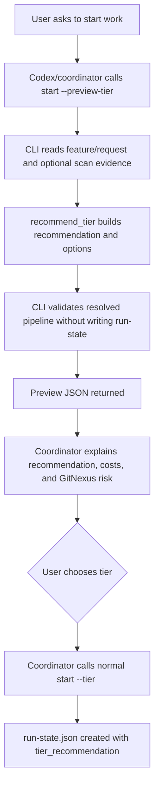

# Tier Preview Confirmation Design

> Date: 2026-06-13
> Scope: `skills/e2e-dev-harness`
> Status: approved design, pending implementation
> Related: `docs/superpowers/plans/2026-06-12-risk-aware-tier-options.md`

## Executive Summary

`e2e-dev-harness start` already computes a risk-aware `tier_recommendation` and persists it into `run-state.json`. That gives the control plane a good default, but the user experience is still "the system chose" rather than "the system recommended and the user confirmed".

This design adds an opt-in tier preview path:

```text
e2e-dev-harness start --preview-tier ...
```

Preview mode computes the same recommendation and option list as `start`, including scanner and GitNexus-derived evidence when `--scan` is enabled, but it does not create a run directory or write `run-state.json`. A Codex/coordinator layer can show the recommendation, costs, and risks to the user, then call normal `start --tier <choice>` after the user chooses.

The key product decision is: make the user choice explicit without turning the CLI into a blocking interactive prompt.

## Current Checkout Facts

- `start` is implemented in `skills/e2e-dev-harness/scripts/e2e_harness/cli/commands/start.py`.
- `start` reads feature/request text, selects the domain adapter, optionally runs adapter scan, calls `recommend.recommend_tier(...)`, validates the resolved pipeline, creates `run-state.json`, and returns JSON.
- `--tier` defaults to `auto` in `skills/e2e-dev-harness/scripts/e2e_harness/cli/main.py`.
- `recommend_tier` is pure and lives in `skills/e2e-dev-harness/scripts/e2e_harness/adapters/tier/recommend.py`.
- The four built-in tiers map to these pipeline shapes:
  - `minimal`: CREATED, CLARIFIED, RED, IMPLEMENTED, VERIFIED.
  - `standard`: adds PLANNED and REVIEWED.
  - `critical`: REVIEWED requires R1/R2/R3 review evidence.
  - `audited`: VERIFIED also requires audit replay and agent-team dispatch evidence.
- GitNexus impact for the current `start.run` and `recommend_tier` symbols is LOW at design time, but CLI shape changes still carry compatibility risk because stdout is machine-readable JSON.

## Goals

- Let users see several tier options before a run is created.
- Preserve the current non-interactive JSON CLI contract.
- Keep `start` deterministic for scripts, tests, and worker automation.
- Keep `recommend_tier` pure; it should consume evidence, not collect it.
- Preserve current `start` behavior when `--preview-tier` is not provided.
- Make GitNexus impact evidence visible in the preview when scanner evidence includes it.
- Make downgrade decisions auditable when the later confirmed `start --tier <choice>` is below the recommendation.

## Non-Goals

- No default stdin prompt inside `start`.
- No new lifecycle phase such as `CONFIRM_TIER`.
- No partially created run-state waiting for tier confirmation.
- No mutation from preview mode.
- No change to `next`, `dispatch`, `submit`, `gate`, `status`, hooks, or phase guards.
- No new top-level CLI verb for the first implementation slice.

## Design Decision

Use an additive flag on `start`:

```text
e2e-dev-harness start --preview-tier --repo . --feature X --request-file request.md --scan
```

The command returns a new schema:

```json
{
  "schema": "e2e-dev-harness.tier-preview.v1",
  "feature": "X",
  "domain": "backend",
  "run_will_be_created": false,
  "recommended_tier": "critical",
  "selected_tier": "critical",
  "selection_source": "auto",
  "tier_reasons": ["GitNexus impact risk: HIGH"],
  "tier_recommendation": {
    "schema": "e2e-dev-harness.tier-recommendation.v1",
    "recommended_tier": "critical",
    "selected_tier": "critical",
    "selection_source": "auto",
    "options": []
  },
  "pipeline": "critical",
  "pipeline_override": false,
  "tier_controls_pipeline": true,
  "confirmation": {
    "recommended_start_args": ["start", "--tier", "critical"],
    "choice_arg": "--tier <minimal|standard|critical|audited>"
  }
}
```

The preview result is intentionally close to the current `start` result but excludes `run_id`, `run_state`, and `current_phase`. Those fields imply a run exists, and preview mode must not imply that.

## Flow



## Command Contract

### Normal Start

Normal start remains unchanged:

```text
e2e-dev-harness start --repo . --feature X --request-file request.md
```

It creates a run and returns:

```json
{
  "schema": "e2e-dev-harness.start.v1",
  "run_id": "...",
  "run_state": ".../run-state.json",
  "current_phase": "CREATED",
  "tier": "standard",
  "tier_recommendation": {}
}
```

### Preview Start

Preview start:

```text
e2e-dev-harness start --preview-tier --repo . --feature X --request-file request.md
```

It returns tier choice data and does not create:

- `docs/agent-runs/<run>/run-state.json`
- `run_id`
- `current_phase`
- dispatch, schedule, evidence, or gate state

### Explicit Tier In Preview

If preview is called with an explicit tier:

```text
e2e-dev-harness start --preview-tier --tier minimal ...
```

The preview uses the same selection semantics as normal start. If the requested tier is below the recommendation, preview includes the same downgrade metadata:

```json
{
  "downgrade": {
    "requested_below_recommended": true,
    "requires_provenance": true,
    "blocked": false
  }
}
```

This lets the coordinator warn before the user confirms the lower tier.

## Pipeline Override Rules

`--pipeline` already overrides the tier-selected spine. Preview must make that visible:

```json
{
  "pipeline": "path/to/custom.yaml",
  "pipeline_override": true,
  "tier_controls_pipeline": false
}
```

In this case tier recommendation still matters as a risk signal, but the actual pipeline comes from `--pipeline`. The preview should validate the resolved pipeline exactly as normal `start` would, then return the same invalid-pipeline error shape if validation fails.

## GitNexus Evidence Rules

Preview does not call GitNexus directly. It uses the same evidence source as normal `start`:

```text
adapter.scan(repo, request) if --scan else None
```

If scanner output includes `scope["gitnexus"]["impact_summary"]`, `recommend_tier` can raise the recommendation. If cross-service dependencies exist but GitNexus evidence is not verified, that reason stays visible in `tier_recommendation.reasons`.

The coordinator can render these reasons as:

- MEDIUM impact: recommend at least `standard`.
- HIGH or CRITICAL impact: recommend at least `critical`.
- Cross-service dependencies without verified GitNexus evidence: recommend at least `critical` and explain the uncertainty.

## Coordinator UX

The CLI returns JSON only. The human-facing choice happens outside the CLI:

```text
Recommended: critical
Reason: GitNexus impact risk HIGH, cross-service dependency evidence verified.

Options:
- minimal: fastest, skips planning/review; below recommendation.
- standard: planning plus single review; below recommendation.
- critical: recommended; R1/R2/R3 review fan-out.
- audited: highest assurance; adds audit replay and agent-team dispatch evidence.

Choose a tier to create the run.
```

When the user chooses a tier, the coordinator calls normal `start --tier <choice>` and carries over the same feature/request/adapter/scan/pipeline arguments.

## State and Audit Contract

Preview mode writes no run-state. The confirmed run records the final decision through the existing `tier_recommendation` object:

```json
{
  "tier": "standard",
  "pipeline": "standard",
  "tier_recommendation": {
    "recommended_tier": "critical",
    "selected_tier": "standard",
    "selection_source": "explicit",
    "downgrade": {
      "requested_below_recommended": true,
      "requires_provenance": true,
      "blocked": false
    }
  }
}
```

The first implementation does not add a separate provenance field. It keeps the existing downgrade contract and leaves richer human-choice provenance for a later slice if real consumers need it.

## Compatibility

- Existing `start` callers do not change.
- Existing tests that parse JSON stdout keep working.
- Preview mode is opt-in and JSON-only.
- No command reads from stdin.
- `--preview-tier` can be ignored by older wrappers until they opt in.

## Failure Modes

- Invalid adapter: same behavior as normal `start`; `main.py` catches and returns JSON error with exit code 2.
- Invalid pipeline: preview returns the same invalid-pipeline JSON shape normal `start` would return.
- Scanner failure: same behavior as normal `start --scan`; no new recovery path.
- Request text mojibake: same `text_input.read_text_arg` guard as normal `start`.

## Test Strategy

- CLI test proves preview returns `tier-preview.v1`, options, recommendation, and no `run_state`.
- Filesystem test proves preview does not create `docs/agent-runs`.
- CLI test proves normal `start` remains unchanged.
- CLI test proves explicit preview below recommendation returns downgrade metadata.
- CLI test proves `--pipeline` marks `pipeline_override=true` and `tier_controls_pipeline=false`.
- Documentation test proves `SKILL.md` documents preview mode, non-mutating behavior, and confirmation flow.

## Rollout

1. Add parser flag and preview branch behind `--preview-tier`.
2. Cover preview behavior with failing tests before implementation.
3. Update `SKILL.md` with the coordinator-facing contract.
4. Keep normal `start` default unchanged.
5. Run focused CLI/doc tests and GitNexus change detection before committing.
