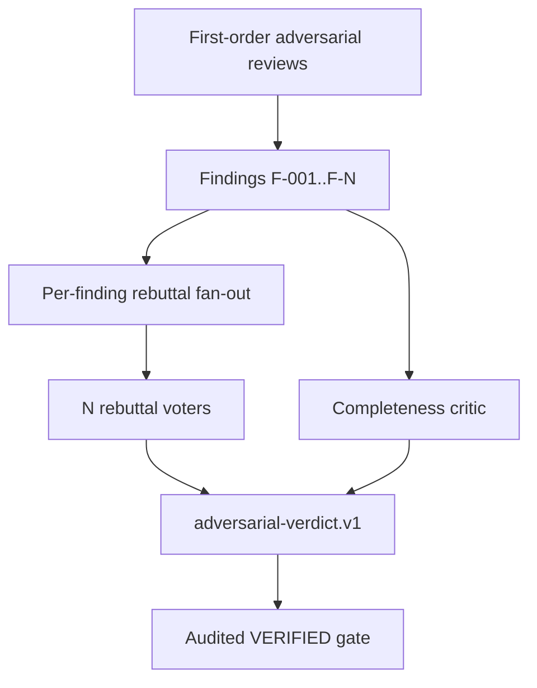

# Adversarial Verdict Harness Design

> Date: 2026-06-14
> Scope: Slice 4: second-order adversarial verdict verification inside the harness
> Status: design proposal, pending user review

## Current Checkout Facts

- GitNexus index was rebuilt before writing this document: `npx gitnexus analyze` reported 6,069 nodes, 8,857 edges, and 179 flows.
- Existing adversarial review design and current source cover first-order adversarial REVIEWED fan-out:
  - `docs/superpowers/specs/2026-06-13-adversarial-review-skill-design.md`
  - `skills/e2e-dev-harness/pipelines/adversarial.yaml`
  - `skills/e2e-dev-harness/agent-teams/default-adversarial.yaml`
  - `skills/e2e-dev-harness/scripts/e2e_harness/adapters/evidence/adversarial.py`
  - `validate.STRUCTURED_KEYS` entries for `adversarial_code_review`, `adversarial_design_review`, and `adversarial_test_design_review`
- That existing layer asks reviewers to attack code, design, and test assumptions. This document defines the next layer: verify each finding itself through independent rebuttal and completeness criticism.

## Goal

Make "second-order verify" a harness-audited capability:

1. For each first-order finding, dispatch independent rebuttal workers.
2. Ask each rebutter to decide whether the finding is real, refuted, overstated, understated, or unsupported.
3. Aggregate majority and minority views.
4. Run a completeness critic that looks for missing findings or blind spots.
5. Submit the result as structured evidence under a new key: `adversarial-verdict.v1`.

The harness should audit this as a control-plane evidence layer, not rely on coordinator prose.

## Non-Goals

- Do not replace the existing adversarial REVIEWED pipeline.
- Do not let the coordinator rewrite reviewer findings into nicer form.
- Do not require every standard or critical run to use this capability.
- Do not make the first-order reviewer and second-order rebutter share context.
- Do not turn second-order verdicts into code fixes.
- Do not make severity correction a free-form chat convention; it must be structured evidence.

## Conceptual Model



The first-order review asks, "What could be wrong?"

The second-order verdict asks, "Are those claims actually valid, and what did the first-order review miss?"

## New Evidence Key

Evidence key:

```text
adversarial_verdict
```

Schema id:

```text
e2e-dev-harness.adversarial-verdict.v1
```

The key name uses underscore to match existing harness evidence-key style. The schema name uses the requested dotted/dashed version string.

## Schema

Top-level artifact:

```json
{
  "schema": "e2e-dev-harness.adversarial-verdict.v1",
  "source_review_keys": [
    "adversarial_code_review",
    "adversarial_design_review",
    "adversarial_test_design_review"
  ],
  "finding_verdicts": [
    {
      "finding_id": "F-001",
      "source_key": "adversarial_code_review",
      "claim": "The implementation can lose submitted evidence under parallel reviewer submit.",
      "is_real": true,
      "refuted": false,
      "justification": "Two independent voters reproduced the lost-update path before the run-state lock was applied; the current code path now serializes submit through mutate.",
      "severity": "high",
      "corrected_severity": "medium",
      "voters": [
        {
          "id": "F-001-r1",
          "perspective": "implementation",
          "vote": "real",
          "confidence": "high",
          "rationale": "The claim is valid for any writer that bypasses run_state.mutate; submit itself is covered.",
          "evidence": [
            "skills/e2e-dev-harness/scripts/e2e_harness/core/run_state.py:128"
          ]
        },
        {
          "id": "F-001-r2",
          "perspective": "test-design",
          "vote": "overstated",
          "confidence": "medium",
          "rationale": "The submitted tests cover submit concurrency but not dispatch concurrency.",
          "evidence": [
            "skills/e2e-dev-harness/tests/test_run_state.py"
          ]
        },
        {
          "id": "F-001-r3",
          "perspective": "control-plane",
          "vote": "real",
          "confidence": "high",
          "rationale": "The control-plane invariant is valid, but corrected severity is medium because the first writer is lock-protected.",
          "evidence": [
            "skills/e2e-dev-harness/scripts/e2e_harness/cli/commands/submit.py"
          ]
        }
      ],
      "majority": {
        "vote": "real",
        "count": 2,
        "of": 3
      },
      "minority_report": "One voter treats the finding as overstated because dispatch was outside the submitted proof scope."
    }
  ],
  "completeness_critic": {
    "reviewed_sources": [
      "adversarial_code_review",
      "adversarial_design_review",
      "adversarial_test_design_review",
      "implementation_diff",
      "test_results"
    ],
    "missing_findings": [
      {
        "id": "M-001",
        "claim": "No test proves malformed adversarial verdict JSON is rejected at gate time.",
        "severity": "medium",
        "evidence": "No STRUCTURED_KEYS test for adversarial_verdict was present in the reviewed test slice.",
        "recommended_action": "Add a malformed JSON gate rejection test before implementation."
      }
    ],
    "residual_risk": [
      "Voters used source snapshots rather than executing the full suite."
    ]
  },
  "overall": {
    "blocks_verification": true,
    "reason": "One medium missing-finding remains untested."
  }
}
```

Required per-finding fields:

- `finding_id`
- `claim`
- `is_real`
- `refuted`
- `justification`
- `severity`
- `corrected_severity`
- `voters`

Allowed severities:

```text
critical | high | medium | low | info
```

Allowed voter decisions:

```text
real | refuted | overstated | understated | insufficient-evidence
```

## Validator

Add a validator:

```python
validate_adversarial_verdict(obj, repo_root, state=None) -> tuple[bool, str | None]
```

Likely file:

```text
skills/e2e-dev-harness/scripts/e2e_harness/adapters/evidence/adversarial_verdict.py
```

Register it in `STRUCTURED_KEYS`:

```python
"adversarial_verdict": adversarial_verdict.validate_adversarial_verdict
```

### Structural Rules

The validator must reject:

- non-JSON evidence
- wrong `schema`
- missing or empty `source_review_keys`
- missing or empty `finding_verdicts` when source reviews contain findings
- duplicate `finding_id`
- verdict entries missing required fields
- non-boolean `is_real` or `refuted`
- `is_real == true` and `refuted == true` at the same time
- unknown severity or voter decision
- empty `voters`
- malformed completeness critic

### Argument Sufficiency Rules

The validator must reject:

- `justification` shorter than a meaningful threshold, for example fewer than 80 non-space characters.
- any voter without non-empty `rationale`.
- any `real`, `overstated`, or `understated` vote without at least one evidence reference.
- `corrected_severity` that changes severity without a justification mentioning why severity changed.
- `overall.blocks_verification == false` while any high or critical finding remains `is_real == true`.
- `overall.blocks_verification == false` while the completeness critic has high or critical `missing_findings`.

### Binding Rules

The validator must bind verdicts to submitted findings, not let workers invent a clean slate.

Inputs it can use:

- The submitted `adversarial_verdict` artifact.
- `state["phases"]["REVIEWED"]["evidence"]` entries for first-order adversarial review keys.
- The repo root to resolve evidence artifact paths.

Binding checks:

- Every `source_key` in a finding verdict must exist in `source_review_keys`.
- Every `finding_id` in the verdict must exist in one of the source review artifacts.
- Every high or critical source finding must have a verdict.
- A verdict must preserve the original `claim` text or cite the original claim id and include `claim`.

If the existing `adversarial-review.v1` schema does not expose enough stable finding ids, implementation must first add stable first-order finding ids under a separate reviewed task. Do not silently fall back to "best effort" string matching.

## Dynamic Fan-Out

### Dispatch Shape

For each finding, create N rebutter packets. Recommended default: N=3.

Perspectives:

- implementation rebutter
- test-design rebutter
- control-plane rebutter

For a run with three findings, the plan shape is:

```text
F-001 -> F-001-r1, F-001-r2, F-001-r3
F-002 -> F-002-r1, F-002-r2, F-002-r3
F-003 -> F-003-r1, F-003-r2, F-003-r3
completion critic -> completeness-critic
aggregator -> adversarial_verdict
```

### Reuse Of Existing Adversarial Review Pipeline

Reuse the existing adversarial review design in three ways:

- Keep first-order `REVIEWED` fan-out as the source of findings.
- Reuse fresh-context worker packet discipline: each rebutter receives only the finding, source artifact path, implementation/test context paths, and expected output.
- Reuse `evidence-key-fanout` machinery where possible for fixed perspectives.

But second-order fan-out has one new requirement: worker count depends on finding count. Existing `evidence-key-fanout` is static by evidence key, so implementation likely needs a new agent-team strategy:

```text
finding-verdict-fanout
```

This strategy reads reviewed evidence, extracts finding ids, and emits per-finding rebuttal workers plus one completeness critic. The aggregator can be either:

- a dedicated worker that produces `adversarial_verdict`, or
- a deterministic harness reducer that merges rebuttal JSON into `adversarial_verdict`.

Recommended first implementation: worker-produced aggregate, harness-validated. A deterministic reducer is stronger but requires a larger control-plane change.

## Gate Model Position

Recommended placement: `VERIFIED` phase in an audited or adversarial-audited pipeline.

Reason:

- First-order adversarial findings are produced in `REVIEWED`.
- Second-order verification judges those findings before final verification closes.
- The output is audit evidence, not another code-review report.

### Pipeline Options

Option A: extend `audited` when adversarial review is selected.

```yaml
VERIFIED:
  produces: [verification, audit_replay, agent_team_dispatch, adversarial_verdict]
  exit_gate: [verification, audit_replay, agent_team_dispatch, adversarial_verdict]
```

Option B: add a new opt-in pipeline:

```text
adversarial-audited
```

It combines:

- adversarial first-order REVIEWED fan-out
- audited VERIFIED evidence
- second-order `adversarial_verdict`

Recommendation: Option B. It avoids surprising existing audited users and keeps the cost explicit.

### Tier Scaling

- `minimal`: no second-order verdict.
- `standard`: no second-order verdict.
- `critical`: no second-order verdict by default.
- `audited`: no second-order verdict unless explicitly selected.
- `adversarial`: first-order adversarial review only.
- `adversarial-audited`: first-order adversarial review plus second-order verdict.

Tier recommendation may suggest `adversarial-audited` for:

- control-plane changes
- evidence/gate/dispatch changes
- HIGH or CRITICAL GitNexus impact
- security-sensitive changes
- changes where review findings themselves are likely contested

The suggestion remains advisory and user-confirmed.

## Exit Gate Wiring

`gate_passes` already delegates structured key validation through `validate.validate_evidence`. The new key should therefore be wired by:

1. Add `adversarial_verdict` to a pipeline phase's `produces`.
2. Add `adversarial_verdict` to that phase's `exit_gate`.
3. Register the validator in `STRUCTURED_KEYS`.
4. Ensure `validate_evidence(..., state=state)` reaches the validator when binding to first-order findings is required.

If `STRUCTURED_KEYS` currently only supports `(obj, repo_root)` lambdas for most validators, implementation must add a small adapter branch like existing `scope_manifest` and `test_substance` state-aware branches. Do not make the validator reload `run-state.json` from paths inside worker-owned evidence.

## Affected Symbols And Impact Plan

The following GitNexus impact samples were run against the current index. They are planning evidence only. Rerun impact for the exact symbols before implementation.

| Symbol | File | Current sampled impact | Edit plan |
| --- | --- | --- | --- |
| `validate_evidence` | `skills/e2e-dev-harness/scripts/e2e_harness/adapters/evidence/validate.py` | LOW, direct callers 0, affected processes 0 | Needed for `STRUCTURED_KEYS` registration and state-aware branch. |
| `validate_adversarial_review` | `skills/e2e-dev-harness/scripts/e2e_harness/adapters/evidence/adversarial.py` | LOW, direct callers 0, affected processes 0 | Usually not edited; source schema may need stable finding ids if absent. |
| `validate_adversarial_verdict` | new `adapters/evidence/adversarial_verdict.py` | New symbol, no upstream callers before registration | Add only after red validator tests. |
| `BuiltinAgentTeamProvider.plan_phase` | `skills/e2e-dev-harness/scripts/e2e_harness/adapters/agent_team/builtin.py` | LOW, direct caller `dispatch.run`, affected process: dispatch run | Needed only if dynamic finding fan-out is integrated into provider. |
| `dispatch.run` | `skills/e2e-dev-harness/scripts/e2e_harness/cli/commands/dispatch.py` | Must rerun before editing | Needed only if dispatch must choose `finding-verdict-fanout`. |
| `pipeline_validate.validate_spec` | `skills/e2e-dev-harness/scripts/e2e_harness/core/pipeline_validate.py` | LOW, direct callers 0, affected processes 0 | Avoid editing unless new pipeline schema fields are needed. |
| `pipeline.spine_for_state` | `skills/e2e-dev-harness/scripts/e2e_harness/pipeline.py` | LOW, direct callers 0, affected processes 0 | Avoid editing; prefer YAML pipeline addition. |
| `gates.gate_passes` | `skills/e2e-dev-harness/scripts/e2e_harness/core/gates.py` | Must rerun before editing | Avoid editing if `validate_evidence` state threading is enough. |

No HIGH or CRITICAL impact was observed in the sampled set.

## TDD Test Plan

Use focused tests first. Do not run the full suite in a parallel workflow.

Windows command template:

```powershell
$env:PYTHONUTF8='1'; $env:PYTHONIOENCODING='utf-8'; $env:TMP='.test-tmp'; $env:TEMP='.test-tmp'; python -m pytest <file> -q -p no:randomly --basetemp=.test-tmp/<slice>
```

### Validator Red Tests

Create:

```text
skills/e2e-dev-harness/tests/test_adversarial_verdict_evidence.py
```

Red cases:

- prose file for `adversarial_verdict` is rejected as `not-json`
- wrong schema is rejected as `bad-schema`
- missing `finding_id` is rejected
- duplicate `finding_id` is rejected
- `is_real` plus `refuted` both true is rejected
- empty voters are rejected
- voter with no rationale is rejected
- real vote with no evidence is rejected
- severity correction with no severity rationale is rejected
- high real finding with `overall.blocks_verification=false` is rejected
- valid artifact passes

### Binding Red Tests

Use a fake reviewed phase with first-order adversarial review artifacts.

Red cases:

- verdict references a `finding_id` not present in source artifacts
- source artifact contains a high finding missing from `finding_verdicts`
- source key in verdict is not present in `source_review_keys`
- validator does not trust worker-supplied copies of source findings when run-state evidence disagrees

### Pipeline Red Tests

If adding `adversarial-audited.yaml`:

- active phases remain full spine
- REVIEWED uses adversarial first-order keys
- VERIFIED requires `verification`, `audit_replay`, `agent_team_dispatch`, and `adversarial_verdict`
- existing `minimal`, `standard`, `critical`, `audited`, and `adversarial` pipelines are unchanged

### Dynamic Fan-Out Red Tests

If adding provider strategy:

- two source findings produce six rebutter workers with N=3
- each worker receives exactly one finding id
- perspectives are diverse for each finding
- no worker receives full coordinator chat
- completeness critic worker is present exactly once
- aggregate expected output is `adversarial_verdict`

### Gate Red Tests

- VERIFIED blocks when `adversarial_verdict` is absent.
- VERIFIED blocks when `adversarial_verdict` is malformed.
- VERIFIED passes when valid verdict, verification, audit replay, and dispatch provenance are present.
- A module-namespaced key such as `adversarial_verdict#auth` either validates through `base_key` or is explicitly rejected by design; choose and test one behavior.

## Rollout Plan

1. Add validator and tests for standalone schema.
2. Add binding to first-order findings through trusted run-state evidence.
3. Add pipeline-level `adversarial-audited` gate wiring.
4. Add dynamic fan-out strategy.
5. Add worker skill instructions for rebutters and completeness critic.
6. Add tier recommendation suggestion only after the pipeline is proven.

This order keeps the gate honest before fan-out becomes expensive.

## Open Questions For User Decision

1. Should the evidence key be `adversarial_verdict` for local naming consistency, or exactly `adversarial-verdict.v1` as a key despite current underscore conventions?
2. Should second-order verdict live in a new `adversarial-audited` pipeline, or extend `audited` when adversarial review is selected?
3. Should the aggregate verdict be produced by a worker or by a deterministic harness reducer?
4. What is the default voter count: 3 always, or tier-scaled N?
5. Should a single high real finding block verification automatically, or only when corrected severity remains high/critical?
6. Should completeness critic missing findings create new first-class findings that require their own rebuttal round, or block with recommended action only?
7. Must first-order `adversarial-review.v1` be upgraded to require stable finding ids before this slice starts?

## Recommended Decision

Use an explicit `adversarial-audited` pipeline with:

- first-order adversarial REVIEWED fan-out,
- second-order per-finding rebuttal fan-out,
- one completeness critic,
- worker-produced `adversarial_verdict`,
- strict `STRUCTURED_KEYS` validation,
- audited VERIFIED gate wiring.

This keeps cost and assurance visible while turning adversarial review from "three reports exist" into "the findings themselves survived structured challenge."
