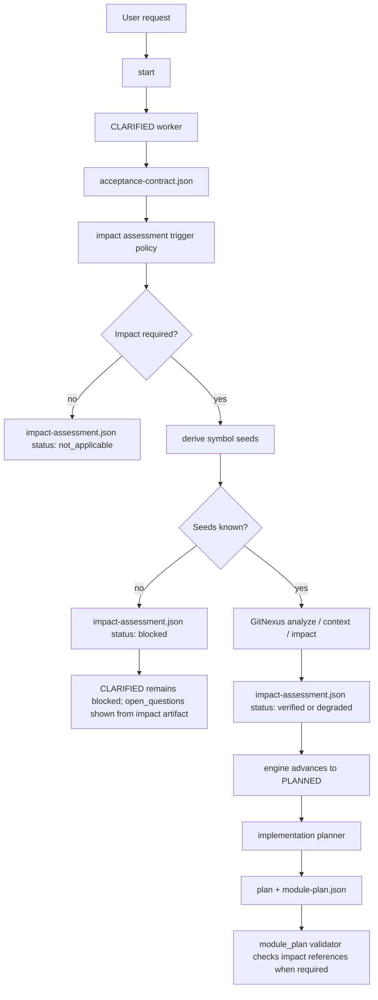

# GitNexus Impact Analysis Design

> Date: 2026-06-14
> Scope: `skills/e2e-dev-harness`
> Status: proposed design, revised after implementation review and a follow-up gate-seam review (F1–F7)
> Related: `docs/superpowers/specs/2026-06-11-plugin-agent-team-design.md`, `docs/superpowers/specs/2026-06-13-tier-preview-confirmation-design.md`, `docs/superpowers/specs/2026-06-13-clarification-review-dispatch-design.md`

## Executive Summary

The harness already knows how to consume GitNexus impact evidence when it is
present, but requirement clarification and implementation planning do not
currently make that evidence a normal part of the analysis flow. This leaves the
planner free to slice work by semantic guesswork instead of by real code
dependencies, affected call chains, and regression surfaces.

This design adds a structured **GitNexus Impact Assessment** artifact between
clarification and planning:

```text
CLARIFIED acceptance contract
  -> derive or request symbol seeds
  -> run GitNexus context / impact
  -> persist impact-assessment.json
  -> pass artifact to implementation planner
  -> require module_plan to reference impact evidence when code impact is known
```

The main decision is: impact analysis should not replace product clarification,
but it should constrain implementation planning. The planner should know which
symbols, processes, modules, API routes, and tests are likely affected before it
commits to a module plan.

The enforcement point is explicit: `next -> engine.evaluate -> gates.gate_passes`
performs a state-aware supplemental gate on `PLANNED`. The trigger policy runs in
one authoritative helper, `impact_bridge.ensure_assessment_for_planning(...)`,
which is idempotent on the acceptance-contract hash and is reachable from two
conditions: when the engine is about to advance from `CLARIFIED` to `PLANNED`,
and when the engine evaluates a run whose cursor is already at `PLANNED` but has
no fresh binding (resume, migration, or an amended contract). `dispatch` only
transports an already-persisted artifact.

## Current Checkout Facts

- Lifecycle phases are declared in
  `skills/e2e-dev-harness/scripts/e2e_harness/core/lifecycle.py`.
- `CLARIFIED` currently produces `clarification` and `acceptance_contract`.
- `PLANNED` currently produces `plan` and `module_plan`.
- `module_plan` validation lives in
  `skills/e2e-dev-harness/scripts/e2e_harness/core/module_plan.py` and checks
  shape, dependency closure, and cycles.
- Structured evidence validation lives in
  `skills/e2e-dev-harness/scripts/e2e_harness/adapters/evidence/validate.py`.
- Gate evaluation lives in
  `skills/e2e-dev-harness/scripts/e2e_harness/core/gates.py`. It already receives
  full run-state through `gate_passes(..., state=state)` from
  `engine.evaluate(...)`.
- `submit` records evidence and stamps the phase contract; it does not decide
  whether a phase can advance. The authoritative advance check is `next ->
  engine.evaluate -> gates.gate_passes`.
- `skills/e2e-dev-harness/scripts/e2e_harness/adapters/tier/recommend.py`
  consumes `scope.gitnexus.impact_summary`, but intentionally does not invoke
  scanners, GitNexus, or subprocesses.
- Legacy cross-service scanning code can run `gitnexus context` and
  `gitnexus impact`, but that path is not a first-class CLARIFIED or PLANNED
  gate in the current lifecycle.
- `dispatch` already passes run-state and extra context through
  `context_paths`, so impact evidence can be introduced as another durable
  worker input without changing runtime adapter responsibilities.

## Problem

The harness currently separates requirement clarification, planning, test
writing, implementation, review, and verification. That separation is valuable,
but planning lacks a hard link to actual repository impact. The result is a
responsibility leak:

- The clarifier may identify acceptance criteria but not the code surfaces they
  affect.
- The planner may create a valid module graph that does not map to real affected
  symbols or execution flows.
- The RED worker may write tests for the new behavior while missing direct
  callers that GitNexus would have identified.
- Reviewers may have to discover missed impact late, turning review into
  cleanup instead of logic validation.
- Tier recommendation can only react to GitNexus risk if external scope evidence
  was already collected.

This is especially weak for shared helpers, API routes, cross-service messages,
database schema changes, and public contracts.

## Goals

- Make impact assessment a normal input to implementation planning.
- Keep product clarification separate from code impact analysis.
- Persist impact evidence as a structured, auditable artifact.
- Allow planners to map modules to affected symbols and execution flows.
- Let tier selection and review fan-out react to HIGH or CRITICAL impact.
- Surface unknown symbol seeds as clarification questions instead of hiding
  uncertainty.
- Preserve compatibility for documentation-only or no-code runs.
- Keep runtime adapters as transport only; policy stays in the control plane.

## Non-Goals

- No attempt to make GitNexus mandatory for every request.
- No replacement of `CLARIFIED` acceptance criteria with code graph output.
- No free-form prompt instruction as the only enforcement mechanism.
- No runtime-adapter-specific GitNexus logic.
- No language-specific scanner rewrite in the first implementation slice.
- No automatic code editing based on impact results.
- No blocking pure documentation or no-code work on unavailable GitNexus.

## Design Decision

Add a run-level artifact:

```text
docs/agent-runs/<run>/impact-assessment.json
```

The artifact is produced after `CLARIFIED` has an acceptance contract and before
`PLANNED` dispatches its implementation planner. It is produced by control-plane
code, not by the implementation planner. The planner consumes it through
`context_paths`.

The design intentionally does not add an `IMPACTED` phase and does not mutate
`Phase.exit_gate`, which is a frozen tuple. Instead, `PLANNED` gets a
state-aware supplemental gate:

```text
gates.gate_passes(phase=PLANNED, rec, repo_root, state)
  -> normal PLANNED exit_gate checks: plan + module_plan
  -> supplemental impact gate:
       - impact trigger evaluated and persisted
       - required impact has verified/degraded/not_applicable status
       - verified required impact is referenced by module_plan
```

The artifact answers four questions:

1. What symbols or routes are the impact seeds?
2. What did GitNexus report for upstream blast radius?
3. Which affected processes and modules must the plan account for?
4. Is the evidence verified, degraded, not applicable, or blocked?

## Trigger Policy

Impact assessment is required when any of these are true:

- The request names existing functions, classes, methods, modules, API routes,
  database tables, message topics, or service boundaries.
- The request modifies production code rather than documentation or metadata.
- The selected tier is `critical` or `audited`.
- The acceptance contract includes compatibility, migration, security,
  cross-service, public API, persistence, or shared helper behavior.
- `start --scan` or domain scanning finds dependencies that cross module or
  service boundaries.
- The user explicitly asks for impact, blast radius, safety, dependency, or
  affected-flow analysis.

The trigger policy is owned by exactly one helper,
`impact_bridge.ensure_assessment_for_planning(state, repo_root)`, so there is one
source of truth for "is impact required and satisfied". The engine calls that
helper in two situations, and the helper is idempotent — it is a no-op when a
fresh binding already exists (keyed on the acceptance-contract hash; see the
Evaluation Point section):

1. During `engine.evaluate`, when the current phase is `CLARIFIED`, its gate has
   passed, and its next phase is `PLANNED` (the normal forward path).
2. During `engine.evaluate`, when the cursor is already at `PLANNED` and no fresh
   binding exists — a resumed run, a migrated pre-feature run-state, or a run
   whose acceptance contract was amended in place after `PLANNED` was reached.

Either way the helper writes or refreshes the run-level `impact-assessment.json`
binding before the engine can advance past `PLANNED`.

Impact assessment is optional when:

- The run is documentation-only.
- The change is a new isolated file with no known integration point.
- The repository is not indexed and the user approves degradation.
- The clarifier cannot derive any symbol seed yet. In this case the artifact is
  still useful with status `blocked` and concrete `open_questions`.

## Artifact Contract

```json
{
  "schema": "e2e-dev-harness.impact-assessment.v1",
  "status": "verified",
  "tool": "gitnexus",
  "repo": "e2e-dev-workflow",
  "trigger": {
    "required": true,
    "reason_codes": ["existing-symbol", "code-change"],
    "evaluated_at_phase": "CLARIFIED"
  },
  "index": {
    "fresh": true,
    "refreshed_by": "npx gitnexus analyze",
    "commit": "HEAD"
  },
  "seeds": [
    {
      "kind": "symbol",
      "name": "_phase_request",
      "file_path": "skills/e2e-dev-harness/scripts/e2e_harness/cli/commands/dispatch.py",
      "reason": "planner dispatch context will include impact evidence"
    }
  ],
  "impact": [
    {
      "seed": "_phase_request",
      "direction": "upstream",
      "risk": "LOW",
      "summary": {
        "direct": 1,
        "processes_affected": 1,
        "modules_affected": 1
      },
      "affected_processes": [
        {
          "name": "run",
          "file_path": "skills/e2e-dev-harness/scripts/e2e_harness/cli/commands/dispatch.py"
        }
      ],
      "affected_modules": ["Commands"]
    }
  ],
  "planning_constraints": [
    {
      "module_id": "dispatch-context",
      "must_cover": ["PLANNED dispatch context includes impact evidence"],
      "test_focus": ["dispatch packet contains impact-assessment path when present"]
    }
  ],
  "open_questions": [],
  "degradation": null,
  "approval": null
}
```

Valid `status` values:

- `verified`: GitNexus evidence is present and usable.
- `not_applicable`: The run is no-code or documentation-only.
- `blocked`: Symbol seeds are missing or GitNexus cannot run.
- `degraded`: The user approved fallback evidence instead of GitNexus output.

`blocked.open_questions` belongs to this artifact. It does not rewrite
`acceptance-contract.json`. The CLARIFIED re-clarify display path should merge
open questions from the acceptance contract and from a blocked impact artifact.
This preserves the acceptance schema while reusing the existing ask-answer loop.

## Data Flow



The diagram shows the forward path. A run resumed or migrated with its cursor
already at `PLANNED` re-enters the same trigger helper on the next `evaluate`
(see the Evaluation Point section) rather than crossing the `CLARIFIED -> PLANNED`
edge again.

## Components

### `adapters/impact/base.py`

Defines the narrow interface for impact providers:

```python
class ImpactProvider(Protocol):
    name: str

    def inspect_index(self, repo: Path) -> dict: ...
    def refresh_index(self, repo: Path) -> dict: ...
    def resolve_seeds(self, repo: Path, request: dict) -> dict: ...
    def assess(self, repo: Path, request: dict) -> dict: ...
```

The first provider is GitNexus. The interface allows future providers without
making the lifecycle depend on GitNexus-specific details. Implementations may
keep subprocess orchestration private, but index status, refresh outcome, seed
resolution, and assessment must be separately testable because they fail and
degrade differently.

### `adapters/impact/gitnexus.py`

Owns GitNexus-specific behavior:

- Check whether the repo is indexed.
- Refresh stale index when configured to do so.
- Resolve symbol seeds.
- Run upstream impact for each seed.
- Normalize risk, direct callers, affected processes, and affected modules.
- Produce structured warnings when impact cannot be verified.

Index refresh can be slow on large repositories. The provider should default to
one bounded synchronous refresh only when the index is stale and the run is
already blocked on impact. Otherwise it should write `status: blocked` with a
`refresh_required` open question or operator action instead of hiding a long
stall inside ordinary dispatch.

Every GitNexus invocation — `inspect_index`, `resolve_seeds`, `assess`, and the
bounded refresh — runs under an overall wall-clock budget. Because the assessment
now executes inside `engine.evaluate` (the hot path behind `next`), a hung
`context` or `impact` call would otherwise stall the engine itself, not just
dispatch. On timeout the provider returns `status: blocked` with a
`gitnexus_timeout` open question (or `degraded` if the user has pre-approved
degradation), never an indefinite wait. The budget is configurable; the default
is a small per-call timeout plus a separate, larger cap for the optional refresh.

The provider should avoid passing service directories as symbol seeds. Seeds
must be symbols, routes, files, or explicit tool-supported identifiers.

### `adapters/evidence/impact.py`

Validates `impact-assessment.json`:

- Schema is correct.
- Status is one of the allowed values.
- Required runs include `verified` or approved `degraded`.
- Every `verified` seed has an impact result.
- HIGH and CRITICAL risks include affected process summaries.
- `blocked` status contains actionable `open_questions`.
- `degraded` status includes explicit user approval and fallback evidence.

This validator is invoked **imperatively** by `impact_bridge` and
`impact_gate.planned_missing`. It is **not** registered in
`adapters/evidence/validate.py:STRUCTURED_KEYS`: `impact_assessment` is a
run-level artifact, not a phase `exit_gate` key, and `gate_passes` only validates
keys in a phase's effective gate. Registering it there would be dead code that
never runs.

Degraded approval is not trusted from the impact artifact alone. The validator
must compare `artifact.approval.sha256` with
`state["approvals"]["impact_degradation"]["sha256"]`, which is written by a
coordinator-owned approval command before worker dispatch. A worker-authored
Markdown file containing `Approval: user-approved` is fallback evidence, not the
trust anchor.

### `core/module_plan.py`

Extend the module plan contract when impact evidence is required:

```json
{
  "id": "planning-gate",
  "name": "Planning gate integration",
  "depends_on": [],
  "acceptance_ids": ["AC-001"],
  "scope": {
    "services": [],
    "tables": []
  },
      "impact_refs": [
    {
      "seed": "_phase_request",
      "affected_processes": ["run"],
      "test_focus": ["dispatch packet contains impact-assessment path when present"]
    }
  ]
}
```

For backwards compatibility, `impact_refs` is optional unless the active
impact-assessment artifact has status `verified` and the trigger policy says
impact was required.

### `cli/commands/dispatch.py`

When `impact-assessment.json` exists and the current phase is allowed to consume
it, add its path to the worker packet's `context_paths`. The seam is `run()`,
where the `extra` list is assembled (it already appends the domain block and the
language profile path) and `repo_root` / run-dir are in scope; `_phase_request`
then folds `extra` into `context_paths` as it does today. Inclusion is gated by
phase and artifact status:

- `CLARIFIED`: only when status is `blocked` and the engine has reopened
  clarification.
- `PLANNED`: when status is `verified`, `degraded`, or `not_applicable`.
- `RED`, `IMPLEMENTED`, and `REVIEWED`: when status is `verified` or
  `degraded`, so tests, implementation, and reviews can target affected flows.

The runtime adapter should only transport this path. It should not interpret
GitNexus output.

### `adapters/tier/recommend.py`

Keep this module pure. It should continue consuming `scope.gitnexus` or a
normalized impact summary supplied by the control plane. It must not run
GitNexus directly.

The source of truth is the impact artifact. To avoid drift, the control plane
derives the `scope.gitnexus` shape from `impact-assessment.json` immediately
before calling `recommend_tier` for any post-clarification tier update. Workers
must not maintain a second independent `scope.gitnexus` value.

The derivation is specified explicitly so two implementers cannot pick different
reductions. `recommend_tier` consumes a single
`scope.gitnexus.impact_summary.risk` and a boolean `scope.gitnexus.verified`
(`_gitnexus_floor`), whereas the artifact carries per-seed `impact[].risk` and a
top-level `status`. The control plane therefore:

- sets `impact_summary.risk` to the **maximum** seed risk
  (`CRITICAL > HIGH > MEDIUM > LOW`); with no seeds it leaves `risk` unset.
- sets `verified` to `true` only when the artifact `status` is `verified`, so
  `degraded` and `blocked` keep the existing "cross-service dependencies but
  GitNexus not verified" escalation to `critical`.

## Gate Enforcement

The cross-phase gate is implemented as a state-aware supplemental gate for
`PLANNED`, not as a new lifecycle phase and not as a mutation of
`Phase.exit_gate`.

### Evaluation Point

`engine._evaluate_singleton` calls the helper at two reach points, both inside
the existing gate-walk, so the engine stays a terminating single pass:

- **Forward edge.** The current phase is `CLARIFIED`,
  `gates.gate_passes(CLARIFIED, ...)` returns ok, and the next phase is
  `PLANNED`. The helper runs before the cursor advances to `PLANNED`.
- **Re-entry at PLANNED.** The cursor is already at `PLANNED`. Before evaluating
  the `PLANNED` gate, the engine calls the same helper, so a resumed, migrated,
  or amended-contract run still gets an assessment. Because the walk starts at the
  stored `current_phase`, a run that reached `PLANNED` in a previous session never
  re-crosses the forward edge — this second reach point is what makes the gate
  enforceable rather than silently skipped.

The helper is idempotent. It first reads `state["impact_assessment"]`; if a
binding exists whose `contract_sha256` matches the current
`acceptance-contract.json` hash, it returns the cached decision without touching
GitNexus. Otherwise it evaluates the trigger policy, writes
`docs/agent-runs/<run>/impact-assessment.json`, stores the run-state binding, and
returns a gate decision. Binding the assessment to the contract hash means an
amended acceptance contract invalidates a stale assessment instead of riding on
it.

The run-state binding is the stable pointer:

```json
{
  "impact_assessment": {
    "schema": "e2e-dev-harness.impact-binding.v1",
    "path": "docs/agent-runs/<run>/impact-assessment.json",
    "sha256": "<artifact hash>",
    "contract_sha256": "<acceptance-contract.json hash at assessment time>",
    "status": "verified",
    "required": true,
    "risk": "LOW"
  }
}
```

If the helper returns `blocked`, the engine leaves `current_phase` at
`CLARIFIED` and returns a CLARIFIED blocker (see the Status Ownership section for
why `blocked` is owned by the CLARIFIED edge and not the `PLANNED` gate).
`next.py` then merges pending questions from `acceptance-contract.json` and
`impact-assessment.json`.

### PLANNED Supplemental Gate

`gates.gate_passes` adds a small branch:

```text
if phase.name == "PLANNED" and state is not None:
    missing.extend(impact_gate.planned_missing(state, repo_root, phase_record))
```

`impact_gate.planned_missing(...)` is a **pure in-memory check** of the run-state
binding and the submitted `module_plan` — it runs no subprocess and reads no
replay key. It returns:

- `impact_assessment` when impact is required but no fresh binding exists. On the
  authoritative path this is normally unreachable, because the engine runs
  `ensure_assessment_for_planning` immediately before the `PLANNED` gate (see the
  Status Ownership section); it is the durable backstop for any closure or
  display caller that reaches the gate without the engine's just-ran helper.
- `impact_degradation_approval` when status is `degraded` but the run-state
  approval hash does not match the artifact.
- `impact_refs` when the artifact is verified, required, and the submitted
  `module_plan` lacks references to the artifact seeds.

It deliberately does **not** report `blocked`: a blocked assessment pins the run
at `CLARIFIED` (see Status Ownership), so the cursor never reaches a `PLANNED`
gate whose only complaint would be "impact blocked".

This keeps `submit` a recorder: the block appears on the next authoritative
evaluation, which matches the current gate architecture.

#### Presence-gate consistency (no display/authoritative split)

The impact gate is a presence/structured check, not a replay key, so display and
authoritative evaluation must agree on it. Today `navigation.py` calls
`gate_passes` with `skip_replay` but **without** `state`, while `engine` and
`all_gates_pass` thread `state`. If left unchanged, a single `navigation_map`
call would contradict itself: its per-phase `PLANNED` row (no state, impact gate
skipped) would show the gate satisfied, while its `all_gates_pass` call (state
threaded) reports the run incomplete and points `next` at `PLANNED`.

The fix is to thread `state` into navigation's per-phase `gate_passes` calls —
the same value `all_gates_pass` already passes. This is safe precisely because
`planned_missing` runs no subprocess: the reason navigation originally withheld
state (scope-manifest replay grounding) does not apply to a pure binding check.
After this change every completion or display authority (`engine`,
`all_gates_pass`, `navigation_map`) evaluates the impact gate identically; only
base-gate unit tests that pass no state legitimately skip it.

### Status Ownership

Each impact status has exactly one owner, so the engine and the navigation map
never disagree about which phase is blocking:

| Status | Owner | Effect |
|---|---|---|
| `blocked` | CLARIFIED edge (`ensure_assessment_for_planning`) | `current_phase` stays `CLARIFIED`; `IQ-*` questions surface through the existing `next.py` CLARIFIED branch. The `PLANNED` gate does not also report it. |
| missing fresh binding | CLARIFIED edge (writes it), PLANNED gate (backstop) | The helper writes the binding before the gate runs; the gate's `impact_assessment` code only fires for a caller that bypassed the helper. |
| `verified` but missing `impact_refs` | PLANNED gate (`impact_refs`) | The plan must reference the artifact seeds before `PLANNED` passes. |
| `degraded` without matching approval | PLANNED gate (`impact_degradation_approval`) | The run-state approval hash must match the artifact. |
| `verified` / approved `degraded` / `not_applicable` | — | Gate passes. |

Rule of thumb: anything that should send the user back to clarification is owned
by the CLARIFIED edge; anything that constrains the *plan* is owned by the
`PLANNED` gate. `blocked` is never double-reported, so a single `next` response
cannot name `CLARIFIED` as the blocker while its navigation map points at
`PLANNED`.

### Blocked Questions

Blocked impact questions remain in `impact-assessment.json`:

```json
{
  "status": "blocked",
  "open_questions": [
    {
      "id": "IQ-001",
      "question": "Which route or handler owns the checkout total calculation?",
      "status": "open"
    }
  ]
}
```

`adapters/evidence/clarification.pending_from_state(...)` should be extended to
merge these `IQ-*` questions with existing `OQ-*` questions. The acceptance
contract schema does not need to change for blocked impact questions.

### Degraded Approval

Degradation is a coordinator action:

```text
python skills/e2e-dev-harness/scripts/e2e_dev_harness.py approve-impact-degradation \
  --state docs/agent-runs/<run>/run-state.json \
  --approval docs/agent-runs/<run>/evidence/gitnexus-degradation.md
```

The command records this run-state block:

```json
{
  "approvals": {
    "impact_degradation": {
      "source": "user-approved",
      "approval_path": "docs/agent-runs/<run>/evidence/gitnexus-degradation.md",
      "sha256": "<approval file hash>",
      "recorded_by": "coordinator",
      "reason": "GitNexus unavailable in this environment"
    }
  }
}
```

The impact artifact may reference the same approval hash, but it cannot approve
itself. The validator fails degraded evidence unless the run-state approval
exists and hashes match.

## Lifecycle Integration

The safest first version does not add a new public lifecycle phase. It adds a
run-level evidence artifact that is evaluated synchronously as the engine moves
from `CLARIFIED` toward `PLANNED`.

Recommended phase behavior:

- `CLARIFIED` keeps its current outputs.
- After `CLARIFIED` passes, `engine.evaluate` runs the impact trigger policy
  before changing `current_phase` to `PLANNED`; it also re-runs the idempotent
  helper when it evaluates a run already parked at `PLANNED` without a fresh
  binding, so resumed and migrated runs are not silently exempt.
- If impact is required and seeds are missing, `CLARIFIED` remains the blocking
  phase with named `IQ-*` open questions from the impact artifact.
- If impact is required and verified, `PLANNED` receives the artifact path.
- `PLANNED` must reference impact evidence in `module_plan` when the artifact is
  verified.
- `VERIFIED` can require final `gitnexus_detect_changes` evidence for code
  changes, but that is separate from the pre-plan impact assessment.

This avoids adding an `IMPACTED` phase while still making impact evidence a
first-class planning input.

## Worker Responsibilities

### Requirements Clarifier

- Convert product ambiguity into acceptance criteria and open questions.
- Identify candidate symbol seeds when the request names code surfaces, using an
  optional `impact_seed_candidates` top-level field in `acceptance-contract.json`.
  The existing acceptance validator ignores unknown top-level fields, so this can
  be introduced without breaking the v1 contract.
- If no seed can be derived, add an open question that asks for the affected
  module, route, class, function, or file.
- Do not guess high-risk seeds silently.

### Impact Assessor

- Consume the acceptance contract and candidate seeds.
- Run GitNexus context and impact analysis.
- Normalize results into `impact-assessment.json`.
- Mark the artifact `blocked` when evidence is unavailable or seeds are missing.

### Implementation Planner

- Read `impact-assessment.json` before writing `module_plan`.
- Allocate modules around affected process boundaries where practical.
- Include direct callers and affected flows in `impact_refs`.
- Route HIGH or CRITICAL impact to stronger review or narrower implementation
  slices.
- Explain any affected process intentionally excluded from the plan.

### Review Workers

- Compare implementation and tests against impact refs.
- Treat uncovered d=1 direct callers as review findings.
- Treat missing regression tests for affected processes as test-design findings.

## Error Handling

| Condition | Behavior |
|---|---|
| GitNexus index stale | Refresh with `npx gitnexus analyze` when allowed; otherwise block or degrade. |
| Index refresh expected to be slow | Block with a refresh action unless the user explicitly asks for synchronous refresh. |
| GitNexus unavailable | Status `blocked` unless user approves degradation. |
| No seed can be derived | Status `blocked` with open questions for specific code surfaces. |
| Seed resolves to multiple symbols | Status `blocked` with disambiguation options. |
| HIGH or CRITICAL risk | Planner receives warning and must use critical or audited review path. |
| Documentation-only run | Status `not_applicable`; no planner impact refs required. |
| Degraded evidence | Requires run-state approval hash plus fallback commands or files. |

## Trust And Audit Invariants

- Impact evidence is persisted as an artifact, not just chat context.
- The planner can only claim impact coverage by referencing artifact seeds.
- The validator checks schema and required references, not prose assertions.
- GitNexus output is normalized before workers consume it.
- Runtime adapters do not own impact policy.
- HIGH and CRITICAL impact cannot be silently downgraded.
- Missing seeds become clarification work, not planner assumptions.
- Degraded status is trusted only when the artifact approval hash matches the
  coordinator-written run-state approval.

## Implementation Slices

### Slice 1: Impact Artifact And Validator

- Create `adapters/evidence/impact.py`.
- Add `impact_assessment` structured validation.
- Add fixtures for `verified`, `blocked`, `degraded`, and `not_applicable`.
- Test that blocked impact evidence must include open questions.

### Slice 2: Impact Provider

- Create `adapters/impact/gitnexus.py`.
- Normalize GitNexus impact output into the artifact contract.
- Add stale-index handling and degradation fields.
- Test symbol disambiguation, HIGH risk, and unavailable GitNexus behavior.

### Slice 3a: Trigger Evaluation And Artifact Binding

- Add `impact_bridge.ensure_assessment_for_planning(...)` and call it from
  `engine._evaluate_singleton` after `CLARIFIED` passes and before advancing to
  `PLANNED`.
- Write `impact-assessment.json` under the run directory.
- Store `state["impact_assessment"]` with path, hash, status, required, and risk.
- Test verified, not-applicable, and blocked outcomes.

### Slice 3b: Re-Clarification Bridge

- Extend `clarification.pending_from_state(...)` to merge `IQ-*` questions from a
  blocked impact artifact.
- Ensure blocked impact leaves `current_phase` at `CLARIFIED`.
- Test that `next` reports the blocked impact questions.

### Slice 3c: Dispatch Context Injection

- Append the artifact path in `_phase_request` according to current phase and
  artifact status.
- Test `CLARIFIED`, `PLANNED`, and review-phase context behavior.

### Slice 3d: PLANNED Supplemental Gate

- Add `impact_gate.planned_missing(...)`.
- Call it from `gates.gate_passes` only for `PLANNED` with non-null state.
- Test missing artifact, blocked artifact, invalid degraded approval, and missing
  module plan refs.

### Slice 4: Module Plan References

- Extend `module_plan` validation to accept optional `impact_refs`.
- Require `impact_refs` only when impact is required and verified.
- Test that a required impact run rejects a module plan that omits refs.
- Test that no-code runs preserve existing module plan compatibility.

### Slice 5: Review And Tier Integration

- Feed normalized impact summary from `impact-assessment.json` into tier
  recommendation.
- Add review guidance that direct callers and affected processes are required
  review inputs.
- Test that HIGH or CRITICAL impact recommends critical or audited handling.
- Re-run the existing `test_tier_recommend.py` suite to catch regressions in the
  pure recommender contract.

## Testing Plan

Focused unit tests:

- `test_impact_evidence.py`
  - verified artifact passes.
  - blocked artifact without open questions fails.
  - degraded artifact without user approval fails.
  - not-applicable artifact passes for documentation-only runs.
- `test_gitnexus_impact_provider.py`
  - HIGH risk output is normalized.
  - ambiguous symbol resolution blocks with options.
  - unavailable GitNexus produces blocked status.
- `test_dispatch_impact_context.py`
  - PLANNED packet includes impact-assessment path when present.
  - CLARIFIED packet includes blocked impact artifact for re-clarification.
- `test_impact_bridge.py`
  - CLARIFIED remains blocked when required seeds are unknown.
  - verified assessment advances toward PLANNED.
  - degraded assessment without matching run-state approval blocks.
- `test_module_plan_impact_refs.py`
  - required impact refs are enforced.
  - optional impact refs preserve existing compatibility.
- `test_tier_recommend_impact.py`
  - HIGH impact floors to critical.
  - unverified cross-service impact keeps critical warning.
  - existing tier recommendation cases still pass.

Regression commands:

```text
python -m unittest discover -s skills/e2e-dev-harness/tests -p "test_impact*.py"
python -m unittest discover -s skills/e2e-dev-harness/tests -p "test_module_plan*.py"
python -m unittest discover -s skills/e2e-dev-harness/tests -p "test_tier_recommend.py"
python -m unittest discover -s skills/e2e-dev-harness/tests
```

## Compatibility

- Existing run-state files remain structurally valid because the impact artifact
  is additive. A pre-feature run already parked at `PLANNED` is not exempt from
  enforcement: the re-entry reach point (see Evaluation Point) runs the trigger
  helper on the next `evaluate`, so the run either gains a binding or blocks with
  actionable questions — it neither silently skips impact nor wedges with a gate
  demanding a binding nothing can create.
- Existing `module_plan` files remain valid unless a run explicitly requires
  verified impact refs.
- Documentation-only and no-code runs can use `not_applicable`.
- Runtime adapter descriptors remain compatible because `context_paths` already
  supports additional paths.
- `recommend_tier` stays pure and does not gain subprocess behavior.

## Risks

- GitNexus output can be stale or ambiguous. The design treats this as blocked
  or degraded evidence rather than silently trusting it.
- Planner workers may overfit to graph output and ignore product acceptance. The
  design keeps acceptance criteria as the source of product truth.
- Running impact too early can create false precision. The design waits until
  CLARIFIED has a contract or explicit unresolved seed questions.
- Making impact mandatory everywhere can slow small work. The trigger policy
  limits hard requirements to code-impacting or high-risk runs.
- Synchronous index refresh can be expensive. The design bounds automatic refresh
  and allows a blocked operator action instead of hiding a long refresh inside
  dispatch.

## Success Criteria

- A code-impacting run cannot dispatch PLANNED without either verified impact,
  approved degradation, or explicit not-applicable status.
- The planner receives durable impact context through `context_paths`.
- `module_plan` references the affected symbols and processes it intends to
  cover.
- Review workers can validate test and implementation coverage against the same
  impact artifact.
- HIGH and CRITICAL GitNexus results influence tier or review depth before code
  is written.

## Revision Notes (2026-06-14 gate-seam review)

Snapshot of design decisions made in response to a review of the seam between
trigger evaluation and gate enforcement. These record intent, not implementation
status.

- **F1 — trigger reachability.** `ensure_assessment_for_planning` is one
  idempotent helper reached from two conditions (forward `CLARIFIED -> PLANNED`
  edge and re-entry at `PLANNED` without a fresh binding). The binding now carries
  `contract_sha256`, so an amended acceptance contract invalidates a stale
  assessment, and resumed/migrated runs cannot silently skip impact.
- **F2 — presence-gate consistency.** The impact gate is a pure in-memory binding
  check. `navigation.py` must thread `state` into its per-phase `gate_passes`
  calls so display and authoritative evaluation never diverge on this
  presence/structured key.
- **F3 — status ownership.** Added the Status Ownership table. `blocked` is owned
  solely by the CLARIFIED edge; `PLANNED`'s gate owns only `impact_refs`,
  `impact_degradation_approval`, and the missing-binding backstop. `blocked` is
  never double-reported.
- **F4 — timeout.** Every GitNexus invocation runs under a configurable
  wall-clock budget; timeout yields `blocked` (or pre-approved `degraded`), never
  an indefinite stall inside `engine.evaluate`.
- **F5 — validator wiring.** `adapters/evidence/impact.py` is invoked imperatively
  by the bridge and `planned_missing`, not registered in `STRUCTURED_KEYS`.
- **F6 — tier derivation.** Specified the reduction from the artifact to
  `scope.gitnexus`: max seed risk -> `impact_summary.risk`; `status == verified`
  -> `verified = true`.
- **F7 — dispatch seam.** Named `run()` (where `extra` is assembled) as the
  injection point for the `context_paths` entry.
