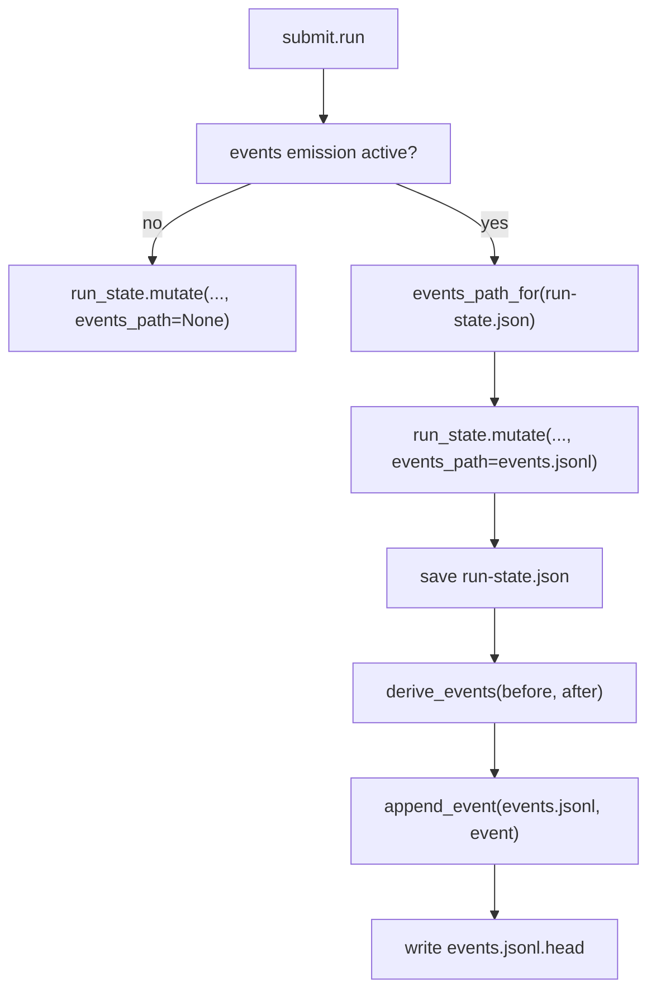

# Loop Engineering Events Emit Design

> Date: 2026-06-14
> Scope: A-emit only: forward-path event witness emission for selected writers
> Status: design proposal, pending user review

## Current Checkout Facts

- GitNexus index was rebuilt before writing this document: `npx gitnexus analyze` reported 6,069 nodes, 8,857 edges, and 179 flows.
- The current worktree is not the clean `f2ddf63` baseline described by the request. It already contains event-forwarding code in several commands. This document therefore records the target design and the safe implementation boundary; implementation must reconcile it against the reviewed baseline before editing code.
- Current source facts observed:
  - `run_state.mutate(path, fn, ..., events_path=None)` already has an optional `events_path` seam. Its default leaves behavior unchanged.
  - `run_state.events_path_for(state_path)` resolves `<run_dir>/events.jsonl`.
  - `run_state.events_path_if_active(state_path)` returns the sibling log only if it already exists.
  - `event_log.append_event` writes canonical chained JSONL and a sibling `<events.jsonl>.head` anchor.
  - `state_store.derive_events` derives `run.started`, `phase.submitted`, `gate.passed`, `gate.failed`, and `dispatch.dispatched` from before/after state.
  - `start.py` currently contains `_seed_event_log`, but the requested design still treats `start` as a decision point because baseline notes say start used `save`, not `mutate`.

## Goal

Add the smallest safe A-emit increment: let one controlled writer append derived events to an append-only sidecar after it has already saved the authoritative `run-state.json`.

The first writer is `submit`. It emits only when explicitly opted in, and it does not change the source of truth. `run-state.json` remains the authoritative SSOT for current harness behavior.

## Non-Goals

- Do not implement A-invert.
- Do not make events authoritative.
- Do not replay `events.jsonl` to drive command behavior.
- Do not change the `run-state.json` schema for event anchors, head hashes, event metadata, or witness status.
- Do not write `.head`, external anchors, or witness recovery state into `run-state.json`.
- Do not make drift a gate blocker in this slice.
- Do not wire every command at once.
- Do not repair historical runs that have no event log.

This preserves the Non-Goal from `docs/loop-engineering-control-plane-design.md`: do not replace `run-state.json` immediately. A-invert remains the later, higher-risk SSOT migration where events become authoritative and `run-state.json` becomes a projection.

## Scope And Switches

### Opt-In Surface

Use an explicit opt-in switch for new emission. Two acceptable forms:

- Environment variable: `E2E_HARNESS_EVENTS_EMIT=1`.
- Run-state flag: `state["control_plane"]["events_emit"] == true`, only if such a control-plane block already exists or is introduced as a separate reviewed schema change.

Recommended first implementation: environment variable only. It avoids modifying `run-state.json` and keeps this slice out of schema migration territory.

### First Writer

Only `submit.run` should pass `events_path` into `run_state.mutate` in the first slice.

Other writers stay dormant:

- `next`
- `dispatch`
- `migrate`
- `recover`
- `start`

This keeps the blast radius limited and provides a clean byte-compat test: with the opt-in off, a submit call produces exactly the same `run-state.json` and no sidecar files.

### File Locations

For a run state:

```text
docs/agent-runs/<run_id>/run-state.json
```

the sidecars are:

```text
docs/agent-runs/<run_id>/events.jsonl
docs/agent-runs/<run_id>/events.jsonl.head
docs/agent-runs/<run_id>/events.jsonl.write-failed
```

`events.jsonl` and `.head` remain in the run directory as external witnesses. They are intentionally not embedded in `run-state.json`.

## Mechanism

### Submit Wiring

Target flow:



`run_state.mutate` is the right seam because it already serializes the load, mutation, save, and derived witness append under the run-state lock. The key ordering is:

1. Load `run-state.json`.
2. Deep-copy `before` only if `events_path` is active.
3. Run the caller mutation.
4. Save `run-state.json`.
5. Derive and append events inside the same lock.

This order matters. The authoritative write happens first. Event emission is a witness, not the write authority.

### Event Content

For `submit`, the minimal useful events are derived from state deltas:

- `gate.passed` when a phase record transitions to `dispatch: done`.
- `gate.failed` when a phase record transitions to `dispatch: failed`.
- Any `phase.submitted` only if submit legitimately causes `current_phase` to change in the current engine contract.

The event writer should not invent extra semantic events for fields that `state_store.replay_events` cannot consume yet. A witness that cannot be replayed is noise.

### Byte Compatibility

When emission is inactive:

- `events_path` is `None`.
- `mutate` must not deep-copy state for event derivation.
- No `events.jsonl`, `.head`, or `.write-failed` file appears.
- `run-state.json` content remains byte-compatible with the pre-A-emit path except for ordinary existing timestamp behavior already produced by `save`.

## Failure Semantics

### Drift

Drift detection is warning-only in this slice.

If `verify_chain(events.jsonl)` or `detect_drift(read_events(events.jsonl), run_state)` fails, the harness should report a control-plane warning through diagnostic surfaces such as `doctor --state`, stderr, or status metadata. It should not block `submit`, `gate`, or `next` yet.

Reason: while `run-state.json` is still authoritative, drift means the witness is degraded. Treating drift as a hard gate before A-invert would let a sidecar failure veto the real SSOT, which is the opposite of this slice.

### Event Write Failure

If event append fails after `save` succeeds:

- Keep the saved `run-state.json`.
- Do not roll back the worker evidence.
- Write best-effort `events.jsonl.write-failed` with run id, expected sequence if known, event type if known, and error reason.
- Warn loudly.
- Return success for the command whose authoritative write succeeded.

This makes event failure visible without turning the witness into a second SSOT.

### Partial Sidecars

If a failure happens while bootstrapping a new log, remove partial `events.jsonl` and `.head` if possible. A half-chain is worse than no chain because it can look like drift for an otherwise valid run.

## start.py And run.started

Baseline problem: `start` creates `run-state.json` through `save`, not `mutate`. Because `derive_events` is hooked to `mutate`, a submit-only A-emit slice cannot derive `run.started` from the actual creation transition.

There are two options:

### Option 1: Do Not Backfill start In A-emit

`submit` creates or extends the witness only after the first submitted evidence. `events.jsonl` starts at the first submit-derived event and has no `run.started`.

Pros:

- Smallest change.
- Keeps this slice strictly to one writer.
- Avoids touching `start.run`.

Cons:

- `detect_drift` must stay tolerant of missing `run_id` from the event projection.
- The event chain is not a complete run history.
- A later start fix must decide how to handle older submit-only logs.

Impact on `detect_drift`: `run_id` remains conflict-only, not under-claim. A projection that lacks `run_id` must not be treated as drift, because the writer never had a chance to emit `run.started`.

### Option 2: Add An Emit Helper For start

After `start.run` saves the initial state, call a helper that derives events from `{}` to the saved state and appends them to `events.jsonl`.

Pros:

- The witness covers the run from birth.
- `detect_drift` can reason about run identity and initial current phase more directly.
- Real runs can satisfy `verify_chain` and `detect_drift` before the first submit.

Cons:

- Touches a second writer.
- Requires start-specific failure cleanup.
- Moves beyond the requested "only submit first writer" boundary unless explicitly approved.

Recommendation for this document: do not include start in the first A-emit implementation. Keep it as the first follow-up after submit is proven stable. If the user chooses completeness over minimality, implement Option 2 under a separate reviewed task.

## Gradual Rollout And Rollback

### Rollout

1. Submit only, env opt-in.
2. Add `doctor --state` warning checks for event-chain failures and drift.
3. Extend to `dispatch` only after submit has stable tests.
4. Extend to `next`.
5. Extend to `migrate` or `recover` only after their ownership boundaries are reviewed.
6. Revisit `start` to seed `run.started`.

### Kill Switch

`E2E_HARNESS_EVENTS_EMIT=0` or an unset env var disables emission. A disabled run should not create or extend `events.jsonl`.

If a run already has a sidecar, the first implementation should still require the opt-in flag; do not implicitly continue a chain merely because the file exists. File existence alone is too sticky as a control surface.

### Rollback Cost

Rollback is cheap while this remains a dormant witness:

- Stop passing `events_path` to `mutate`.
- Leave existing sidecars on disk.
- `run-state.json` remains authoritative and complete.

The cost rises only if later phases start gating on drift or reading events as authority.

## Affected Critical Symbols And Impact Plan

The following GitNexus impact samples were run against the current index. They are planning evidence only. Before implementation, rerun impact for the exact symbol being edited because the worktree is dirty and the symbol set may change.

| Symbol | File | Current sampled impact | Follow-up edit plan |
| --- | --- | --- | --- |
| `submit.run` | `skills/e2e-dev-harness/scripts/e2e_harness/cli/commands/submit.py` | LOW, direct callers 0, affected processes 0 | Required before adding opt-in `events_path` wiring. |
| `run_state.mutate` | `skills/e2e-dev-harness/scripts/e2e_harness/core/run_state.py` | LOW, direct callers 0, affected processes 0 | Avoid editing if possible; use existing `events_path` parameter. |
| `run_state.events_path_if_active` | `skills/e2e-dev-harness/scripts/e2e_harness/core/run_state.py` | LOW, direct callers 0, affected processes 0 | Likely replace or wrap with env opt-in if current behavior is too broad. |
| `event_log.append_event` | `skills/e2e-dev-harness/scripts/e2e_harness/core/event_log.py` | LOW, direct callers 0, affected processes 0 | Avoid editing unless `.head` behavior changes. |
| `state_store.derive_events` | `skills/e2e-dev-harness/scripts/e2e_harness/core/state_store.py` | LOW, direct callers 0, affected processes 0 | Avoid editing unless submit deltas cannot be represented. |
| `state_store.detect_drift` | `skills/e2e-dev-harness/scripts/e2e_harness/core/state_store.py` | LOW, direct callers 0, affected processes 0 | Only edit if start omission creates false positives. |
| `start._seed_event_log` | `skills/e2e-dev-harness/scripts/e2e_harness/cli/commands/start.py` | LOW, direct caller `start.run`, affected modules: Commands | Do not edit in first submit-only slice unless the user chooses Option 2. |
| `start.run` | `skills/e2e-dev-harness/scripts/e2e_harness/cli/commands/start.py` | Must rerun before editing | Required only for start seeding option. |

No HIGH or CRITICAL impact was observed in the sampled set.

## TDD Red Test List

Implementation must start with failing tests. Use the Windows command shape requested by the user:

```powershell
$env:PYTHONUTF8='1'; $env:PYTHONIOENCODING='utf-8'; $env:TMP='.test-tmp'; $env:TEMP='.test-tmp'; python -m pytest <file> -q -p no:randomly --basetemp=.test-tmp/<slice>
```

### Submit Emits Chain When Opted In

Test file: `skills/e2e-dev-harness/tests/test_forward_events.py` or a new focused submit-event test.

Scenario:

1. Create a run-state with a phase that can accept evidence.
2. Set `E2E_HARNESS_EVENTS_EMIT=1`.
3. Invoke `submit.run`.
4. Assert `events.jsonl` and `events.jsonl.head` exist.
5. Assert `event_log.verify_chain(events_path)` passes.
6. Assert `state_store.detect_drift(read_events(events_path), load(run_state))` is warning-clean for the projectable fields.

### events_path=None Remains Byte-Identical

Scenario:

1. Run the same submit with the env var unset.
2. Compare the saved state to the legacy expected state.
3. Assert no sidecar files exist.

If exact byte comparison is unstable because `updated_at` changes, freeze `now` at the `mutate` seam or compare canonical JSON with timestamp controlled by the existing test helper.

### Drift Warning Path

Scenario:

1. Produce a healthy `events.jsonl`.
2. Tamper with a non-tail event.
3. Run the diagnostic surface.
4. Assert the result reports `control_plane` drift or chain failure.
5. Assert no gate command is blocked by this warning in A-emit.

### Event Write Failure After Save

Scenario:

1. Monkeypatch `event_log.append_event` to raise.
2. Submit evidence with emission enabled.
3. Assert `run-state.json` includes the submitted evidence.
4. Assert the command returns success.
5. Assert `events.jsonl.write-failed` exists or stderr contains the warning.

### Real Run verify_chain

Scenario:

1. Start a small real run.
2. Enable A-emit for submit.
3. Submit a real evidence artifact.
4. Assert `verify_chain` passes.
5. Assert `detect_drift` does not falsely report `run_id` drift when start was not emitted.

### Lock-Internal Concurrency Consistency

Scenario:

1. Create one run-state with an active `events.jsonl`.
2. Launch two submit calls against independent evidence keys.
3. Assert both evidence records are present.
4. Assert event sequence numbers are monotonic and chain verification passes.

## Open Questions For User Decision

1. Should the first implementation use env-only opt-in, or is a run-state flag acceptable despite the schema sensitivity?
2. Should file existence continue an already active chain, or should emission require the env flag on every command?
3. Should `start` remain out of A-emit first slice, or should it seed `run.started` through an emit helper now?
4. Where should drift warnings surface first: `doctor --state`, `status`, stderr from mutating commands, or all three?
5. Should submit-only A-emit create a new chain on first submit, or only extend a chain seeded by start?
6. Should `events.jsonl.write-failed` be treated as a diagnostic input only, or should it affect readiness reporting?

## Recommended Decision

Choose the smallest safe route:

- Env-only opt-in.
- Submit-only writer.
- Create or extend `events.jsonl` only when the env var is set.
- Keep `start` as a follow-up.
- Treat drift as warning-only.
- Keep all anchors as sidecars.

This gives the harness a real witness path without changing the SSOT contract.
