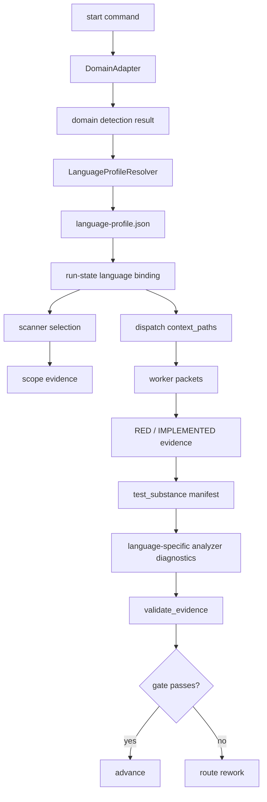

# Multi-Language Adaptation Design

> Date: 2026-06-14
> Scope: `skills/e2e-dev-harness`
> Status: reviewed design, pending implementation plan
> Related: `docs/superpowers/specs/2026-06-08-e2e-dev-harness-u5-domain-adapter-design.md`, `docs/superpowers/specs/2026-06-07-e2e-dev-harness-u4-config-layer-design.md`, `docs/frontend-playwright-harness-integration-plan.md`

## Executive Summary

The current harness can already run outside Java/Spring, but it is not yet a
first-class multi-language platform. The lifecycle, pipeline, dispatch, runtime,
and command-evidence layers are mostly language-neutral. The remaining hard
edges are concentrated in scanner depth, test-substance validation, language
profile selection, and gate/provider registration.

This design makes Java, JavaScript, TypeScript, and Python first-class supported
languages without weakening the harness control plane:

```text
project files
  -> language profile detection
  -> language scanner
  -> test command contract
  -> test-substance analyzer
  -> evidence validators
  -> pipeline gates
```

The main design decision is to add a narrow **language profile layer** that sits
beside the existing domain adapter layer. Domain answers what kind of project
this is, such as backend or frontend. Language profile answers which language
contracts are active, which test runners are valid, which scanners apply, and
which test-substance analyzer should validate the evidence.

## Current Checkout Facts

- `start.run` already selects a domain adapter and can optionally call
  `adapter.scan(...)` before creating `run-state.json`.
- `FrontendAdapter` detects JavaScript and TypeScript UI projects through
  `package.json`, Vite, Vitest, and common frontend framework dependencies.
- `BackendAdapter` detects Java, Python, and Go markers through `pom.xml`,
  Gradle files, `pyproject.toml`, `setup.py`, and `go.mod`.
- Verification replay already accepts Python, npm, pnpm, yarn, Vitest,
  Playwright, Jest, Maven, Gradle, Go, Cargo, and `node --check` style commands.
- The frontend scanner is intentionally thin. It finds UI component files but
  does not build a dependency graph or route-level impact map.
- Java/Spring still has the deepest scanner path through the legacy dependency
  scanner and optional tree-sitter Java support.
- `test_substance` is the strongest current language-specific gate. It accepts
  only `python` and `java` manifests and only implements Python AST plus Java
  text heuristics.
- The default lifecycle requires `test_substance` during `IMPLEMENTED`, so JS/TS
  projects can run test commands but cannot honestly satisfy the same
  structured test-substance gate without a new analyzer or pipeline override.
- A legacy provider registry exists under the scanner layer, but gate/scanner
  provider registration is not yet a global harness extension surface.

## Goals

- Make Java, JavaScript, TypeScript, and Python explicit supported language
  profiles.
- Preserve current Java/Spring behavior.
- Preserve current Python behavior while making it an explicit profile instead
  of backend fallback.
- Let JS/TS projects pass the same quality gates as Java/Python when their tests
  contain real assertions.
- Keep lifecycle and runtime adapters language-agnostic.
- Make unsupported or partially supported languages fail with clear diagnostics,
  not silent weak gates.
- Keep custom pipeline YAML working for teams that need temporary overrides.
- Provide an incremental path toward future Go, Rust, and mixed-language
  monorepos without redesigning the core again.

## Non-Goals

- No full language server integration in the first slice.
- No mandatory browser automation for every frontend run.
- No replacement of GitNexus as the code intelligence backend.
- No unsafe plugin execution from arbitrary project paths by default.
- No hidden background scanner that mutates state outside the normal run
  lifecycle.
- No attempt to make every language equally deep in the first implementation
  slice. The target is honest support with explicit capability levels.

## Design Principles

1. Language-specific logic belongs in adapters, not lifecycle core.
2. Gates should validate structured evidence, not prose claims.
3. A language may be supported at different capability levels: command replay,
   test-substance validation, dependency scanning, browser evidence, and
   semantic impact are separate capabilities.
4. Default behavior must be backward compatible for existing Java and Python
   runs.
5. JS/TS support should be useful for real frontend work without requiring a
   full Playwright rollout on day one.
6. Mixed-language repositories should compose multiple profiles instead of
   choosing one global language and losing the rest.

## Target Architecture



The dependency direction is intentional. `LanguageProfileResolver` consumes the
domain adapter's already-computed detection result as one scoring signal. It may
read additional language markers, but it should not re-parse the same
`package.json`, Vite/Vitest config, or backend build files when the domain layer
has already done that work. This keeps domain and language from becoming two
uncoordinated sources of truth.

If domain and language disagree, the language profile stores both facts:

```json
{
  "domain_hint": "frontend",
  "primary_language": "python",
  "warnings": ["domain-language-mismatch: frontend domain with python primary"]
}
```

The warning is advisory unless a selected pipeline declares it blocking. Runtime
adapters still do not interpret either field.

When `domain_hint` and `primary_language` disagree, test command selection
belongs to `primary_language`. The domain hint can still influence review
profile, worker skill selection, and UI/backend context, but it must not choose a
test runner that contradicts the active language profile.

Add a new adapter family:

```text
skills/e2e-dev-harness/scripts/e2e_harness/adapters/language/
```

The layer is intentionally small:

- Detect language profiles from project files.
- Resolve per-language test command contracts.
- Route scanner selection.
- Route test-substance analysis.
- Report capability level in run-state and diagnostics.
- Reuse domain detection results where available.

## Language Profile Contract

Persist a normalized profile artifact per run:

```json
{
  "schema": "e2e-harness.language-profile.v1",
  "profiles": [
    {
      "language": "typescript",
      "roots": ["src"],
      "test_runners": ["vitest", "playwright", "jest"],
      "package_managers": ["npm", "pnpm", "yarn"],
      "capabilities": {
        "command_replay": true,
        "test_substance": true,
        "scope_scan": "component",
        "dependency_graph": false,
        "browser_evidence": "optional"
      }
    }
  ],
  "primary_language": "typescript",
  "warnings": []
}
```

Capability fields are part of the Slice 1 schema even when their first values
are conservative. This avoids a later schema migration when scanner capability
reporting lands. Each profile owns its own `roots` list, so a monorepo can carry
Java, Python, and TypeScript profiles in one immutable run artifact.

Run-state stores a compact binding:

```json
{
  "language": {
    "schema": "e2e-harness.language-binding.v1",
    "profile_path": "docs/agent-runs/<run>/language-profile.json",
    "primary_language": "typescript",
    "profiles": ["typescript", "javascript"],
    "source": "detected"
  }
}
```

The artifact is immutable for the run. Workers read it through `context_paths`.
Validators compare evidence language fields against this active profile instead
of trusting self-reported language strings.

Immutability is run-level, not single-language. The artifact can contain many
entries in `profiles[]`; what must not change after `start` is the mapping from
profile roots to language capability contracts. Validators use `test_files` paths
to look up matching profile roots, then verify that the manifest language agrees
with that matched profile. A manifest cannot choose a more convenient analyzer by
self-reporting a different `language`.

The binding is a trusted control-plane field. `start` writes it, gate-time
validation reads it from the harness-injected trusted state, and workers treat it
as read-only context. Workers may submit evidence that refers to the profile
path, but they must not edit `run-state.language` or replace
`language-profile.json` after `start`.

## Detection Rules

Detection should be deterministic and cheap.

| Language | Strong markers | Default test command family |
|---|---|---|
| Java | `pom.xml`, `build.gradle`, `build.gradle.kts`, `src/main/java` | Maven or Gradle |
| TypeScript | `tsconfig.json`, `.ts`, `.tsx`, Vite/Vitest config | npm/pnpm/yarn, Vitest/Jest/Playwright |
| JavaScript | `package.json`, `.js`, `.jsx`, Jest/Vitest config | npm/pnpm/yarn, Jest/Vitest/Playwright |
| Python | `pyproject.toml`, `setup.py`, `pytest.ini`, `tests/*.py` | pytest or unittest |

When several profiles match, the resolver returns all of them. Primary profile
selection must be deterministic and auditable. The resolver computes one score
per candidate root:

```text
score =
  explicit_profile_bonus
  + project_local_profile_bonus
  + min(touched_file_score, 5000)
  + domain_hint_score
  + marker_score
  + bounded_file_count_score
```

Suggested initial weights:

| Signal | Score |
|---|---:|
| Explicit CLI profile | 10000 |
| Project-local `.e2e/language-profile.json` profile | 9000 |
| Touched test file under profile root | 200 each, capped together with source touches at 5000 |
| Touched source file under profile root | 100 each, capped together with test touches at 5000 |
| Domain adapter hint matches profile family | 60 |
| Strong build marker: `pom.xml`, Gradle file, `pyproject.toml`, `tsconfig.json` | 250 |
| Package/test marker: `package.json`, `pytest.ini`, Vitest/Jest config | 125 |
| File-count evidence under root | min(file_count, 50) |

The touched-file cap makes explicit CLI and project-local profile choices
impossible to overturn by a large module plan. Test files are weighted 2:1 over
source files because tests directly bind the evidence shape, but touched files
remain weaker than structural markers. Strong markers are deliberately high
because `pom.xml`, `pyproject.toml`, and `tsconfig.json` are stable project
facts; touched files are often a planning artifact.

Tie-break order is explicit profile source, then highest capped touched-file
score, then strongest marker score, then lexical root path ascending. The
resolver should not use a global language order as a hidden tie-break because
that makes monorepo audits hard to reproduce.

The old human-readable precedence is still useful as a mental model:

1. Explicit CLI profile selection.
2. Project-local `.e2e/language-profile.json`.
3. Test files touched by the request or module plan.
4. Domain adapter hint.
5. File-count and marker strength.

Mixed-language repositories are valid. The profile list is used later to select
per-module analyzers by path, not by one global primary language. For example, a
backend repository with a few TypeScript tooling scripts should keep a Java or
Python primary profile when touched files and marker score point to backend work,
while still recording a secondary TypeScript profile for files under the tooling
root.

## Test-Substance Support

There are two existing files with similar names, so this design always uses full
paths when the distinction matters:

- Analyzer: `skills/e2e-dev-harness/scripts/e2e_harness/core/test_substance.py`
- Evidence validator:
  `skills/e2e-dev-harness/scripts/e2e_harness/adapters/evidence/substance.py`

The current analyzer compatibility API can remain available:
`test_substance.analyze(source, language)` returns verdict tuples and
`test_substance.empties(source, language)` returns empty test names. Slice 2 adds
an explicit diagnostics API instead of overloading those wrappers:

```python
def analyze_with_diagnostics(source: str, language: str) -> dict:
    return {
        "verdicts": [("renders empty state", "ok")],
        "warnings": [
            {
                "code": "analyzer-limitation",
                "message": "Unsupported table-driven test name shape",
                "line": 12,
            }
        ],
    }
```

Warning identity is stable and intentionally narrow. For subset checks, two
warnings are equal by `(code, line)` when `line` is present and by `code` when no
line is available. `message` is human-facing and must not participate in
equality. The analyzer must return deterministic warnings for the same
`source` and `language`; repeated calls over the same bytes should produce the
same warning identity set.

Published warning codes are compatibility contracts. After a code ships, do not
change its meaning; add a new warning code for new semantics. This keeps old
worker evidence from failing because the validator changed wording or repurposed
a warning identity.

The compatibility wrappers call the diagnostics API and drop warnings only for
legacy callers. New JS/TS validation must use `analyze_with_diagnostics(...)`.
This creates a data channel for analyzer limitations without forcing every old
caller to change in the first slice.

Python and Java analyzers should also route through the diagnostics API. For
example, Python `SyntaxError` should keep the current verdict behavior of
returning no blocking empties through `analyze(...)`, while
`analyze_with_diagnostics(...)` emits an `analyzer-limitation` warning. That
keeps all language analyzers honest without changing legacy callers.

The implementation should delegate by language:

```text
skills/e2e-dev-harness/scripts/e2e_harness/core/test_substance.py
  -> skills/e2e-dev-harness/scripts/e2e_harness/adapters/language/test_substance/python.py
  -> skills/e2e-dev-harness/scripts/e2e_harness/adapters/language/test_substance/java.py
  -> skills/e2e-dev-harness/scripts/e2e_harness/adapters/language/test_substance/javascript.py
  -> skills/e2e-dev-harness/scripts/e2e_harness/adapters/language/test_substance/typescript.py
```

### Python

Keep the existing AST implementation. It already detects empty tests, trivial
assertions, weak `is not None` checks, pytest `raises`, and unittest assertion
calls.

### Java

Keep the current Java heuristic as the compatibility baseline. Later slices can
upgrade it to tree-sitter Java for better precision.

### JavaScript And TypeScript

Add a conservative text/AST hybrid analyzer. The first version can use text
heuristics with clear limits, because the gate should avoid false blocks when
the parser is unavailable.

Classify test blocks from common forms:

```text
test("name", () => { ... })
it("name", () => { ... })
describe("group", () => { it("name", () => { ... }) })
```

The analyzer classifies each test body by the strongest assertion it contains,
matching the Python analyzer's `bump(level)` pattern. A weak assertion does not
make the whole test weak if the same body also contains a stronger assertion.

Treat these as strong assertion signals:

```text
expect(value).toBe(...)
expect(value).toEqual(...)
expect(value).toMatchObject(...)
expect(value).toHaveBeenCalled()
await expect(promise).resolves...
await expect(promise).rejects...
assert.equal(...)
assert.deepEqual(...)
screen.getBy...
screen.findBy...
await page.expect...
```

Treat these as empty or weak-only assertion signals:

```text
test("name", () => {})
it("name", async () => {})
expect(true).toBe(true)
expect(value).toBeDefined()
expect(value).not.toBeNull()
```

`toBeDefined()` and `not.toBeNull()` are weak only when they are the strongest
signals in the test body. This prevents ordinary React Testing Library tests from
being downgraded when they also assert visible text, roles, events, network
behavior, or explicit expectations.

React Testing Library query semantics must stay precise:

- `getBy*` is a strong presence assertion because it throws when the element is
  missing.
- `findBy*` is a strong async presence assertion when awaited.
- Bare `queryBy*` is not a strong assertion because it returns `null` on miss.
- `expect(queryBy*(...)).toBeNull()` and equivalent negative assertions are
  strong absence assertions.
- `expect(queryBy*(...)).toBeDefined()` remains weak-only unless paired with a
  stronger signal.

The JS/TS analyzer may return `[]` for unparseable or unknown shapes rather than
blocking by accident, but it must also emit an analyzer-limitation warning into
the test-substance result or run evidence. Completion output must surface that
warning so an analyzer outage is honest and visible rather than a silent pass.

Concretely, the worker-produced `test_substance` evidence carries
`analyzer_warnings`; the validator recomputes diagnostics with
`analyze_with_diagnostics(...)` and rejects the evidence only when a recomputed
warning is missing from the manifest. It does not reject because the warning
exists. Completion reads `analyzer_warnings` from the accepted evidence and
surfaces them as honest limitations.

The subset check uses warning identity, not object equality:

```text
warning_key(w) = (w.code, w.line) if w.line is present else (w.code)
required_keys = keys(recomputed_warnings)
declared_keys = keys(manifest.analyzer_warnings)
reject only when required_keys is not a subset of declared_keys
```

## Evidence Manifest Changes

Extend `e2e-dev-harness.test-substance.v1` language support:

```json
{
  "schema": "e2e-dev-harness.test-substance.v1",
  "language": "typescript",
  "test_files": ["src/App.test.tsx"],
  "red_tests": ["renders empty state"],
  "green_tests": ["renders empty state"],
  "analyzer_warnings": [],
  "acceptance_contract_path": "docs/agent-runs/<run>/acceptance-contract.json",
  "ac_coverage": {
    "AC-001": ["renders empty state"]
  }
}
```

Validator changes:

- Accept `javascript` and `typescript` in addition to `python` and `java`.
- Normalize RED and GREEN test names with Unicode NFC before set comparison.
- Require the manifest `test_files` to match exactly one active profile root
  when a profile binding exists. Then require the manifest language to match
  that root's profile language.
- Continue reading real test files and re-running the analyzer locally.
- Use `analyze_with_diagnostics(...)` for JS/TS and verify that recomputed
  warnings appear in `analyzer_warnings`.
- Keep the RED and GREEN same-batch requirement, but compare names after NFC
  normalization.
- Keep acceptance contract coverage unchanged.

Profile-aware validation needs access to run-state. Follow the existing
`scope_manifest` precedent in `validate.py`: keep the normal structured
validator shape for most keys, but branch `test_substance` through a three-arg
validator `(obj, repo_root, state)` once Slice 3 begins. Do not invent a second
state-loading path inside
`skills/e2e-dev-harness/scripts/e2e_harness/adapters/evidence/substance.py`.

Multi-track evidence uses the existing `multitrack.base_key(...)` behavior in
`validate_evidence`. For keys such as `test_substance#auth`, validation strips
the module suffix for rule selection but preserves it as the module hint:

```text
test_substance#auth
  -> base key: test_substance
  -> module hint: auth
  -> module plan root(s)
  -> matching language profile root
  -> analyzer language
```

If a module plan is available in trusted state, the module hint narrows the
allowed roots before matching `test_files`. If no module plan is available,
`test_files` must still match exactly one profile root. A cross-profile manifest
for one module is invalid; workers must submit separate `test_substance#<module>`
artifacts for Java and TypeScript modules.

The module plan lookup should reuse the existing
`pipeline._module_plan_from_state(state, repo_root)` helper or a public wrapper
with the same behavior. The state-aware substance validator may parse the module
plan from the trusted injected state; that is not a second state-loading path.
Use local imports where needed to avoid introducing an evidence -> pipeline
import cycle at module import time.

When `state is None`, profile grounding is unavailable by design. In that case
the three-argument `test_substance` validator must degrade to the current
two-argument behavior: structural manifest checks plus local analyzer checks
only. This matches the `scope_manifest` precedent and keeps display/navigation
callers from disagreeing with the engine on basic structure. Profile/root/module
checks are added only when trusted state is present.

## Scanner Strategy

Scanner depth should be explicit in the profile rather than implied by language.

| Capability | Java | Python | JS/TS |
|---|---|---|---|
| File/component discovery | existing | add simple package/module scan | existing frontend scan |
| Dependency graph | existing Java/Spring scanner | future import graph | future import graph |
| API route detection | GitNexus or future scanner | future FastAPI/Django scanner | future Next/Vite route scanner |
| UI browser evidence | not default | not default | optional Playwright slice |

First implementation should not block on full dependency graph parity. It should
make capability reporting honest:

```json
{
  "scanner": "typescript-frontend",
  "capability": "component",
  "dependency_graph": false,
  "warnings": ["dependency graph not available for TypeScript scanner v1"]
}
```

The same capability information must be present in `language-profile.json` from
Slice 1 and echoed in scanner-scope output from Slice 4. Tier recommendation can
then use available scope evidence without overstating missing graph depth.

## Pipeline And Gate Behavior

Default lifecycle can stay unchanged once JS/TS test-substance exists.

For languages without a supported test-substance analyzer:

- `standard`, `critical`, and `audited` pipelines hard-block with
  `unsupported-test-substance-language`.
- `minimal` may remain an open policy decision until implementation, but it must
  emit weaker-completion metadata if it allows the run to continue.
- A custom pipeline can remove `test_substance` as an explicit operator escape
  hatch, and completion must mark the run as weaker.

There is no silent fallback where unsupported languages satisfy `test_substance`
with prose or an empty analyzer result.

## Runtime And Worker Context

Runtime adapters do not need language-specific changes. They should continue to
transport worker packets.

Dispatch should add the language profile artifact to worker `context_paths` only
when run-state contains a language binding:

```json
{
  "context_paths": [
    "docs/agent-runs/<run>/language-profile.json",
    "docs/agent-runs/<run>/acceptance-contract.json"
  ]
}
```

Backend parity is explicit: existing backend runs that do not create a language
binding must keep the old empty extra-context behavior. Do not inject a generic
language profile into every backend run just to make the field always present.

Worker prompts should say:

- Use the active language profile for test commands and evidence shape.
- Produce `test_substance` using the exact profile language.
- Do not claim unsupported scanner depth.

## Error Handling

| Condition | Behavior |
|---|---|
| No language markers found | use `generic` profile with warning; require explicit profile for `test_substance`. |
| JS/TS test-substance requested before analyzer exists | transient Slice 1 behavior: block with `unsupported-test-substance-language`; remove this condition after Slice 2 lands. |
| Manifest language not in active profile | reject with `language-profile-mismatch`. |
| Scanner reports only component scope | accept scope but mark dependency graph unavailable. |
| Mixed-language manifest uses one global language | reject if files do not match language profile roots. |
| Test command is unsupported | reject replay with the current `replay-command-disallowed` path. |
| Analyzer cannot parse a supported test file | do not block by default, but emit `analyzer-limitation` warning and surface it in completion output. |

The generic profile is a control-plane fallback, not a valid
`test_substance.language`. Its profile entry should use `"language": "unknown"`
or omit language-specific analyzers, then fail with
`unsupported-test-substance-language` when `test_substance` is required. Do not
let generic runs fall through to the vaguer `bad-language` error.

Validation order matters: when trusted profile state exists, profile grounding
and unsupported-profile checks run before the language allow-list. This makes a
generic `"unknown"` profile fail as `unsupported-test-substance-language` rather
than `bad-language`. The allow-list handles ordinary malformed manifests only
after the active profile has been resolved.

## Security And Trust Invariants

- Workers cannot satisfy language support by writing prose. They must provide
  structured manifests and command evidence.
- The active language profile is chosen before workers run and is persisted as a
  run artifact.
- `run-state.language` is trusted harness state, written by `start` and read by
  gates through the same trusted-state injection pattern used by
  `scope_manifest`.
- Workers cannot edit `run-state.language` or swap the profile artifact to make
  a manifest pass.
- Validators read real test files from disk and classify them themselves.
- Runtime adapters only transport language context; they do not interpret it.
- Unsupported capabilities are surfaced in JSON warnings and completion output.

## Implementation Slices

### Slice 1: Language Profile Binding

- Add `adapters/language/` with profile detection for Java, Python, JS, and TS.
- Add optional `--language-profile <name-or-path>` to `start`.
- Persist `language-profile.json` and run-state `language` binding.
- Include capability fields in `language-profile.json` even when values are
  conservative.
- Add profile path to dispatch context only when the language binding exists.
- Tests: detection fixtures, explicit profile override, run-state binding,
  dispatch context inclusion, backend parity with no extra context.

### Slice 2: JS/TS Test-Substance Analyzer

- Refactor `core/test_substance.py` into dispatcher plus language analyzers.
- Add `analyze_with_diagnostics(...)` and keep `analyze(...)` / `empties(...)`
  as compatibility wrappers.
- Add `javascript` and `typescript` support.
- Extend `validate_substance_manifest` language allow-list.
- Normalize RED and GREEN test names with Unicode NFC before comparison.
- Add and validate `analyzer_warnings` in `test_substance` evidence so
  analyzer limitations can reach completion output.
- Match analyzer warnings by `(code, line)` when line exists, otherwise by
  `code`; message text is not part of equality.
- Route Python `SyntaxError` and equivalent analyzer limitations through
  `analyze_with_diagnostics(...)` while preserving legacy `analyze(...)` /
  `empties(...)` behavior.
- Locate the Slice 1 transient `unsupported-test-substance-language` JS/TS test
  and remove it or mark it obsolete once JS/TS analyzer support lands.
- Tests: empty Vitest/Jest tests fail, real assertions pass, weak assertions are
  suspicious only when no stronger assertion appears in the same test body, and
  unparseable supported JS/TS shapes produce surfaced warnings instead of silent
  green evidence.

### Slice 3: Profile-Aware Evidence Validation

- Validate manifest language against run-state language binding.
- Validate test files against declared language roots when available.
- Upgrade `test_substance` validation to the existing state-aware validator
  pattern used by `scope_manifest`: `(obj, repo_root, state)`.
- Define multi-track resolution for `test_substance#<module>` as
  module hint -> module plan roots -> language profile root -> analyzer
  language.
- When trusted `state` is absent, degrade to the existing two-argument
  structural/analyzer checks instead of failing profile grounding.
- Report structured reasons: `bad-language`, `language-profile-mismatch`,
  `test-file-language-mismatch`.
- Tests: mismatched Python manifest over TS files fails; mixed profile works
  when each manifest targets the correct language; `test_substance#api` and
  `test_substance#ui` can validate against different profile roots in one run.

### Slice 4: Scanner Capability Reporting

- Normalize Java, Python generic, and JS/TS frontend scanner outputs to one
  scanner-scope schema.
- Add capability fields for component scope, dependency graph, route discovery,
  and browser evidence.
- Update tier recommendation to consume capability-aware scope without
  overstating missing graph data.
- Tests: frontend scanner reports component capability; Java scanner reports
  dependency graph when available; generic scanner reports limited capability.

### Slice 5: Documentation And Worker Contracts

- Update `skills/e2e-dev-harness/SKILL.md` with language profile rules.
- Update worker references for TDD red, implementation, and completion workers.
- Add examples for Python, Java, JS, and TS `test_substance` manifests.
- Tests: skill doc coverage tests for language profile and JS/TS support.

## Testing Plan

Focused test files:

- `skills/e2e-dev-harness/tests/test_language_profile.py`
- `skills/e2e-dev-harness/tests/test_test_substance_js_ts.py`
- `skills/e2e-dev-harness/tests/test_substance_manifest.py`
- `skills/e2e-dev-harness/tests/test_substance_multitrack_language.py`
- `skills/e2e-dev-harness/tests/test_dispatch_language_context.py`
- `skills/e2e-dev-harness/tests/test_scanner_capabilities.py`

Representative commands:

```text
python -m pytest skills/e2e-dev-harness/tests/test_language_profile.py -q
python -m pytest skills/e2e-dev-harness/tests/test_test_substance_js_ts.py -q
python -m pytest skills/e2e-dev-harness/tests/test_substance_manifest.py -q
python -m pytest skills/e2e-dev-harness/tests/test_substance_multitrack_language.py -q
python -m pytest skills/e2e-dev-harness/tests/test_dispatch_language_context.py -q
python -m pytest skills/e2e-dev-harness/tests/test_scanner_capabilities.py -q
python -m pytest skills/e2e-dev-harness/tests -q -p no:cacheprovider --basetemp .pytest-tmp/multilanguage
```

## Compatibility

- Existing Java and Python runs continue to work.
- Existing custom pipeline YAML remains valid.
- Existing evidence manifests with `language: "python"` or `language: "java"`
  remain valid.
- Existing frontend detection remains, but its output becomes capability-labeled.
- Existing runtime adapters remain unchanged except for receiving one extra
  context path.

## Open Decisions

Resolved before Slice 1:

- A run-level `language-profile.json` is immutable, but it can contain multiple
  `profiles[]` entries partitioned by roots.
- Capability fields belong in the Slice 1 profile schema.
- Primary language selection uses explicit scoring, not an implicit precedence
  list.
- JS/TS test bodies are classified by strongest assertion, not by the mere
  presence of a weak assertion.
- `getBy*` and awaited `findBy*` count as strong RTL presence assertions; bare
  `queryBy*` does not.

Still open:

1. Whether JS and TS should share one analyzer module with language aliases or
   separate modules from day one.
2. Whether Playwright browser evidence should be optional for all frontend runs
   or required only by a frontend-specific pipeline.
3. Whether unsupported languages in minimal tier should hard-block or continue
   with weaker-completion metadata.

Recommended defaults:

- Use one JS/TS analyzer module first, with language aliases.
- Keep Playwright optional unless the selected pipeline requires it.
- Hard-block unsupported `test_substance` in standard and above; allow custom
  pipeline escape hatch with explicit weaker completion metadata.

## Acceptance Criteria

- A Python project can complete the existing lifecycle without behavior drift.
- A Java/Spring project can complete the existing lifecycle without scanner
  regression.
- A TypeScript frontend project with Vitest tests and real assertions can pass
  `test_substance`.
- A JavaScript project with Jest tests and empty test bodies is blocked by
  `test_substance`.
- A JS/TS run records `language-profile.json` and passes that path to dispatched
  workers.
- Mixed-language repositories can record multiple profiles without losing the
  primary domain adapter selection.
- In a backend repository with a strong Java or Python marker, one touched TS
  helper test plus one touched TS helper source file must not overturn the
  backend primary profile.
- After Slice 2 lands, the transient `unsupported-test-substance-language` test
  case for JS/TS must be removed or marked obsolete, proving the error condition
  did not become permanent dead code.
- Completion output names unsupported language capabilities instead of implying
  Java/Spring-level graph depth.
- JS/TS analyzer limitations travel through `analyzer_warnings` in accepted
  evidence and appear in completion output.
- `test_substance#<module>` evidence can resolve different language profile
  roots in the same monorepo run.
- Workers cannot satisfy profile-aware validation by editing
  `run-state.language`.

## Implementation Notes

Before editing existing functions, run GitNexus upstream impact analysis for the
target symbol as required by `AGENTS.md`, but do not rely on one symbol query for
registry-dispatched validators. GitNexus can under-report functions reached
through dictionary registration such as `STRUCTURED_KEYS`.

Likely symbols include:

- `start.run`
- `dispatch.run`
- `validate_substance_manifest`
- `test_substance.analyze`
- `BackendAdapter.scan`
- `FrontendAdapter.scan`
- tier recommendation helpers that consume scanner scope

If GitNexus reports HIGH or CRITICAL risk, narrow the slice before editing. The
safest first slice is profile binding plus dispatch context, because it is
additive and does not alter existing Java/Python analyzer behavior.

The practical risk audit should include both graph queries and a manual
coordination checklist:

```text
gitnexus_impact({target: "validate_evidence", direction: "upstream"})
gitnexus_impact({target: "empties", file_path: "skills/e2e-dev-harness/scripts/e2e_harness/core/test_substance.py", direction: "upstream"})
gitnexus_impact({target: "analyze", file_path: "skills/e2e-dev-harness/scripts/e2e_harness/core/test_substance.py", direction: "upstream"})
```

Manual checklist:

- `validate_evidence` structured validator dispatch branch.
- `STRUCTURED_KEYS["test_substance"]` registration.
- `validate_substance_manifest` state-aware signature.
- `test_substance.analyze`, `test_substance.empties`, and new
  `analyze_with_diagnostics` callers.
- `lifecycle.py` `IMPLEMENTED` gate requiring `test_substance`.
- multitrack evidence keys such as `test_substance#<module>`.

If a direct `gitnexus_impact` query for `validate_substance_manifest` reports
LOW or zero callers, treat that as an expected limitation of registry dispatch,
not proof of low risk. The Slice 1 pull request should include both the GitNexus
impact excerpts and the manual checklist results in its description.
